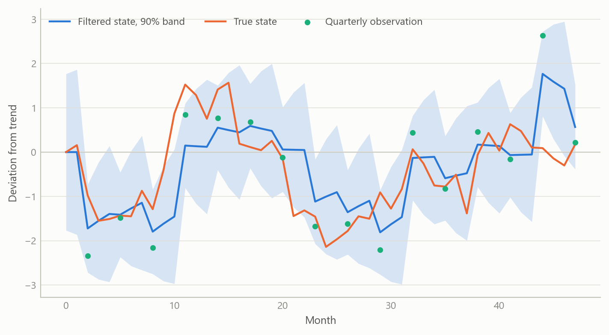
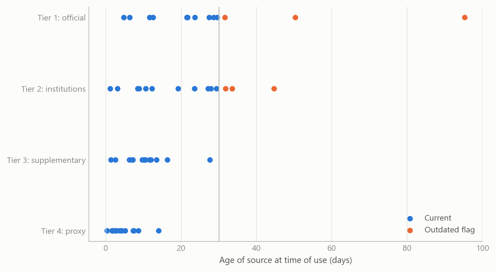
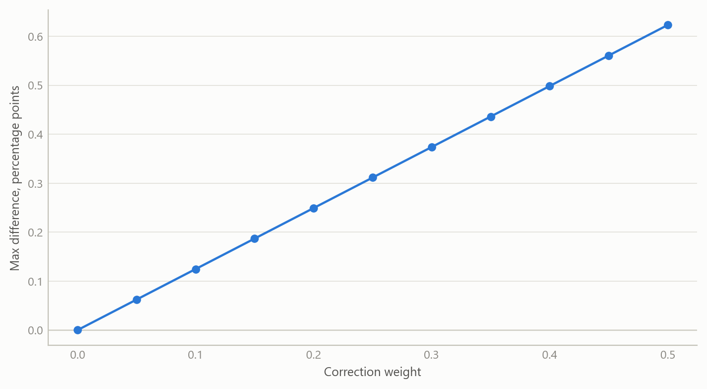

# An AI-assisted workflow for macroeconomic models
Carlos Galindo

> [!NOTE]
>
> ### At a glance
>
> - **Question.** If an AI assistant writes much of the code and drafts much of the analysis, what makes the output safe to rely on?
> - **Approach.** Wrap a small macroeconomic model in a research protocol: sources are ranked in tiers, every figure is dated, every transformation is logged, and every piece of machine-written code must pass tests before its output counts.
> - **Finding.** The pieces fit together into a workflow that ran end to end on simulated data, with a provenance record and an audit trail for each run, and with its own gaps stated openly.
> - **Why it matters.** Speed from AI assistance is only useful in economics if the result stays checkable. Here the checking is part of the design, not an afterthought.

## The question

Macroeconomic work now leans on assistants that can draft a model, fetch a number and write the code that estimates it in minutes. The risk is not that they are slow. It is that they are fluent: a wrong number, a stale release or a silently changed transformation reads exactly like a right one. A reader who sees only the final table cannot tell which numbers were observed, which were proxied, how old they were, or whether the code that produced them did what it was meant to do.

The obvious response, reviewing the output by eye, does not scale and does not catch the errors that matter, because the reviewer sees the same polished surface the author does. The question this project addresses is therefore practical: how do you build a research workflow in which an AI assistant does a great deal of the work, yet each output can be traced to its sources, dated, and tested, so that a sceptical reader can re-check it?

The setting was a family of small macroeconomic models for open economies, begun as a set of equations and a research protocol and then turned into a tested implementation during 2025. The models combine a standard New Keynesian block (an output gap, a Phillips curve and a policy rule) with political-credibility and capital-flow terms that enter through the exchange-rate and risk-premium channels. The workflow around them is the subject here, not the models’ forecasts.

## Approach

The workflow has three layers, each answering a different way the output could go wrong.

### Sources in tiers, dated

The first layer is a protocol that the assistant must follow whenever it gathers evidence. Sources are ranked in four tiers, from authoritative official statistics down to supplementary and proxy series. Official sources come first; where they are stale, a newer but less authoritative series may be added alongside them, with its credibility noted, and the official figure is retained rather than overwritten. When two sources disagree, a fixed order decides which is reported and the disagreement is flagged.

Every figure carries its source and its date. An authoritative release more than one month old is explicitly marked as outdated in the text. That small rule does a lot of work: it turns a vague worry about timeliness into something a reader sees on the page. Where a variable cannot be observed in time, the protocol requires a higher-frequency proxy with a stated rationale, for example a monthly activity indicator standing in for quarterly output, and the proxy is labelled as such.

### Transformations logged for provenance

The second layer is a record. Every raw file is stored with a content fingerprint and the date it was fetched. Every transformation applied to it, such as annual differences, trend-gap calculations and normalisation, is written to a provenance log, so that a later reader can see not just what a number is but how it came to be. Parameters, matrix dimensions and the mapping from observed series to model states are written to an inventory alongside each run, and a generated report places the measured series next to the model’s reconstruction of them, with the state taxonomy and diagnostics laid out for review.

### Machine-written code audited by tests

The third layer addresses the code itself. The implementation is a linear state-space model estimated with a Kalman filter, a smoother and an expectation-maximisation routine, extended to handle mixed frequencies: a monthly state is measured partly through quarterly observations. The political and capital-flow terms are mapped from underlying indicators into model shocks through a deliberately conservative mapping. The code was largely written with AI assistance, and the progress documents are themselves agent-maintained. That is precisely why it is wrapped in tests. Component-level tests check individual pieces; equivalence tests check that an optional extension, when switched off, reproduces the baseline exactly; stability tests check that estimation behaves across a grid of settings; and an end-to-end test generates simulated data, runs the whole cycle and confirms that the expected artefacts exist and have the right shapes. A verification step fails the run if any of them is missing.

All of this was exercised end to end on simulated data. That choice is deliberate and is part of the claim: the aim was to prove the workflow, not to publish estimates.

## What the work shows

The first result is structural. The three layers compose: a figure in a report can be followed back through its transformations to a dated, tiered source, and the code that produced it has passed checks that do not depend on anyone’s recollection of what it was supposed to do. The workflow is a method for making AI-produced economics inspectable, and it was shown to run end to end.

The second result is about what the tests can and cannot see. Simulated data allow a check that real data never do: the true state is known, so the filter’s reconstruction can be compared with it. The first figure shows the shape of that check for a mixed-frequency setting, where the latent monthly state is observed only every third month. The band is narrow in the months with a fresh observation and widens in between, which is the behaviour the audit should confirm.

Figure 1: A latent monthly state recovered by a filter when only every third month is observed, against the known truth (simulated data).

The third result concerns the sourcing rules. The second figure shows what the dating rule does to a simulated evidence set: items are drawn from four tiers with different release lags, and those older than one month are flagged. The point is not the particular ages but that the flagged share is visible, per tier, before anyone reads the analysis.

Figure 2: Age of simulated evidence items by source tier; items older than one month are flagged as outdated (simulated data).

The fourth result is the equivalence audit. The political-risk correction is optional and additive. The test is that with its weight at zero the corrected run must reproduce the baseline exactly, and that the difference must grow smoothly as the weight rises. The third figure shows that check on a simulated forecast. A failure at zero would reveal a coding error that no amount of reading the output would catch.

Figure 3: Largest forecast difference between a run with the optional correction and the baseline run, by correction weight (simulated data).

## Insights

- **Fluency is the hazard, so provenance has to be mechanical.** A rule such as “flag anything older than one month” is cheap, objective and visible. Reviewing for quality by eye is none of those.
- **Tests are the assistant’s supervisor.** When code is machine-written, the tests carry the authority. A component that passes equivalence and stability checks is trusted for what it was tested to do, and no more.
- **Simulated data are the right first proof.** Known truth makes it possible to verify that a pipeline recovers what it should, and it removes any temptation to read results into an unfinished system.
- **Keep optional extensions optional.** Building additions as switchable, additive layers with an exact-equivalence test at the off position made it safe to extend the baseline model without losing the ability to verify it.
- **Write the gaps down.** The project’s own assurance summary lists what is missing. Naming the gaps is part of what makes the rest credible.

## Limits and next steps

The workflow shows that machine-assisted work can be made traceable. It does not show that the models forecast well, and nothing here should be read as estimates on real data. The model is a minimal linear core. The full forward-looking solution with rational expectations is not implemented, the fiscal block is reduced to a simple additive term rather than full debt dynamics, and the political-risk correction is a non-structural add-on rather than a rule embedded in a structural model. Those are the documented gaps, and each is a research task in its own right.

Three steps would strengthen the work. First, solve the forward-looking model and test that the structural version reduces to the current one in the appropriate limit, using the same equivalence logic. Second, run the workflow on real data, with the same logging, and compare the audit trail with the simulated one. Third, put the checks into an automated gate that fails a run whenever an expected artefact or provenance record is missing, so the discipline does not depend on anyone remembering it.

## About the evidence

The work was carried out during 2025 as part of a rebuild of macroeconomic modelling capability. It rests on a written research protocol, a tested implementation and generated audit reports, all exercised on simulated data; no real-data estimates are claimed. The figures above are simulated and show the logic of each check, not the project’s results.

Figures and tables marked *simulated* are generated from simulated data built to share the structure of the analysis (its variables, horizons and frequencies). They show how the method works and what its output looks like; they are not the project’s results. Results stated in the text are the project’s own. Methods are described at the level of a methods section. Code and data pipelines are not reproduced here.
