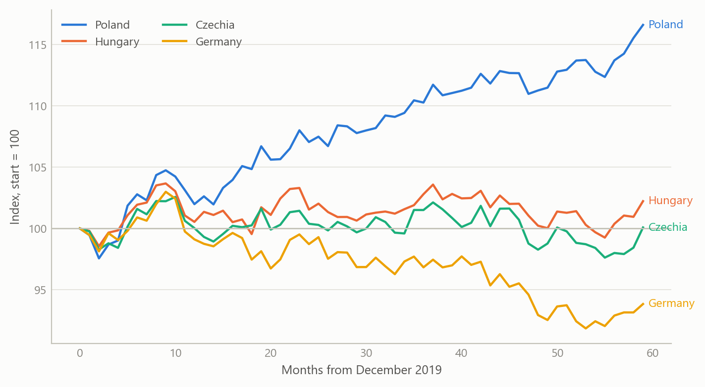
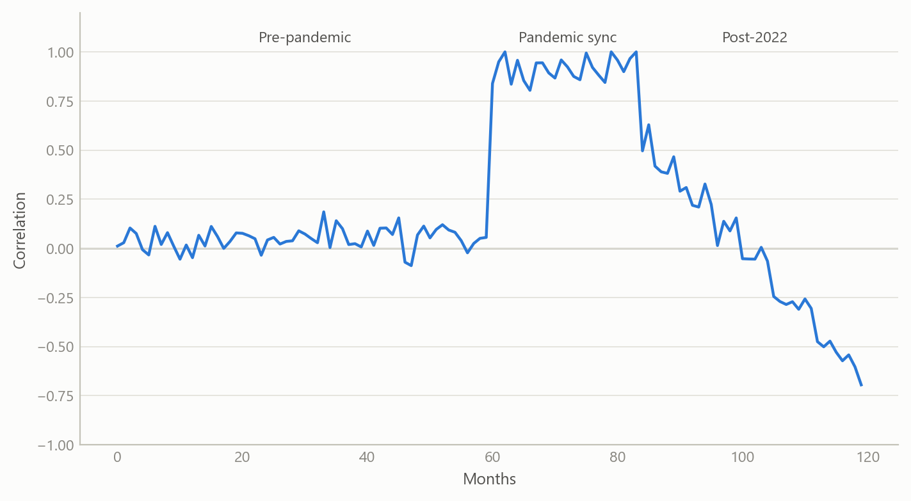
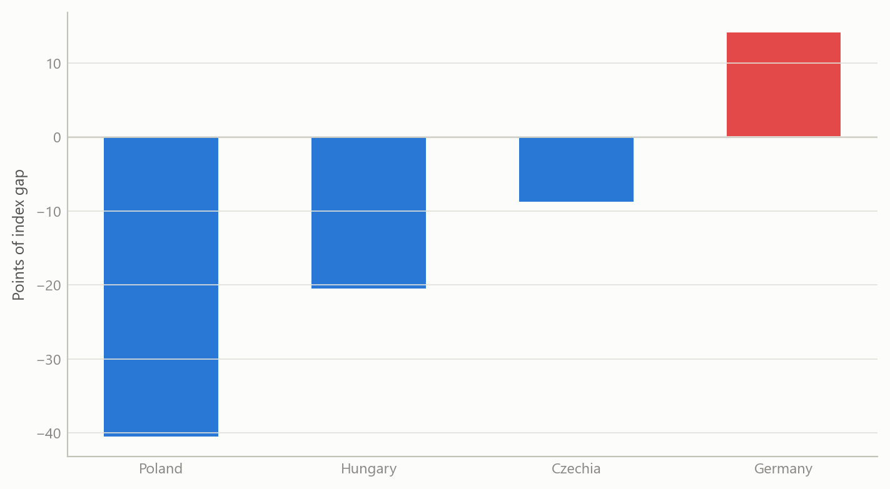
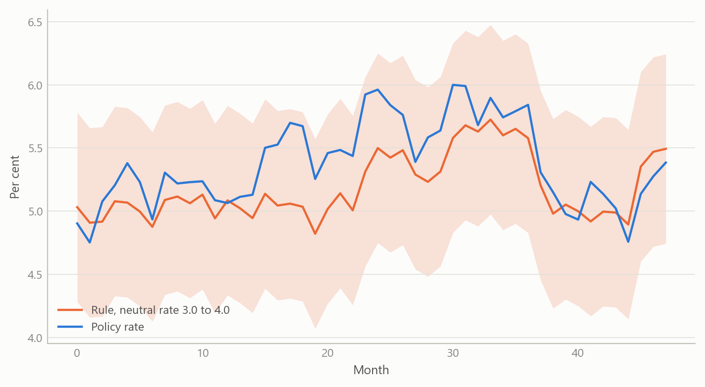

# Central Europe’s industrial drift from Germany
Carlos Galindo

> [!NOTE]
>
> ### At a glance
>
> - **Question.** Since 2022, have industrial economies in Poland, Hungary and Czechia broken away from Germany, and which of the competing stories about Polish industry, public finances and interest rates survives contact with the data?
> - **Approach.** Monthly industrial output compared with Germany in growth terms, rolling correlations, formal break tests at pre-specified dates, a margin proxy from producer prices and labour costs, and a Taylor-rule check of the Polish policy rate.
> - **Finding.** The drift is real and large in levels, but the break tests find no discrete break. The pattern is a gradual decoupling, and the evidence supports volume strength and margin weakness at the same time.
> - **Why it matters.** “Structural decay” and “cyclical rebound” are often argued as rivals. Here they describe different dimensions of one economy.

## The question

Central European manufacturing has long been wired into German supply chains, so for two decades the three economies were treated as an extension of the German cycle. Since 2022 that assumption has been under pressure. Germany absorbed an energy-price shock that hit its industrial base hard, while Poland in particular kept growing. Commentary quickly split into camps: one says Polish industry is in structural decay, another says it is a cyclical rebound; one says Polish public finances are an institutional strength, another says they are a sovereign-risk problem; one says the central bank is prudent, another says it is procrastinating.

The obvious way to settle such arguments is to pick the indicator that supports your side. This project does the opposite. It states each narrative as a testable null, chooses the evidence that could embarrass it, and reports where the data are silent. The audience is anyone who has to form a view on the region quickly, whether an economist, an investor or a policy reader, and needs to know which claims are safe to repeat.

## Approach

**Data.** Monthly industrial output, producer prices, retail trade and consumer prices for Poland, Hungary, Czechia and Germany, with quarterly labour-cost indices, policy rates and long-term government bond yields, all from official statistical sources. The monthly panel covers 62 series. Growth is always measured as three-month-on-three-month change on seasonally adjusted data, never as year-on-year change, which blurs turning points.

**Divergence.** Each country’s industrial output was indexed to its December 2019 level and compared with Germany. The co-movement of Polish and German output growth was tracked with a rolling 24-month correlation, split into a pre-pandemic, a pandemic-synchronisation and a post-2022 window. A single-factor decomposition of the four output series gave the share of common variation.

**Narrative tests.** For the industry narrative, the null was that the divergence is cyclical and will revert as energy prices normalise. It was tested with Chow tests for a shift in the growth relationship at three pre-specified dates: the financial crisis, the pandemic and the 2022 energy shock. For competitiveness, a margin proxy was built as the gap between output-price and wage-cost indices. For public finances, bond spreads and real yields were examined. For monetary policy, the policy rate was compared with a Taylor rule using inflation, an output measure and unemployment, with an assumed neutral real rate of 3.5 per cent.

**Checks.** Every result was reported with its sample length and its power limits, and each claim was classed as structural or cyclical only against an explicit multi-cycle standard. Where a figure came from outside the dataset, it was labelled as context and not used in a test.

## What the work shows

### The levels have moved apart

Measured against December 2019, Polish industrial output stands 18.2 per cent higher, Hungarian 3.1 per cent higher and Czech 1.2 per cent higher, while German output is 6.7 per cent lower. That is a large reallocation of European manufacturing in four years, and it is the fact that fuels the structural-decay and structural-shift stories alike.

Figure 1: Industrial output indexed to December 2019 = 100, four economies, monthly (simulated data).

### Co-movement fell, but not to a break

The correlation of Polish and German output growth is the sharpest single piece of evidence. It was strongly positive in the pandemic window, at about +0.92, when synchronised closures and reopenings moved everything together. In the post-2022 window its average was +0.39, and the latest reading was -0.67. A first reading of the last value says the link has inverted. A fuller reading says the window average is still positive, and the latest value may be the tail of the energy shock and not a permanent state. The single-factor share is also misleading: it is dominated by the pandemic crash and rebound, so a high full-sample common share coexists with a weaker post-2022 link.

Figure 2: Rolling 24-month correlation of Polish and German output growth, three regimes (simulated data).

### No discrete break

Output growth momentum slowed from a pre-2022 mean of +0.448 per cent to a post-2022 mean of +0.147 per cent per quarter-on-quarter-style step, a shift of about 0.30 percentage points, which is meaningful but not catastrophic. The Chow tests at the three pre-specified dates give p-values of 0.22 for the financial crisis, 0.69 for the pandemic and 0.23 for the 2022 shock. None is significant. The slowdown is gradual. That is the basis for the headline: a gradual decoupling, not a structural break. The tests state their scope: the post-shock sample is only a few dozen months, so low power could hide a real change, and the null of a cyclical divergence cannot be rejected either.

### Volume strength, margin weakness

The margin proxy, output prices less wage costs, is where the picture turns. Germany is the only economy in which output prices exceed wage costs, by 15.5 points. Poland’s gap is -45.4 points, Hungary’s -23.9 and Czechia’s -10.3. Poland therefore shows the strongest volume growth and the weakest margin at once. This resolves much of the “structural decay versus cyclical rebound” argument: decay refers to margins and competitiveness, rebound to output volume, and both can be true when growth is driven by wages and not by pricing power. The proxy is not a firm-level margin, so it is a direction-of-pressure indicator and nothing more.

Figure 3: Margin proxy, output-price index minus wage-cost index, four economies (simulated data).

### A policy rate close to its rule

For the Polish policy rate, the last full-data observation, December 2023, was 5.54 per cent against a Taylor-rule value of 5.41 per cent with the assumed neutral rate. The gap of 0.13 points means policy was essentially neutral by that standard. In the later data vintage the central bank cut by 175 basis points between May and December 2025 while its Hungarian peer held its rate throughout and the Czech bank cut a quarter point. Three different strategies followed similar inflation convergence. The rule explains little on its own: in the broader panel regression, output variation is almost entirely idiosyncratic, with an R-squared of about 0.03 on 853 observations. And the conclusion is conditional on the neutral rate, which was assumed, not estimated.

Figure 4: Policy rate against a Taylor-rule band for a range of neutral rates (simulated data).

## Insights

1.  **Level divergence and dynamic decoupling are different claims.** Output levels diverge sharply, while growth co-movement fades gradually. Arguing from the first to a “structural” label skips a step.
2.  **Volume and margins can point in opposite directions.** The most polarising economy in the group is polarising because its volume and margin indicators disagree, so analysts disagree for good reason.
3.  **A last observation is not a regime.** The latest correlation value is far below the window average. Reporting both keeps a tail event from being read as a permanent state.
4.  **A rule check is only as good as its neutral rate.** Fixing the neutral rate makes the verdict a conditional statement. The right output is a band, not a point.
5.  **Say what cannot be tested.** Public finances could be discussed only through bond pricing, because no fiscal balance or debt series was in the dataset. The fiscal narrative was therefore left as plausible on both sides, with bond yields placing Poland between Czechia and Hungary.

## Scope and next steps

The analysis is built to separate structural from cyclical divergence in Central European industry, combining break tests, a policy-rule check, margin and real-rate measures, and bond pricing.

The natural extensions are three. First, refreshing every series to a common end date and re-running the break tests as the post-2022 sample lengthens toward two full cycles. Second, a sensitivity band around the neutral rate in the policy-rule check. Third, firm-level margin data and survey-based inflation expectations, to sharpen the profit and real-rate readings.

## About the evidence

The analysis is a 2026 piece of independent work built on official monthly and quarterly statistics for four economies, with 62 series and 837 months at the longest. The figures in this note are illustrative simulations that share the structure of the real analysis. The numbers in the text are the project’s own results.

Figures and tables marked *simulated* are generated from simulated data built to share the structure of the analysis (its variables, horizons and frequencies). They show how each method works and what its output looks like. Results stated in the text, and figures that give a source, are the project’s own. Methods are described at the level of a methods section. Code and data pipelines are not reproduced here.
