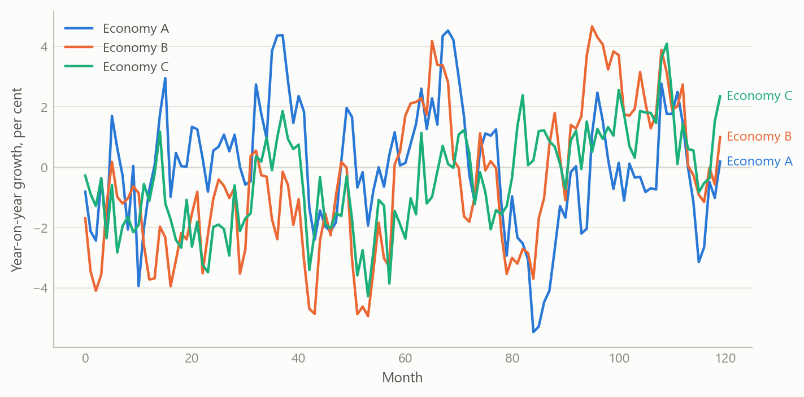
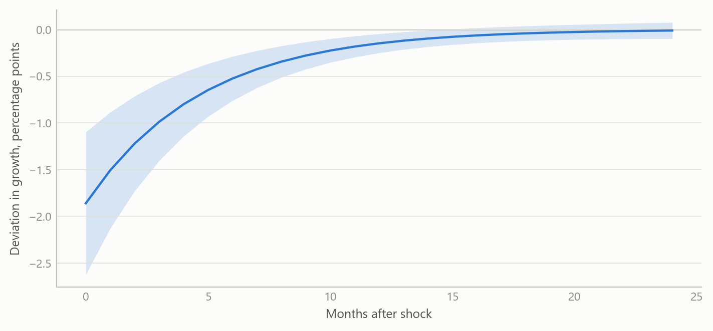
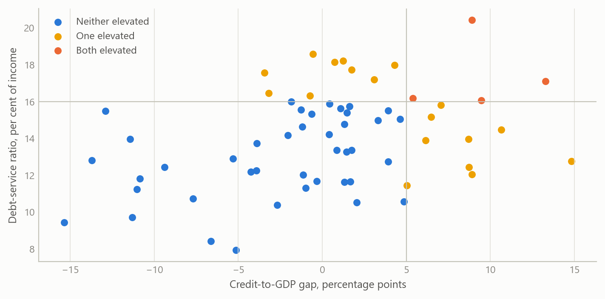

# A cross-country macro panel and what global shocks do to small open economies
Carlos Galindo

> [!NOTE]
>
> ### At a glance
>
> - **Question.** What do global shocks, macroeconomic uncertainty and financial-sector fragility do to small open economies, and can one harmonised data panel answer it routinely?
> - **Approach.** An automated monthly and quarterly panel for five economies, built from international official sources under strict frequency and aggregation rules, plus an early-warning screen built on the BIS’s published credit-gap and debt-service series.
> - **Finding.** One harmonised panel now serves monthly and quarterly analysis of five economies. Its first use, a dynamic panel of industrial output, found global market volatility the one channel that survives every specification and no robust direct effect of domestic policy rates. The early-warning screen finds no jurisdiction with a credit gap in the danger zone at the start of 2026, against 23 of 43 at the 2009 peak.
> - **Why it matters.** The panel turns a one-off analysis into a routine diagnostic that can be refreshed as new data arrive.

## The question

Small open economies are price-takers in global markets. Poland, Hungary, the Czech Republic, South Africa and Israel differ in size, monetary regime and exposure, yet their output, exchange rates and funding costs often move together when global conditions change. A macro analyst covering them needs three things at once: a comparable record of what is happening at home, a consistent measure of the global environment, and an early read on where the financial system is stretched.

The obvious approach, a country-by-country spreadsheet refreshed by hand, falls short in three ways. Definitions drift between countries and over time. Mixing monthly and quarterly series quietly invents data. And nothing is repeatable, so a conclusion cannot be checked a month later when the numbers have been revised.

This project builds the panel so that those problems are handled by design, and then uses it to ask what the global environment does to domestic activity.

## Approach

**Data.** The panel covers five small open economies at monthly and quarterly frequency from 1999 onward. It draws on international official sources and comprises 182 series: 60 global series (market volatility, commodities, US rates and activity, uncertainty and geopolitical-risk indices, credit and sentiment measures) and 122 country-specific series covering prices, output, labour markets, policy rates, exchange rates, external accounts, fiscal positions and financial stability. Global series are fetched once and attached to every country, so every economy faces an identical global backdrop.

**Design rules.** Three rules do most of the work.

- The monthly panel contains monthly series only. Quarterly or annual series are never forward-filled into months; they live in the quarterly panel instead.
- When series are aggregated up to quarters, the rule follows the economic type: flows are summed, stocks are averaged or taken at period end, and rates are averaged.
- Seasonally adjusted and unadjusted series are not mixed, units and transformations are audited, and every series carries its source and revision history so a later refresh can be compared with an earlier one.

**Diagnostics framework.** The panel is organised around three blocks: global shocks, macroeconomic uncertainty, and financial-sector vulnerability. For the last, the screen uses the two early-warning series the BIS publishes for the private non-financial sector: the credit-to-GDP gap, available for 43 jurisdictions, and the debt-service ratio, available for 32 of them. Four of the five panel economies have both; Israel has the credit gap only. The screen reads both series directly from the BIS, with the download date recorded, because an earlier extraction had stored the credit-to-GDP ratio under the gap’s label.

**Estimation.** Industrial output growth is modelled as a dynamic panel: its own lag, the policy rate, inflation, the change in the sovereign spread, oil prices, and a market volatility index. Estimators include pooled and fixed-effects least squares, fixed effects with standard errors clustered by time (so that contemporaneous cross-country correlation is respected), and two instrumental-variable estimators in first differences. The panel is balanced with five countries and about 326 months, from January 1999 to February 2026, so fixed-effects bias from the lagged dependent variable is small.

**Checking.** Results were compared across estimators and re-estimated after a data correction to one country’s price series. Where the original dynamic-panel estimation used a very large instrument set relative to five countries, it was replaced by a parsimonious one and the test of instrument validity re-run.

## What the work shows

**Persistence dominates.** Industrial growth carries strong inertia: the own-lag coefficient is about 0.84 in the fixed-effects model, implying a half-life of roughly four months. The ordering across estimators is what theory predicts, with pooled estimates highest and the instrumental-variable estimates lower, at about 0.67 to 0.70.

Figure 1: Industrial output growth in five small open economies: a common global factor plus strong persistence (simulated data).

**Global risk appetite is the one robust channel.** A rise in market-implied volatility lowers industrial growth contemporaneously by about 0.09 to 0.10 percentage points per index point, and the result holds in both the fixed-effects and instrumental-variable specifications. Because output is persistent, the cumulative cost of a one-off 20-point volatility spike is roughly 9.7 percentage points of growth, spread over several months, with an impact effect near 1.9 points.

Figure 2: Illustrative response of industrial growth to a one-off 20-point rise in market volatility, with an uncertainty band (simulated data).

**Domestic policy rates show no robust direct effect.** The policy-rate coefficient is statistically indistinguishable from zero in every specification. A significant negative result that appeared under the earlier, over-instrumented estimation disappeared once the instrument set was made credible, and the test of instrument validity then no longer rejected. The most plausible reading is two offsetting forces: tightening dampens output, while central banks tighten when the economy is strong.

**Oil and spreads.** Oil prices are insignificant in levels but positive and significant in first differences, which fits oil acting as a proxy for global demand rather than as a pure cost shock. The change in the sovereign spread has no contemporaneous effect. That does not make sovereign risk irrelevant: it more plausibly works through longer lags, spread levels, or thresholds that only extreme episodes cross.

Table 1: Dynamic-panel estimates for industrial output growth (year on year, per cent), five economies, monthly, 1999 to 2026. Standard errors in parentheses; the robust column clusters by month; the two instrumental-variable estimators are in first differences. \*\*\* p\<0.01, \*\* p\<0.05, \* p\<0.10. In the monetary-channel specification the volatility coefficient is −0.093 (0.023) under fixed effects with month-clustered errors and −0.103 (0.028) under the first-difference instrumental-variable estimator, both p\<0.01. Source: public macroeconomic and market series; the author’s estimates.

|  | Pooled OLS | Fixed effects | Fixed effects, robust | Fixed effects, GLS | GMM (Arellano-Bond) | IV (Anderson-Hsiao) |
|----|---:|---:|---:|---:|---:|---:|
| Lagged output growth | 0.849\*\*\* | 0.842\*\*\* | 0.842\*\*\* | 0.845\*\*\* | 0.673\*\*\* | 0.702\*\*\* |
|  | (0.014) | (0.014) | (0.029) | (0.014) | (0.142) | (0.124) |
| Policy rate | −0.017 | −0.014 | −0.014 | −0.020 | 0.190 | 0.231 |
|  | (0.034) | (0.040) | (0.076) | (0.040) | (0.341) | (0.376) |
| Inflation | −0.059\* | −0.065\* | −0.065 | −0.064\* | −0.232 | −0.270 |
|  | (0.035) | (0.036) | (0.050) | (0.035) | (0.209) | (0.226) |
| Change in sovereign spread | −0.023 | −0.003 | −0.003 | 0.013 | 0.153 | 0.125 |
|  | (0.293) | (0.293) | (0.440) | (0.299) | (0.333) | (0.323) |
| Oil price | 0.002 | 0.002 | 0.002 | 0.002 | 0.050\*\* | 0.051\*\* |
|  | (0.004) | (0.004) | (0.006) | (0.004) | (0.023) | (0.021) |
| Observations | 1,442 | 1,442 | 1,442 | 1,442 | 1,431 | 1,434 |

**Financial vulnerability.** The screen places each jurisdiction’s credit-to-GDP gap against how far its debt-service ratio sits above or below its own average over its published history, which starts in 1999 at the earliest. The BIS’s quarterly early-warning tables mark a gap above 10 percentage points as the danger zone, and its 2018 evaluation puts the standalone critical value near 9. In the first quarter of 2026 none of the 32 jurisdictions with both series is near either value: the largest gap is Japan’s, at +5.7 points, and the median is −12.7. Debt-service burdens sit well above their own averages in Türkiye, Hong Kong, Brazil and Russia, by 9.5 to 12.1 points, but none of the four has a credit gap above +0.7. Over time, the count of jurisdictions above the 10-point line peaked at 23 of 43 in the third quarter of 2009, and it has been zero since the second quarter of 2024.

Figure 3: Early-warning screen, private non-financial sector. Left: credit-to-GDP gap against the debt-service ratio’s deviation from its own average over its history (from 1999 at the earliest), 32 jurisdictions, first quarter of 2026; the vertical line marks a 10-point gap. Right: number of jurisdictions with a gap above 10 points, out of the 33 to 43 reporting each quarter, 1995 to 2026. Source: BIS credit-to-GDP gap and debt-service ratio statistics, downloaded 8 October 2026; the author’s calculations.

## Insights

1.  **Build the panel before the model.** Most of the value sat in the harmonised, rule-governed panel. Once definitions, frequencies and aggregation are fixed, each new question becomes a short exercise rather than a new data project.
2.  **Respect frequency.** Refusing to forward-fill quarterly data into months costs some coverage but avoids spurious precision. Separate monthly and quarterly panels keep each claim precise.
3.  **Instrument sets must suit the sample.** With five countries and many months, a large dynamic instrument set produced a pathological test statistic and a spurious policy effect. A parsimonious set gave a credible result. This lesson transfers to any small-N dynamic panel.
4.  **A data correction can change conclusions.** Fixing one country’s price series changed the size and significance of several coefficients, which is why every series carries its provenance.
5.  **Some gaps are real.** For some countries, series such as quarterly government debt, core inflation or debt-service ratios have no public source. Recording those gaps explicitly is better than filling them with proxies.

## Scope and next steps

The panel has only five economies, so the results describe a small group, not emerging markets in general. Estimates are contemporaneous and linear; they do not capture thresholds or longer credit lags, and the volatility effect may partly reflect common global demand. The activity model uses one output measure and should be extended to labour-market and external-account outcomes. The downstream step, turning the diagnostics into regular written macro briefs, has been designed but not built. The early-warning screen applies a published threshold to the credit gap only; it sets none for the debt-service ratio and has not been tested out of sample, so it describes where jurisdictions stand rather than predicting crises.

## About the evidence

The panel and the dynamic-panel estimates are the project’s own work during a career break, from late 2025 to early 2026, built with AI assistance under my direction as systems architect. The text and the table report real results from that work; the table was re-fitted from the stored panel, which reproduces the reported estimates exactly. The first two figures are simulated to share its structure (five units, monthly frequency) and are not the project’s estimates. The early-warning figure is real: new work from October 2026 on the BIS’s public series, with the screen’s rules fixed before it was first run; the count over time was added afterwards as a description.

Figures and tables marked *simulated* are generated from simulated data built to share the structure of the analysis (its variables, horizons and frequencies). They show how each method works and what its output looks like. Results stated in the text, and figures that give a source, are the project’s own. Methods are described at the level of a methods section. Code and data pipelines are not reproduced here.
