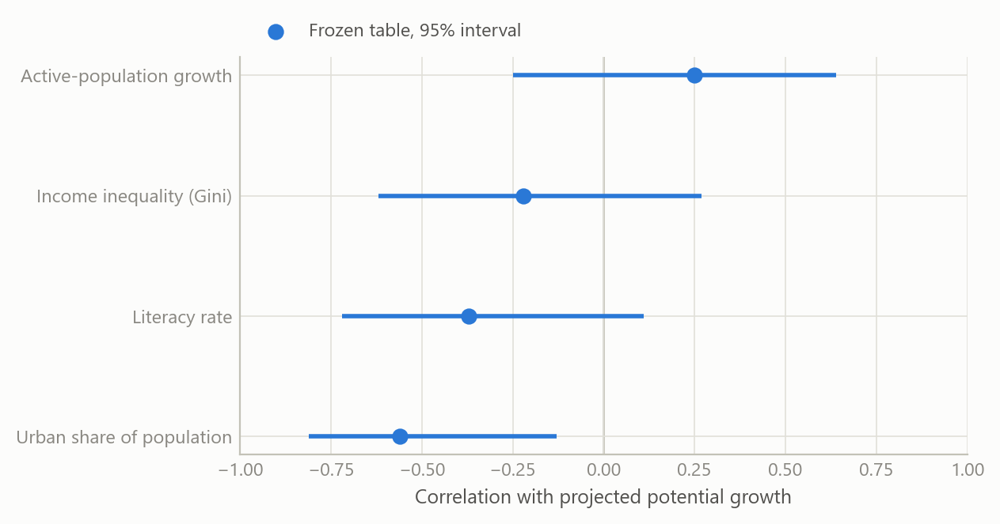
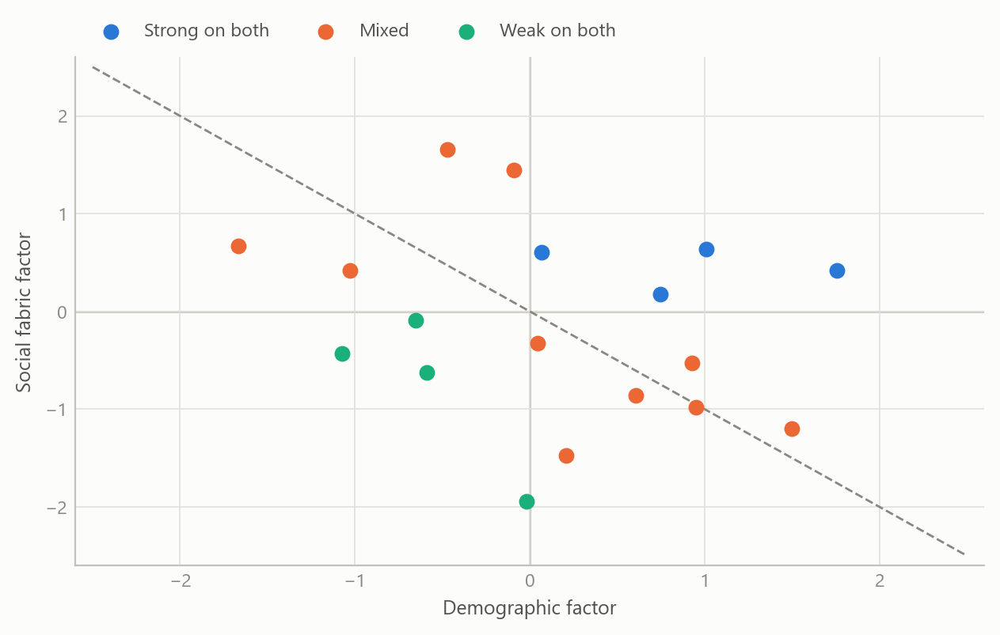
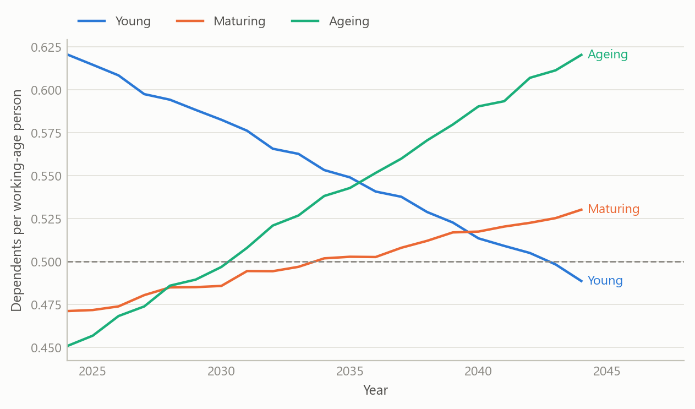

# Demographics and growth in emerging markets
Carlos Galindo

> [!NOTE]
>
> ### At a glance
>
> - **Question.** How far do a country’s demographic trajectory and its social conditions together explain how fast an emerging economy can grow over the next two decades?
> - **Approach.** Pair published population projections with public social indicators for 18 economies, reduce each block to a single factor, and compare both factors with projected potential growth.
> - **Finding.** Estimated on one frozen dataset, working-age growth (+0.25) and inequality (−0.22) point the expected way but cannot be told apart from zero in 18 economies. Only urbanisation has a link whose 95% interval excludes zero, and it is negative, a level effect. A demographic and a social factor each line up with growth, in opposite directions, and cancel in an equal-weight composite.
> - **Why it matters.** It tests the “demographic dividend” story against the projections themselves, and checks each early correlation against a frozen re-run, so that only relationships that hold carry the conclusions.

## The question

Demographics is the slow variable in macroeconomics. Births, deaths and migration set the size of the workforce a generation ahead, and they are known with far more confidence than almost anything else in a long-run forecast. The popular story is that a young, growing population is a growth engine and an ageing one is a drag.

That story is incomplete in a way that matters to anyone allocating attention or capital across emerging markets. A large cohort of working-age people is a potential, not an outcome. It becomes growth only when those people are educated, healthy, employed and able to move up, and when savings and investment follow. This project asked a simple question of that framework: across a broad group of emerging economies, how much of projected growth lines up with demography, and how much with the social conditions that decide whether demography pays?

The work was a research note and a presentation, written and delivered in under a week in spring 2025. It was built to be read by decision-makers, so it favours a clear structure and a short list of takeaways over econometric detail.

## Approach

**Coverage.** The sample covers 18 emerging economies across Latin America, emerging Asia, Central and Eastern Europe, the Middle East and Africa. For each one the project assembled projected annual growth of total and economically active population over 2024–2044, the year in which the working-age population peaks, the year in which the dependency ratio crosses one half, and projected potential output growth over the same horizon taken from published external work. A second block of public indicators described social conditions: literacy, urbanisation, income inequality, life expectancy, connectivity, access to electricity, and spending on education and health.

**Framework.** The note starts from the demographic dividend: a falling dependency ratio opens a window in which savings, investment and productivity can rise, provided human capital and social mobility keep up. It also treats the mirror image, demographic drag, when the workforce shrinks and the dependency burden climbs.

**Factors.** To avoid choosing among dozens of overlapping indicators, each block was standardised and reduced to its first principal component. The demographic factor was built from six population variables and the social fabric factor from twelve variables on education, infrastructure and well-being. A composite score averaged the two with equal weights. Each country’s score can be decomposed into the contribution of every underlying variable, which makes the ranking explainable in a meeting rather than a black box.

**Reading the relationships.** Factors and individual indicators were set against projected potential growth with correlations, simple regressions and a quadrant map that sorts countries by strength of demography and strength of social fabric. A cluster analysis grouped economies with similar profiles. A comparison across several published long-run growth scenarios gave a sense of how wide the disagreement over each country’s trajectory is.

## What the work shows

**Demography lines up with growth, weakly.** On the frozen table of 18 economies, growth of the economically active population and projected potential growth have a correlation of +0.25, with a 95% interval from −0.25 to +0.64. The sign is the one the dividend story predicts, but 18 observations cannot separate it from zero. Total population growth adds nothing beyond it: in the source table the two series differ by a constant in every economy.

Figure 1: Correlation of each indicator with projected potential growth, 18 emerging economies, 2024-2044. Dots: frozen final table, with 95% intervals. Source: the project’s final 18-economy table (published population projections, long-run growth scenarios and development indicators); the author’s calculations.

**Inequality: the sign survives, the strength does not.** The spring summary put the inequality-growth correlation at about −0.74, the strongest of the social links. The frozen table gives −0.22, with an interval from −0.62 to +0.27, and the rank correlation is only −0.08. The earlier figure most likely came from a wider early sample that included several Gulf economies and Egypt, which the final table does not contain. The one link whose interval excludes zero is urbanisation, at −0.56 (−0.81 to −0.13), with literacy at −0.37 close behind. These negative signs look perverse until one notices who is in the sample: economies that are already highly urbanised and literate are the mature ones, with lower growth ceilings. These are level effects, not evidence that schooling or cities hurt growth. The note says so plainly, because a naive reading would recommend the opposite of what the development literature shows. Adding the United States to the sample moves none of the four correlations by more than 0.03.

**The standout cases are the instructive ones.**

- India combines a growing workforce, with its working-age population peaking around 2032, with the highest projected potential growth of the group, despite the weakest social scorecard on literacy and urbanisation. Its case rests on scale and on the scope for upward mobility if policy delivers.
- South Africa has a similarly favourable demographic profile but the lowest projected potential growth of the group. Inequality and weak human capital are the standard explanation, and it is the clearest example of a dividend that goes uncollected.
- Korea and Taiwan show the opposite: shrinking workforces, high literacy and low inequality, and growth sustained by productivity.

**Two factors, four quadrants.** Plotting the demographic factor against the social fabric factor sorts the economies into four groups: strong on both, strong demography with weak social fabric, the reverse, and weak on both. The factors summarise their blocks unevenly: the first demographic component captures 0.63 of the variance of its six variables, the social component 0.44 of its twelve. On the frozen table the demographic factor correlates at +0.64 with projected growth (R-squared 0.40), but its loadings are dominated by population size, so it mostly says that India and China are both large and fast-growing. The social factor correlates at −0.52 (R-squared 0.27): the mature, well-served economies are projected to grow more slowly, which is convergence rather than a social drag. Because the two point in opposite directions, the equal-weight composite explains almost nothing (R-squared 0.001).

Figure 2: Demographic factor against social fabric factor for 18 economies, grouped by quadrant, with the equal-weight composite as the diagonal (simulated data).

**The timing matters as much as the level.** The most useful single variable for a decision-maker is not the growth rate of the population but when the dependency ratio crosses one half, and when the workforce peaks. Some economies are decades from that threshold, others have already passed it. The stylised paths below show three types of profile.

Figure 3: Stylised dependency-ratio paths, 2024-2044, for a young, a maturing and an ageing economy; the dashed line is the one-half threshold (simulated data).

## Insights

1.  **Eighteen economies cannot confirm a dividend.** Working-age growth and inequality carry the expected signs, but neither interval excludes zero. The same working-age growth appears alongside very different projected growth, and India and South Africa sit at opposite ends of the group with similar demographic profiles.
2.  **A composite can hide two signals.** The demographic and social factors each line up with projected growth, in opposite directions, and an equal-weight average cancels them. Look at the components before trusting an index.
3.  **Productivity can offset shrinking numbers.** The high-literacy, low-inequality economies with falling workforces still show respectable projected growth, which says that the weight falls on output per worker.
4.  **Timing beats averages.** The year a workforce peaks and the year the dependency ratio crosses one half say more about the investment horizon than a twenty-year average growth rate.
5.  **Level effects mislead.** Negative correlations for literacy and urbanisation reflect mature economies with lower growth ceilings, not a harm from education.
6.  **Disagreement among scenarios is information.** Long-run growth scenarios from different institutions can differ by several percentage points for the same country, so a single projection should not be treated as a fact.

## Scope and next steps

The study is built to test the demographic-dividend argument against long-run growth projections across a cross-section of economies, on one frozen table, so that every quoted value traces to a single source. Because the projections embed demographic assumptions of their own, it reads how forecasts line up with fundamentals.

The natural extensions are four. First, a demographic factor built from the speed and timing of population change rather than its size. Second, dependency-ratio timing as an explicit regressor, and a measure of productivity growth. Third, realised growth outcomes in place of projections, to move from how forecasts line up with fundamentals to what fundamentals cause. Fourth, a wider sample of economies, to test whether the working-age and inequality effects hold in a larger cross-section.

## About the evidence

The note and presentation were produced in spring 2025, using published population projections, published long-run growth scenarios and public development indicators for 18 emerging economies. Correlations, intervals and explained variance in the text are estimated on the project’s frozen final table of 18 economies, with 95% intervals from the Fisher transformation. The correlation chart shows these derived statistics, not the underlying third-party projections. The quadrant chart and the dependency-ratio paths are simulated to share the structure of the analysis and are not the project’s results.

Figures and tables marked *simulated* are generated from simulated data built to share the structure of the analysis (its variables, horizons and frequencies). They show how each method works and what its output looks like. Results stated in the text, and figures that give a source, are the project’s own. Methods are described at the level of a methods section. Code and data pipelines are not reproduced here.
