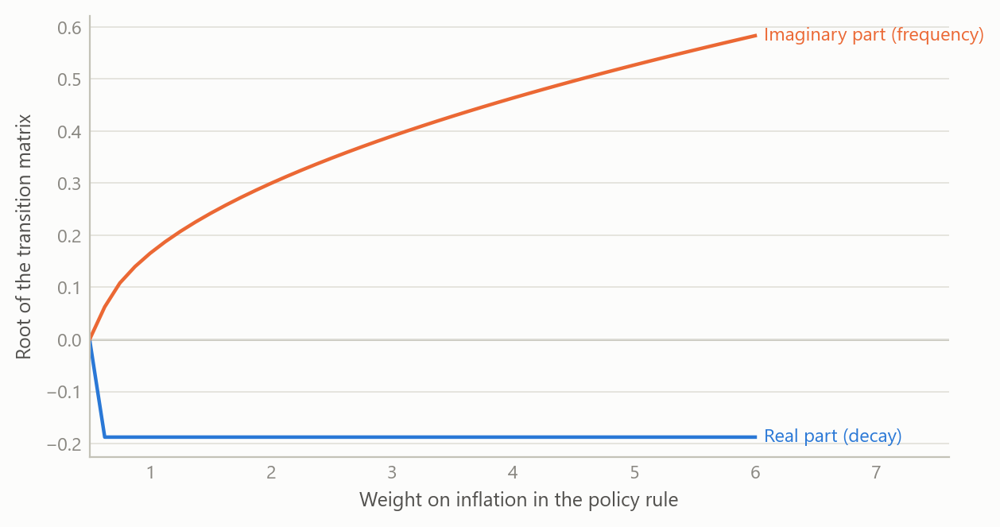
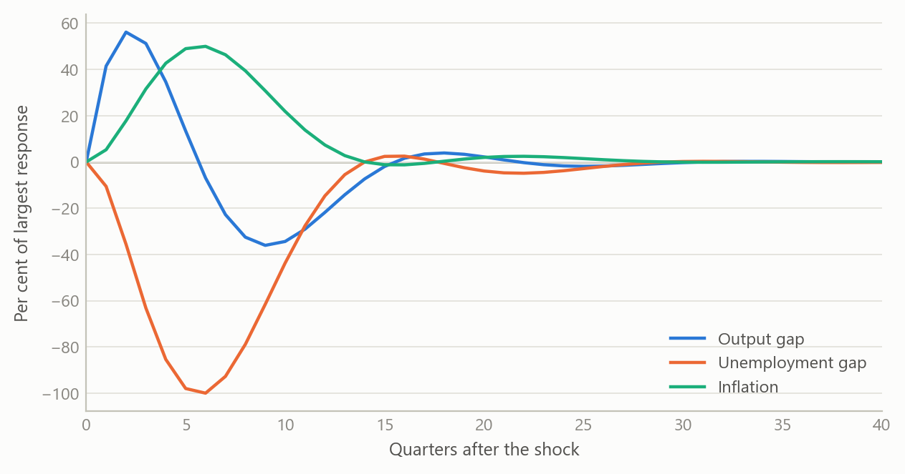
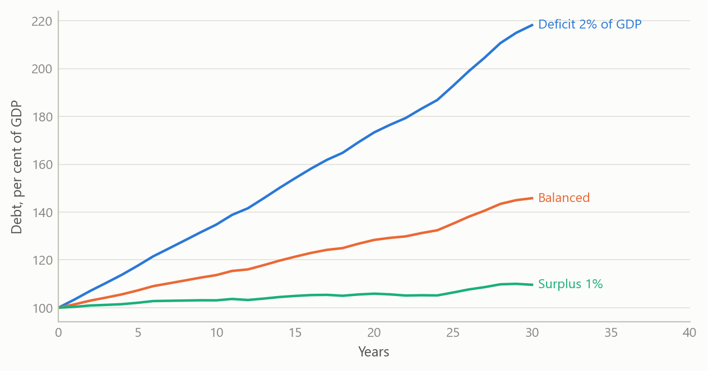

# Derivation notes for the core macro models
Carlos Galindo

> [!NOTE]
>
> ### At a glance
>
> - **Question.** Can the workhorse models used for macro projection be written out so that each equation is derived, not asserted, and so that a reader can see exactly when the system is stable?
> - **Approach.** Step-by-step derivation notes for the output–inflation–interest-rate system and for a quarterly projection model, plus explanatory notes on the New Keynesian model and on debt dynamics.
> - **Finding.** The three-equation system reduces to a small matrix whose roots can be read off by hand; the same reduction shows what a projection model becomes once expectations are removed.
> - **Why it matters.** A model that cannot be derived line by line cannot be audited, taught or trusted in a briefing.

## The question

Policy models are usually met as finished equations: an output equation, an inflation equation, a rule for the interest rate. The reader is asked to accept the coefficients and the signs. That is fine for someone who already works with the model every day. It is a poor basis for anyone who has to defend a forecast, explain a surprise or decide whether a change to the model is safe.

These notes start from the other end. Each equation is built from a simple economic argument, linearised, and then assembled into a system whose behaviour can be inspected. The aim is that a reader with only school algebra can follow every step, and that an expert can see at a glance where each assumption enters. Four topics are covered: a three-equation model of output, inflation and the policy rate; a quarterly projection model of the semi-structural kind used by central banks; the New Keynesian version of the same three-equation core; and the arithmetic of public debt.

## Approach

The notes were written during the career-break rebuild of my macro toolkit, working with AI assistance as a systems architect would: I specified the structure, the order of derivation and the checks, and reviewed every result. There is no data in the derivations themselves. The method is analytical, followed by a numerical check of the algebra.

**The output–inflation–interest-rate system.** The goods-market equation is derived from the condition that income equals spending, with consumption depending on disposable income and investment on the interest rate. Solving for output gives a downward-sloping relation between the two, which is then linearised around the natural level to give output-gap dynamics driven by the deviation of the rate from its neutral value plus a demand shock. The inflation equation comes from the labour market: when unemployment is below its natural rate, bargaining power shifts to workers and inflation rises above its target. A third relation links unemployment to the output gap, with a coefficient of 0.5, so that a 2 per cent output gap lowers unemployment by 1 percentage point. The rule closes the loop: the policy rate rises with inflation above target and with a positive output gap. The textbook illustration uses weights of 1.5 on inflation and 0.5 on the gap.

Put together, these are four relations in continuous time. A demand shock moves output; output moves unemployment; unemployment moves inflation; inflation moves the rate; and the rate feeds back into output. The notes then discretise the system with a step of 0.1 of a quarter, so that it can be traced period by period, and state the assumptions that make it tractable: a closed economy, rational expectations, log-linear output, a steady state at the natural rate, a temporary shock that decays exponentially, and fixed structural parameters.

**The quarterly projection model.** Semi-structural projection models combine forward-looking expectations with inertia and with blocks for demand, supply, policy, fiscal and external sectors. The notes ask a precise question: under what conditions does such a model collapse to a vector autoregression? The answer is derived in steps. Write the model as a linear system with expected future values on one side and current and lagged values on the other. Set the expectation weights to zero and relax the policy-rule restrictions. The system then becomes a pure vector autoregression in which current variables depend on their own lags, on exogenous drivers and on uncorrelated structural shocks. Each block (demand, inflation, the policy rule, fiscal, external and exchange rate) is converted separately before being stacked. The stability condition is stated in companion form: every root must lie strictly inside the unit circle.

Two extensions are worked through with numbers. One is a monthly system with a latent monthly series for quarterly output, so that quarterly releases can be linked to monthly dynamics. The other embeds the minimal three-variable core in a larger eight-variable state, with the impulse response to a unit output shock computed explicitly.

**The New Keynesian model and debt dynamics.** For the New Keynesian model the notes are explanatory rather than derivational: the three equations, the feedback loop from inflation to the rate to output and back, and the condition under which the loop stabilises. For public debt, the notes derive the change in the debt ratio from the government budget constraint scaled by nominal output, and then linearise it.

**Checks.** Every system derived by hand was written as a state matrix and its roots computed numerically, so that the algebra was tested against a calculation rather than re-read.

## What the work shows

**A small matrix, readable by hand.** Collecting the output gap, unemployment and inflation into a state vector, the three-equation system has a 3-by-3 transition matrix. With an interest-rate sensitivity of 0.25, a Phillips slope of 0.5, an output–unemployment coefficient of 0.5, and rule weights of 3.0 on inflation and 1.5 on the gap, the roots are a zero root and a complex pair with real part −0.1875 and imaginary part about 0.39. The zero root belongs to unemployment, which is a pure integral of the output gap and does not feed back. The pair governs the cycle: negative real part means every shock dies out, and the imaginary part means it does so with oscillations.

The structure of the answer is more useful than the numbers. The real part of the pair equals minus half the product of the interest-rate sensitivity and the weight on the output gap. It does not depend on the weight on inflation. The weight on inflation controls only the frequency. Moving that weight from 1.0 to 5.0 raises the imaginary part from about 0.17 to about 0.53, leaving the decay rate unchanged. In words: a more aggressive response to inflation makes the cycle faster, not shorter-lived; damping comes from responding to the output gap. This follows directly from the characteristic polynomial, which is the point of writing the derivation out.

Figure 1: Roots of the three-variable system as the inflation weight in the policy rule rises (simulated data).

**What a shock looks like.** A demand shock that decays over a few quarters lifts output first, then pulls unemployment down, then raises inflation; the rule responds and pushes everything back. The responses are small and damped, and the rule brings all three back to steady state.

Figure 2: Responses to a decaying demand shock: output gap, unemployment gap and inflation, in per cent of the shock’s peak (simulated data).

**From projection model to autoregression.** The derivation shows the exact price of removing expectations: the resulting autoregression is purely inertial. It is useful as a diagnostic benchmark, because any gap between the full model’s forecasts and the autoregression’s is attributable to expectations and policy behaviour. It is unsuitable for forward-guidance questions, because without expectations a promised future path of rates has no effect today. The notes also list the minimum inputs needed to build the system: the series for each block, their transformations to gaps, and the checks on quality and stationarity.

**Debt dynamics.** The change in the debt ratio is the interest-growth differential times the opening debt ratio, minus the primary balance. Two implications follow from the algebra alone. First, the primary balance needed to hold the ratio constant is the differential times the debt ratio, so the same differential demands a larger surplus the higher the debt. Second, when the differential is positive the ratio compounds, and small shocks to the interest rate matter more as debt rises. The figure shows the shape of this using simulated paths.

Figure 3: Simulated debt-ratio paths for three primary-balance settings, with a persistent, noisy interest-growth differential (simulated data).

## Insights

- **Derivation exposes what a table of coefficients hides.** The finding that the decay rate does not depend on the inflation weight is invisible in a calibration table and obvious in the polynomial.
- **Stocks and flows are a discipline, not a footnote.** Treating levels as integrals of flows is what makes the zero root appear, and what makes the discrete trace match the continuous system.
- **Stability is a property of the whole loop.** For the three-equation core in its New Keynesian form, the standard requirement that the policy rate respond more than one-for-one to inflation is what stops expectations from becoming self-fulfilling; the notes show where in the loop that requirement bites.
- **Removing expectations is a modelling decision with a known cost.** The implied autoregression is a clean benchmark precisely because it is blind to policy credibility.
- **Pedagogy and audit are the same thing.** Writing each step so a newcomer can follow it is also the fastest way to find the step that does not follow.

## Scope and next steps

These are derivation and explanation notes, not estimation. The coefficients in the worked examples are illustrative calibrations, chosen to make the algebra concrete; they are not estimates from data and should not be read as such. The three-equation system is closed-economy and uses a single shock. The projection-model notes derive the autoregressive form and set out the inputs it needs, but do not report an estimated model.

The explanatory notes on the New Keynesian model and on debt dynamics were built partly from secondary reading, and any empirical magnitudes quoted there would need to be re-checked against primary data before being relied on; they are not used here. The natural next steps are to estimate the quarterly system on real data, to test the autoregressive benchmark against out-of-sample forecasts, and to extend the debt identity with a stochastic differential and a fiscal reaction function.

## About the evidence

The real content of this project is the derivations and the numerical checks of them, written in 2025. The numbers quoted in the text are the calibrated parameters and the roots computed from them; they come from the notes’ own numerical appendix. All figures in this page are simulated, and the debt paths in particular are illustrative.

Figures and tables marked *simulated* are generated from simulated data built to share the structure of the analysis (its variables, horizons and frequencies). They show how each method works and what its output looks like. Results stated in the text, and figures that give a source, are the project’s own. Methods are described at the level of a methods section. Code and data pipelines are not reproduced here.
