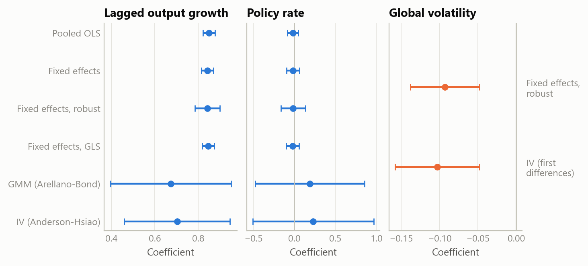
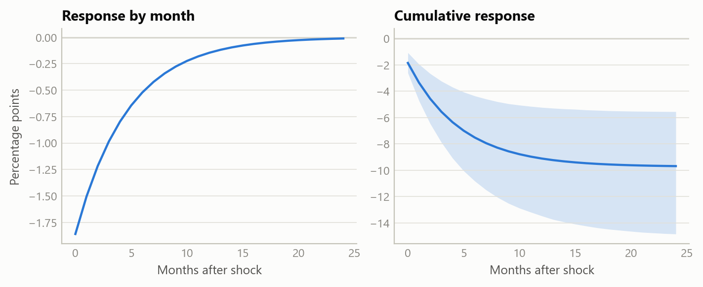

# What drives industrial output in five emerging economies
Carlos Galindo

> [!NOTE]
>
> ### At a glance
>
> - **Question.** What moves industrial output growth in a small set of open emerging economies: domestic monetary policy, or conditions set abroad?
> - **Approach.** A dynamic panel of five economies, monthly from 1999 to 2026, estimated by several methods that treat persistence and endogeneity differently.
> - **Finding.** Output growth is highly persistent. Global risk appetite is the one driver that survives every specification. The policy rate has no measurable direct effect.
> - **Why it matters.** For a forecaster or a policymaker, it shifts attention from the domestic rate path to the global risk regime, and it shows how fragile a “significant” policy effect can be.

## The question

Emerging-economy industrial output is often modelled as a response to domestic conditions: the policy rate, inflation, the exchange rate. Yet these economies are small, open and exposed to the same global swings in risk appetite, commodity prices and financing conditions. A model that includes only domestic variables can attribute to home policy what really belongs to the world.

The project asks a plain question: once persistence is accounted for, which variables have a stable, measurable association with industrial output growth across five emerging economies? The obvious approach, a single regression on one country, falls short for three reasons. A single country offers too little variation to separate global from local forces. Output growth is strongly autocorrelated, which biases naive estimates. And policy rates respond to the same conditions they are supposed to influence, so a simple regression mixes cause and effect.

## Approach

**Data.** The panel covers five emerging economies at monthly frequency from January 1999 to February 2026, a balanced panel of about 326 months per economy, or 1,630 country-months before lags. The outcome is the year-on-year growth rate of industrial production. The explanatory variables are the policy rate, domestic inflation, changes in sovereign spreads and the oil price in the main specification, with a second specification on the monetary channel using the real interest rate, the change in the real effective exchange rate and a measure of global equity-market volatility. Daily and weekly series were averaged to monthly rather than sampled at month end, which matters in crisis months when volatility is extreme.

**Method.** The core model is a dynamic panel: output growth depends on its own lag plus the drivers above. It was estimated several ways, so that no conclusion depends on a single estimator:

- pooled least squares, which ignores country differences;
- fixed effects, with standard errors that allow for correlation across countries within the same month;
- feasible generalised least squares;
- two instrumental-variable estimators that use lagged levels of output growth to handle the endogeneity that lagged outcomes create.

**Checks.** With only five economies and a long time dimension, the usual dynamic-panel worry runs the other way. The classic small-sample bias in fixed effects is of order one over T, roughly 0.003 here, so fixed effects is reliable. By contrast, estimators designed for many units and few periods can generate far more moment conditions than there are cross-sections. An earlier estimation with a very large instrument set produced a pathological over-identification test and a spurious significant policy-rate coefficient. Using a small, pooled instrument set restored a test that does not reject. Results were also re-estimated after correcting one economy’s inflation series, which removed a spurious significance in the real rate and strengthened the global-risk effect.

## What the work shows

**Persistence dominates.** The coefficient on lagged output growth is about 0.84 under fixed effects, close to the pooled value, and 0.67 to 0.70 under the instrumental-variable estimators. That ordering is what theory predicts: pooled estimation overstates persistence, and the instrumented estimates sit lower. At 0.84 a shock to output growth has a half-life of roughly four months. Most of the explained variation, about 71 per cent in the levels models, comes from this inertia.

**Global risk appetite is the one robust driver.** In the monetary-channel specification the coefficient on global equity-market volatility is about −0.09 under fixed effects and −0.10 under instrumental variables, and it is significant at the one per cent level in both. A one-point rise in the volatility measure lowers output growth by about a tenth of a percentage point in the same month. Because of persistence, the cumulative cost of a one-off 20-point surge is roughly 10 percentage points of output growth spread over the decay path, with about 1.9 points on impact. That is the scale of episodes such as the global financial crisis and the pandemic.

**No measurable direct effect of the policy rate.** In the main specification the policy-rate coefficient is −0.014 with a robust standard error of 0.076 under fixed effects, and +0.190 with a standard error of 0.341 under the GMM instrumental-variable estimator. Neither is distinguishable from zero, and the sign changes. The real rate gives the same answer. Two forces plausibly offset: higher rates restrain activity, while central banks raise rates when activity is strong. The work does not claim policy is irrelevant. It claims that a direct, contemporaneous effect cannot be measured in this panel once global conditions are controlled.

Figure 1: Estimated coefficients with 95% intervals, by estimator. Left and centre: the main specification (the two instrumental-variable estimators are in first differences). Right: global equity-market volatility in the monetary-channel specification, fixed effects with month-clustered errors and the first-difference instrumental-variable estimator. Five economies, monthly, 1999 to 2026. Source: public macroeconomic and market series; the author’s estimates.

**The other channels are weak or conditional.** Inflation has a negative sign in every specification, consistent with a cost channel, but it is significant only at the ten per cent level and loses significance once errors are clustered by month. Oil is insignificant in levels but positive in first differences, which reads as a global-demand proxy rather than a supply shock for these economies. Sovereign-spread changes have no contemporaneous effect; the work suggests that any effect runs through longer lags, spread levels or thresholds, and treats that as untested.

Figure 2: Response of output growth to a one-off 20-point rise in global volatility, from the estimated persistence (0.81) and volatility coefficient (−0.093) of the monetary-channel fixed-effects model. Shaded: 90% band from 4,000 draws of the two coefficients. Source: public macroeconomic and market series; the author’s estimates.

## Insights

1.  **Look abroad first.** In small open economies the global risk regime explains more output variation than any domestic variable tested.
2.  **A null is a result.** The absence of a direct policy effect holds across estimators once the instrument set is credible, and an earlier “significant” effect did not.
3.  **Match the estimator to the panel.** With few units and many periods, fixed effects is sound and heavily instrumented GMM is the hazard, the reverse of the textbook case.
4.  **Persistence amplifies.** A small contemporaneous effect becomes a large cumulative one when output growth has a four-month half-life.
5.  **Data validation can change conclusions.** Correcting one country’s series moved three of the headline coefficients.

## Limits and next steps

The panel has only five economies, so cross-country inference is limited and the results describe this group, not emerging markets in general. Monthly industrial output is a narrow measure of activity. The policy-rate result is a statement about a direct, linear, contemporaneous effect; it says nothing about expectations, forward guidance or effects at longer lags. The exclusion restrictions behind the instrumental-variable estimates cannot be proven, only tested for consistency, and with a small set of instruments the over-identification test has little power. Next steps are distributed-lag and threshold versions of the spread channel, a larger panel, and separating pre- and post-crisis samples.

## About the evidence

The study is real work on public macroeconomic and market series, covering 1999 to early 2026, carried out in an AI-assisted workflow during 2025 and 2026. Both figures show the project’s own estimates, re-fitted from the stored panel, which reproduces the reported results exactly.

Figures and tables marked *simulated* are generated from simulated data built to share the structure of the analysis (its variables, horizons and frequencies). They show how the method works and what its output looks like; they are not the project’s results. Results stated in the text are the project’s own. Methods are described at the level of a methods section. Code and data pipelines are not reproduced here.
