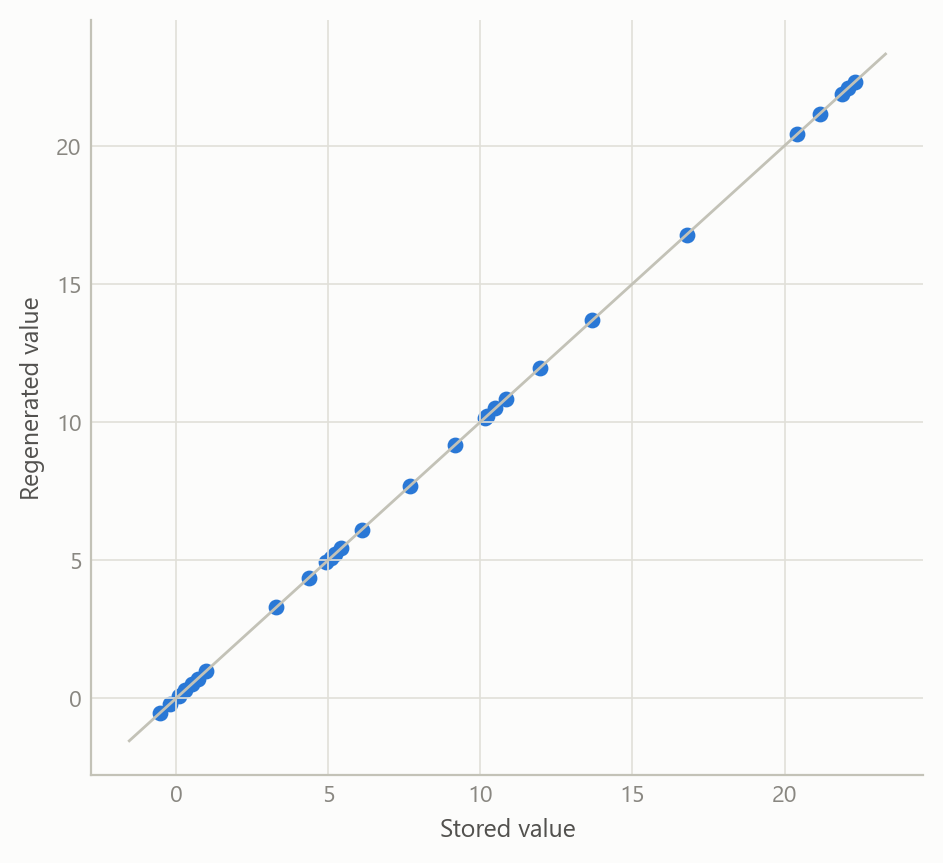
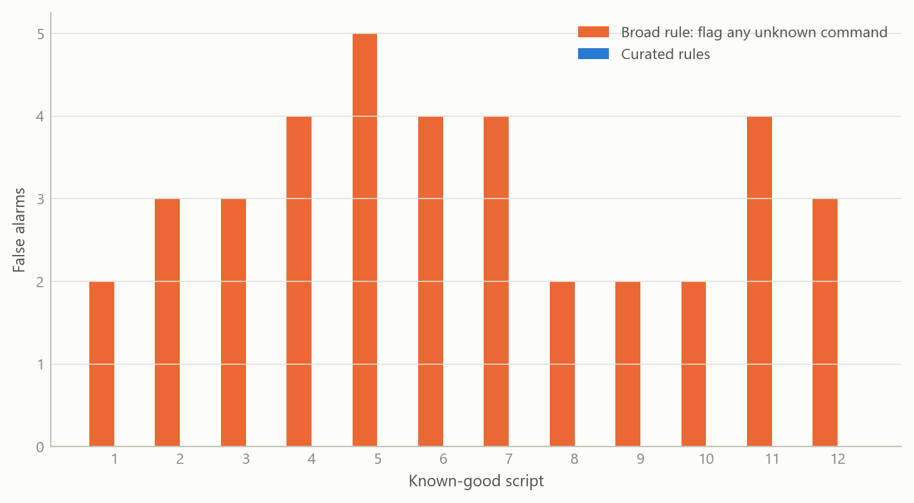
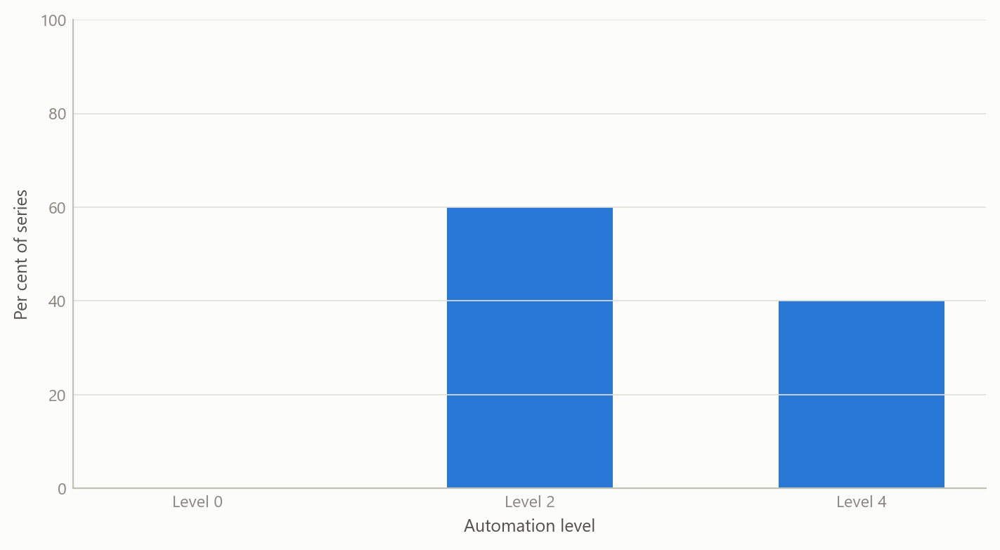

# Making econometric results checkable
Carlos Galindo

> [!NOTE]
>
> ### At a glance
>
> - **Question.** How can an economist trust numbers produced with machine-generated model code, and later reproduce them?
> - **Approach.** Check every command against an authoritative reference before it runs; store inputs and raw diagnostics; regenerate results from those and compare them with the stored version; confirm the whole chain against a live run.
> - **Finding.** Regenerated diagnostics matched the stored version exactly for all seven series in the test case, and a fresh live run matched it again. A broad automatic check raised false alarms on correct code, so the checks were kept few and precise, each tied to a documented failure.
> - **Why it matters.** A table in a paper is only as good as the route that produced it. This makes the route inspectable.

## The question

Econometric work is a chain: data, model specification, estimation, a table of diagnostics, a paragraph of prose. Each link can fail without any visible error. A mis-specified command can run and return numbers. A diagnostic can be copied by hand from a screen. A paragraph can describe a model more confidently than the output supports.

Machine-generated code makes this worse in one specific way. It is fluent, so wrong syntax and invented commands look as plausible as correct ones. The usual defence, reading the output and asking whether it looks sensible, catches large errors and misses quiet ones.

The project asks two questions. Can code be checked against an authoritative reference *before* it runs, so that invented commands never produce numbers? And can every reported result be regenerated exactly from stored inputs, so that the table in a paper can be audited rather than trusted?

## Approach

The design has four layers, each answering a different failure.

**1. Reference-first generation.** An authoritative knowledge base was built from the vendor documentation of the estimation environment: a structured index of 335 commands (261 distinct names) with their syntax, parameters, constraints and examples. Code is written from, and cited to, that index instead of from memory. Every lookup returns the source it came from.

**2. A deliberately small set of pre-run checks.** A second tool checks scripts before they run. The first design was broad: flag any command absent from the index. A viability probe killed it. On scripts known to be correct it produced two to five false alarms per file, from legitimate code the reference did not recognise and from gaps in the reference itself. A rule that fires on good code teaches people to ignore it. The checks were therefore rebuilt as a short list of precise rules, each tied to a documented failure, each shipped with a synthetic example that must trigger it, and each required to stay silent on the whole library of known-good scripts.

**3. Stored inputs and regenerated results.** The raw diagnostic output of each model-based seasonal-adjustment run is archived, then parsed into structured records covering sample size, model orders, residual tests, outliers and calendar effects. A formal schema rejects records with unknown fields, wrong types or missing identifiers. Re-parsing the archive reproduces the stored results with no live software needed.

**4. End-to-end validation.** A parser can reproduce its own earlier output and still be wrong. Two further checks address this. Synthetic raw outputs with *known* values test that extraction is correct, independently of any stored result. And a live run on a real workfile is compared with the stored record, so the stored record is confirmed by an independent recomputation.

## What the work shows

**Regeneration is exact.** Re-parsing the archive reproduced the stored results exactly for all seven series in the price-correlation study that the toolkit was built around. A fresh live run on one of those series, from the workfile through estimation to parsed record, then matched the stored record in full. The stored record was therefore independently confirmed and not merely self-consistent. The figure below shows the shape of that comparison with simulated numbers.

Figure 1: Regenerated against stored diagnostics, seven series and four statistics each (simulated data). Every point lies on the 45-degree line: exact reproduction.

**Broad checks fail; narrow checks work.** The probe on known-good scripts is the clearest result. A rule that flags every unrecognised command is noisy because no reference is complete. Curated rules, each justified by a documented failure, produced no false alarms on the same library. The figure illustrates the trade.

Figure 2: False alarms per known-good script under two checking designs (simulated data). The broad rule fires on correct code; the curated rules stay silent.

**Validation against many real runs corrected the project’s own prose.** The toolkit was checked against sixty-five archived runs of the seasonal-adjustment procedure under different automation levels, transformation choices and edge cases such as short samples and missing values. All sixty-five parsed and passed the schema. They also exposed an error in the project’s own paper. Its text said a fixed seasonal “airline” model was imposed uniformly. In fact, at the lower automation setting, the procedure still identifies the model, and some series came out with richer orders. The mixed results were consistent with the setting used; the sentence in the paper was imprecise. The general claim that this setting imposes the airline model is not universal.

Figure 3: Share of series with a non-airline model, by automation level (simulated data, ten series per level). Levels that still run model identification can return richer models.

## Insights

1.  **Matching your own earlier output is not correctness.** Reproducing a stored result shows a refactor preserved behaviour. Correctness needs a second source: known-value fixtures, and a live recomputation.
2.  **Stand-in checks cannot find interface faults.** The live runs revealed faults in how results were retrieved that the stand-in tests were structurally unable to see. Where a tool talks to real software, a real run belongs in the test plan.
3.  **Precision beats coverage in automatic checks.** A short rule list with a zero-false-alarm guarantee is used; a broad one is switched off. The design review therefore kept only the rule additions that meet that bar.
4.  **Verification finds the author’s own mistakes.** The sharpest finding was an overstatement in a draft paper, caught because the numbers had been regenerated rather than recalled.
5.  **Cite the source of every answer.** Returning the reference alongside each lookup turns “the machine said so” into something a reader can check.

## Scope and next steps

The checks cover a small set of documented traps. It cannot judge whether a model is appropriate, and some real errors, such as claiming model identification at a setting that does not perform it, depend on intent and cannot be found by reading code. The reference index covers the commands extracted so far, not the full language. Some components have so far been validated only on crafted cases, and everything has been run in a single computing environment, so portability is unproven.

Next steps are a wider set of crafted raw outputs, validation of the second connection route, and extending the same regenerate-and-compare discipline from seasonal-adjustment diagnostics to estimated model coefficients and forecasts.

## About the evidence

The work was done in 2025–2026 during a career break and draws on a documented reference index, an archived set of model runs, and the validation record of the tools. The figures on this page are simulated to show structure only; counts and findings in the text come from the project’s own records.

Figures and tables marked *simulated* are generated from simulated data built to share the structure of the analysis (its variables, horizons and frequencies). They show how each method works and what its output looks like. Results stated in the text, and figures that give a source, are the project’s own. Methods are described at the level of a methods section. Code and data pipelines are not reproduced here.
