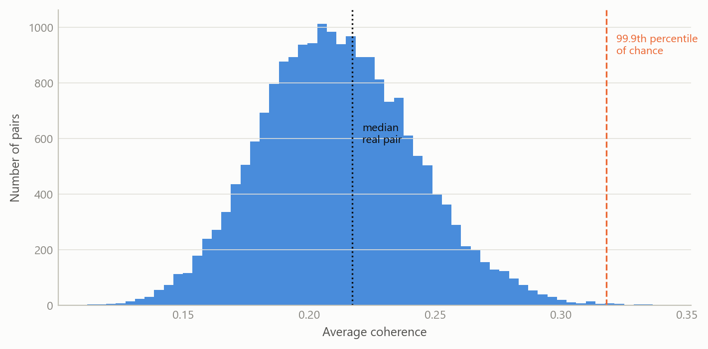
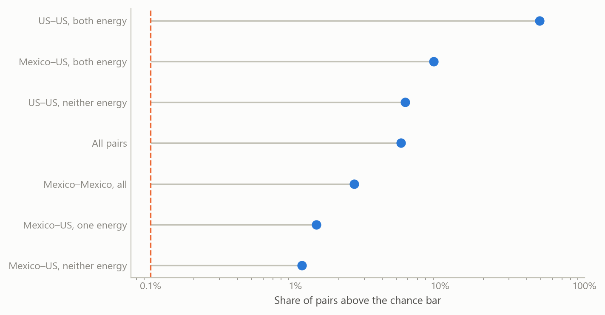
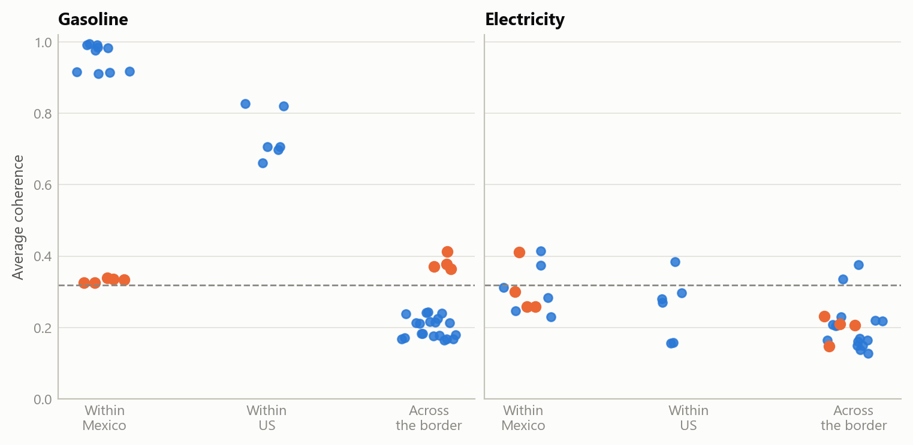

# Do energy-price surprises cross the US–Mexico border?
Carlos Galindo

> [!NOTE]
>
> ### At a glance
>
> - **Question.** When energy prices move unexpectedly in the United States, do Mexican energy prices move with them, and can that be told apart from chance in a screen of tens of thousands of series pairs?
> - **Approach.** Strip trend and seasonal pattern from each monthly price series, measure how closely the remainders move together across all frequencies, benchmark that against simulated independent series, and compare one product across regions on both sides of the border.
> - **Finding.** Gasoline surprises move almost in lockstep within Mexico and strongly within the United States, but barely across the border, with one exception: Mexico’s northern border region moves more closely with every US region than with any other Mexican region.
> - **Why it matters.** A screen this large always produces striking pairs. A chance benchmark and a like-for-like design are what separate a pattern worth explaining from noise, and here they isolate one region where border fuel pricing is a plausible explanation.

## The question

Energy is the most visible channel through which US price movements could reach Mexican households. Fuel is traded across the border, and refined products flow south. Whether a surprise in US energy prices shows up in Mexican consumer prices is a question about market integration, with direct consequences for inflation forecasting on both sides.

The question grew out of informal supervision of the methods of a 2025 master’s thesis on energy-price transmission between the United States and Mexico’s northern border. The analysis here is separate: it uses none of the thesis’s estimates.

Its starting point was a screen I had built in 2025 to look for related series in a very large database of price and activity indices. Such a screen ranks every pair of series by how closely they move together. A ranking alone cannot say which pairs matter. With tens of thousands of pairs, some will look striking by chance, and comparing series of different kinds mixes genuine links with coincidence. This note turns the screen into a test with two additions: a benchmark for what chance alone produces, and a comparison of like with like.

## Approach

**The screen (2025).** Each monthly series, January 2000 to January 2024 (289 months), was split into a trend, a regular calendar pattern and a remainder. The trend is a centred twelve-month moving average and the calendar pattern is the average deviation by month of the year. What is left, the remainder, carries the surprises: movements that neither the trend nor the season predicts. A centred average cannot be computed for the first and last few months, so the screen fills those ends rather than extrapolating a trend into them. For every pair of series, the screen then measured coherence between the two remainders: a frequency-by-frequency R-squared, estimated from 84-month windows that overlap by half, and averaged across all frequencies. A value near one means the two surprise series move together at every horizon; a value near zero means they are unrelated. The screen covered 72,393 pairs.

**The chance benchmark (2026).** What does this estimator report for two series that have nothing to do with each other? To answer, 20,000 pairs of independent simulated series of the same length were passed through the same decomposition and the same coherence calculation. Because the estimator averages over few windows, it reports a sizeable value even for unrelated series. The 99.9th percentile of this chance distribution, 0.318, is the bar a pair must clear before it counts.

**Like with like (2026).** The sharpest comparison holds the product fixed and varies the place: gasoline in one region against gasoline in another, and the same for electricity, using Mexico’s official regional consumer price indices and the four US census regions. Two checks guard each comparison. Trimming the most extreme 1 per cent of months at each end tests whether a few spikes drive the result. A time-shift test slides one series against the other by 24 to 265 months and recomputes coherence each time; a genuine link should be much stronger at the true alignment than at any shifted one.

## What the work shows

**Most pairs are indistinguishable from chance.** The median pair in the screen has coherence 0.217, against a median of 0.211 for unrelated simulated series. The screen’s typical value is the estimator’s floor, not a finding.

Figure 1: Coherence between 20,000 pairs of independent series passed through the screen’s decomposition and coherence estimator. The dashed line marks the 99.9th percentile of chance; the dotted line the median pair of the real screen (simulated data).

**But the excess over chance is large, and it sits where it should.** By construction, one pair in a thousand clears the bar by chance. Across the whole screen, more than one pair in twenty does. The excess is concentrated: nearly half of all pairs of US energy price series clear it, while pairs that mix Mexican and US series of other kinds clear it only about once in a hundred.

Figure 2: Share of pairs whose coherence clears the 99.9th percentile of chance, by group of series, on a logarithmic scale. The dashed line is the share expected by chance alone. Source: the author’s 2025 co-movement screen of monthly price and activity series; chance benchmark simulated.

The mixed Mexico–US groups also show the limits of a screen. Only 22 pairs in it link a Mexican and a US energy series, and they mix products and measures: consumer against producer prices, city against region, gasoline against electricity. A product-by-region comparison removes that mix.

Figure 3: Average coherence of the remainders for one product across disjoint regions: within Mexico, within the United States, and across the border. Orange points are pairs that involve Mexico’s northern border region. The dashed line is the 99.9th percentile of chance. Source: the author’s 2025 screen input, recomputed in 2026; chance benchmark simulated.

**Gasoline: integrated within each country, separate across the border, except at the border.** Within Mexico, the median gasoline pair has coherence 0.916 and every pair clears the bar. Within the United States the median is 0.706, and again every pair clears it. Across the border, the median falls to 0.213, around the level of chance. Only four cross-border pairs clear the bar, and all four involve Mexico’s northern border region, one for each US census region (0.364 to 0.412). Each also survives trimming and the time-shift test. The same region’s five pairs with other Mexican regions are the five lowest within Mexico (0.325 to 0.339), and none passes the time-shift test at the 1 per cent level. Measured by the movement of its gasoline surprises, the northern border region sits closer to the United States than to the rest of Mexico.

This is consistent with how fuel was priced there. For decades, gasoline and diesel prices in Mexico were set by the government. A federal notice for the first ten days of January 2017 set maximum gasoline prices for the northern border region with fiscal stimuli set zone by zone, including distance bands from the border running from 0–20 km to 40–45 km. Liberalisation then began in the border states of Baja California and Sonora on 30 March 2017 and was scheduled to reach every remaining state by 30 November 2017. Border prices set under their own rules would let the region’s surprises follow its neighbour’s rather than the national schedule. The data cannot confirm that mechanism; it can only say the pattern is the one such a regime would produce.

**Electricity: no comparable pattern.** Within Mexico the median electricity pair is 0.292, within the United States 0.275, and across the border 0.206. Two of the 20 cross-border pairs clear the bar, both linking Mexico’s north-east to a US region (the Midwest, 0.376, and the South, 0.336), and both pass the time-shift test. Two pairs out of 20 are a lead, not a pattern.

**One robust anomaly.** Of the screen’s two Mexico–US energy pairs above the bar, one, a US city’s motor-fuel consumer price index against Mexico’s north-west gasoline index, has coherence 0.727. That holds at 0.695 after trimming and passes the time-shift test. It is far stronger than any regional gasoline pair across the border, and nothing here explains it. The other pair, a US producer price for industrial electricity against Mexico’s southern gasoline index (0.342), drops to 0.290 after trimming. That is below the bar, so a few extreme months drive it.

## Insights

- **A chance benchmark is the first output of a screen, not an afterthought.** For this estimator, unrelated series average about 0.21, so a ranking that starts from zero overstates every pair. Once the bar is set by simulation, the question becomes where the excess sits, and that is informative.
- **Holding the product fixed turns a ranking into a test.** The mixed cross-border group says only that a few pairs stand out. The same product in disjoint regions says which regions are integrated and which are not.
- **The border shows up as a region, not as a product.** Gasoline is integrated within each country. The one cross-border link runs through a single Mexican region, and the same region is the least connected to the rest of Mexico.
- **Robustness checks separate leads from artefacts.** Trimming removed one of the screen’s two cross-border energy pairs. The time-shift test sorted the regional pairs into those that hold at the true alignment and those that do not.

## Limits and next steps

Coherence averaged over all frequencies says that two surprise series move together, not which leads, by how much, or at what horizon. The natural next step is to report phase and gain by frequency band for the four northern-border pairs. Splitting the sample at 2017 would then test whether the border region’s link to the United States changed with liberalisation, which would turn the policy reading from “consistent with” into a test.

The policy timeline is context, not evidence: the analysis does not observe border fuel prices directly. The composition of Mexico’s statistical regions is not used, so the reading by state is indicative only. Regional consumer price sub-indices are noisy, and the estimator’s floor of about 0.21 limits what modest coherence can show.

The robust anomaly, a single US city’s motor-fuel index moving closely with Mexico’s north-west gasoline index, is the open lead. It needs checking against how the two series are constructed before any economic reading. Until then it is reported, not interpreted.

## About the evidence

The screen ran in 2025 over a licensed commercial database of price and activity series. Its input is not reproduced here, and series are described by category only. The chance benchmark, the product-by-region comparison, the trimming and the time-shift tests were computed in 2026 from the screen’s own input, with an exact replica of its estimator that matches its stored values to rounding error. The first figure is simulated. The second and third plot statistics derived from the real series. The policy dates come from a 2017 industry report on Mexico’s fuel-price liberalisation and from the text of the January 2017 federal notice.

Figures and tables marked *simulated* are generated from simulated data built to share the structure of the analysis (its variables, horizons and frequencies). They show how the method works and what its output looks like; they are not the project’s results. Results stated in the text are the project’s own. Methods are described at the level of a methods section. Code and data pipelines are not reproduced here.
