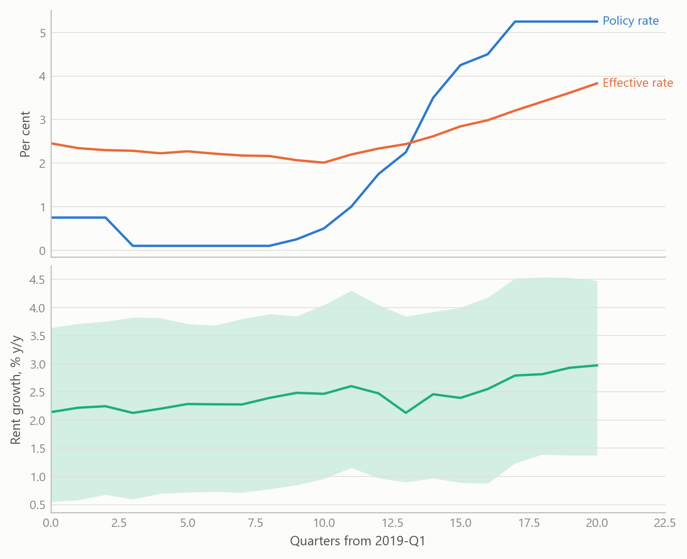
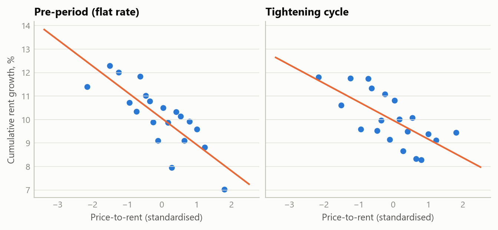
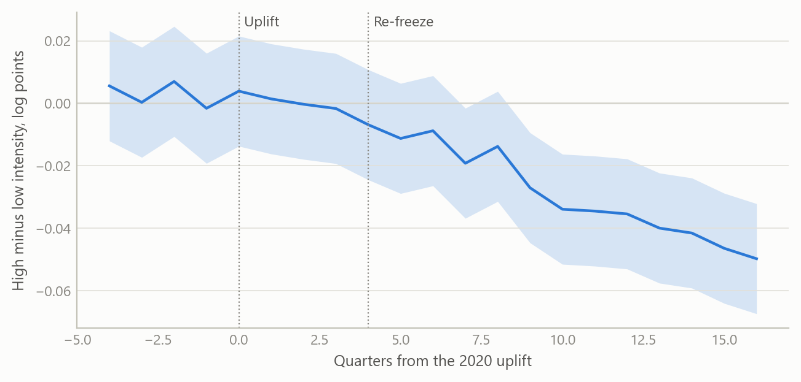

# A quarterly panel of every English local authority
Carlos Galindo

> [!NOTE]
>
> ### At a glance
>
> - **Question.** Did higher interest rates raise private rents, and did housing benefit end up in landlords’ pockets rather than tenants’ budgets?
> - **Approach.** A quarterly panel of all 290 English local authorities, 2019 to early 2024, built from official housing, benefit and labour-market statistics, so that areas can be compared with each other within the same region and quarter.
> - **Finding.** Rents rose no faster where landlords were more exposed to higher interest rates, and the design rules out roughly four-fifths of full pass-through. Where more tenants relied on housing benefit, rent growth slowed once the allowance was frozen: negative in all 23 specifications, and clearly so in the better-powered window.
> - **Why it matters.** Local rent growth is driven by many things at once. A panel that absorbs what areas share is what lets a policy effect be told apart from the noise.

## The question

Between 2021 and 2024 the Bank of England raised its policy rate from 0.1% to 5.25%. Over the same years private rents rose fast, and a frequent claim in the policy debate was that landlords were simply passing higher mortgage costs on to tenants. Over the same years the cash value of housing support for private renters (the Local Housing Allowance) was frozen, then partly restored, then frozen again. Both stories matter for policy, and both are hard to test with national totals: rents, rates, inflation and benefit policy all move together in time, so a single national series cannot say which one is doing the work.

Areas, however, differ. They differ in how expensive housing is relative to rents, and in how many tenants depend on benefit. If a policy or a shock acts through one of those differences, rents should respond differently in the areas that have more of it. That is the logic of a quasi-experiment, and it needs one thing before anything else: a clean, comparable, quarterly dataset covering every authority, over a window that includes the events of interest. This project built that dataset and used it for two studies.

## Approach

### The panel

The panel covers all 290 local authorities in England, quarterly, from the first quarter of 2019 to the first quarter of 2024. That is 21 quarters and 6,090 authority-quarter observations in the headline sample. It combines three kinds of official statistics:

- **Housing.** Median private rents for two-bedroom homes, house prices, and the rental-market areas used to set benefit rates.
- **Benefits.** Housing benefit and Universal Credit caseloads in the private rented sector, expressed as a share of the private rental stock. This is “benefit intensity”.
- **Labour market.** The claimant count and the 10th-percentile wage, used as time-varying controls. The low-paid wage is the relevant outside option for the tenants who depend on benefit.

Most of the work is unglamorous and decisive. Boundaries change, so every source had to be mapped to a single set of authority codes. Rents are published on a different geography from the one on which benefits are administered, so a crosswalk was needed. The official private-rent series changed methodology during the window, so the analysis window was locked at early 2024 rather than splicing across the break, and an extension is treated as optional until an overlap check has been done. The set of 290 authorities was locked once, so both studies use the same sample.

### Two predetermined exposures

The key design choice is to measure how exposed an area is *before* the events, so that exposure cannot respond to them.

- **Interest sensitivity.** The 2019 ratio of average house price to annual rent, standardised across authorities. Where prices are high relative to rents, a given rise in financing cost eats a larger share of rental income, so a landlord restoring a target yield would have to raise rents by more. Under full cost-plus pass-through the required percentage rent rise is proportional to this ratio.
- **Benefit intensity.** The pre-period share of private rented homes with a benefit claimant. It averages 4.4% across authorities and exceeds 8% in the top decile, concentrated in coastal towns, post-industrial districts and a few inner-London boroughs.

### The estimating design

Both studies use the same skeleton. The outcome is year-on-year rent growth. The regressor of interest is the exposure interacted with the event: the change in the rate for the first study, the 2021 benefit re-freeze for the second. Authority fixed effects remove each area’s own average growth, and region-by-quarter fixed effects remove everything common to a region in a given quarter, including every nationwide shock. What is left is the question that matters: among authorities in the same region and quarter, did the more exposed ones diverge as the event unfolded? Standard errors are clustered by authority.

For the rate study the treatment is not Bank Rate but the effective rate on the *outstanding* stock of mortgages, which is what landlords with existing fixed-term debt actually pay. It rose far more slowly, from about 2.05% in 2021 to about 3.8% by early 2024. The specification, its placebo window and a distributed-lag variant were fixed before any estimation on real data.

Figure 1: The two series the design compares, and the spread it exploits (simulated data). Top: policy rate and effective mortgage-stock rate. Bottom: year-on-year rent growth across 290 authorities, median with 10th to 90th percentile band.

## What the work shows

### Rate pass-through: a bounded null

The central estimate for the rate study is essentially zero. The interaction coefficient is −0.00013 with a p-value of 0.9835: more interest-sensitive areas did not see faster rent growth as financing costs rose. A null only matters if it excludes something, so the study calibrates what it excludes. The largest differential effect the design could plausibly have missed is about 0.59% of cumulative rent growth per standard deviation of interest sensitivity, while full cost-plus pass-through, over a range of plausible loan-to-value ratios, mortgaged shares and a tax amplifier for individual landlords, would require 2.8% to 5.0%. The data therefore rule out roughly four-fifths of frictionless pass-through through this channel.

Two checks make the null credible rather than empty. First, results are uniformly small and insignificant across alternative rate measures, transformations, lag structures and samples. Second, a raw cross-section tells a seemingly opposite story: more interest-sensitive areas had *slower* rent growth over the cycle. A true pre-period with a flat policy rate shows the same gradient, and a steeper one (0.01328 before, 0.00887 during, both negative). It is a long-running convergence of cheaper areas catching up, not a monetary effect, and it is exactly what the authority fixed effects absorb. One placebo window did fail, and the work reports it with its diagnosed cause, the 2020–21 pandemic reshuffling of London and the South East, rather than dropping it.

Figure 2: Why a panel and not a cross-section (simulated data). In both a flat-rate pre-period and the tightening cycle, areas with higher price-to-rent grew rents more slowly. The gradient predates the rate rises, so it cannot be a rate effect.

### Benefit incidence: a consistent direction

The second study treats the benefit freeze as a natural experiment. Housing support is meant to reach the 30th percentile of local rents. It is reset to that level at each uplift and then held in cash terms, so during the 2021–24 re-freeze it fell steadily behind a market whose lower tail was growing at close to five per cent a year. If the allowance acts as a floor under rents in the benefit-dependent part of the market, areas with more claimants should see rent growth *slow* once the floor stopped rising. The 2020 uplift is the mirror-image test, but it landed in a soft pandemic market and is a weak one.

Across 23 specifications varying the window, spatial controls, bedroom mix and treatment of outliers, every estimate of the re-freeze effect is negative, with no sign reversals. The specifications share one cross-section, so this reads as robustness of the sign, not as 23 independent tests. The baseline estimate is small and imprecise (−0.0174, p = 0.142), which is the expected signature when sitting tenants and reluctance to cut rents bias the estimate towards zero. The better-powered window, which uses the uplift period as the baseline, gives −0.0498 (p = 0.0033). Excluding the top decile of authorities by net in-migration leaves the sign unchanged, so the pattern is not just people moving.

Figure 3: The shape of an event-study on benefit intensity (simulated data). Differential rent growth of high- relative to low-intensity authorities, with the uplift and the re-freeze marked. Simulated to illustrate the design, not the estimates.

## Insights

1.  **Exposure must be fixed before the event.** Both studies use 2018–19 values, so an area’s position cannot be a response to the rate path or the freeze. Most of the credibility is bought there, at no cost in data.
2.  **A null needs a yardstick.** “No significant effect” says little. Converting it to economic units and comparing it with what the theory predicts turns it into a statement about what has been excluded.
3.  **Show the confound before the reader does.** The negative cross-sectional gradient looks like a perverse channel until a pre-period shows it was already there. Putting that in the paper turns the strongest objection into the best argument for the design.
4.  **Treat the treatment variable as a finding.** Policy rates and the rate landlords actually pay diverged for years. Choosing the wrong one would have overstated the shock.
5.  **Read two results together.** Rate pass-through through landlords’ financing costs looks small, while the frozen benefit floor appears to bind. Together they suggest the pressure sat on the tenant side of the market, and that monetary and fiscal policy were pulling in different directions.

## Scope and next steps

An area panel cannot see what happens inside an area. A cost shock that passes through hardest where tenant demand is least elastic, or a landlord with a portfolio across authorities, is below its resolution. The null is silent on those mechanisms rather than exculpatory, and a household- or landlord-level incidence design is the right next test.

The window is also short and mid-transmission. The effective mortgage rate had only reached about 3.8% by early 2024, and fixed-rate deals taken out in 2021–22 were still rolling off. Tenancies reprice at renewal, and the rent series records rents currently paid, so adjustment is staggered and slow by construction. The rate study therefore commits to a replication once transmission is complete. Finally, the benefit estimates identify the direction of the effect robustly but their size depends on the specification, and the sustenance reading of housing support that sits alongside them is consistent with the results without being tested by them.

## About the evidence

The panel and both studies are real: 290 authorities, 21 quarters, official statistics, built between 2024 and 2026 during a period of independent research. The figures here are simulated from the same structure (authorities, quarters, exposures, event timing) and illustrate the design only. The estimates in the text are the project’s own results.

Figures and tables marked *simulated* are generated from simulated data built to share the structure of the analysis (its variables, horizons and frequencies). They show how each method works and what its output looks like. Results stated in the text, and figures that give a source, are the project’s own. Methods are described at the level of a methods section. Code and data pipelines are not reproduced here.
