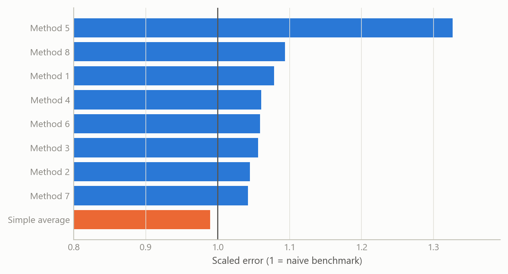
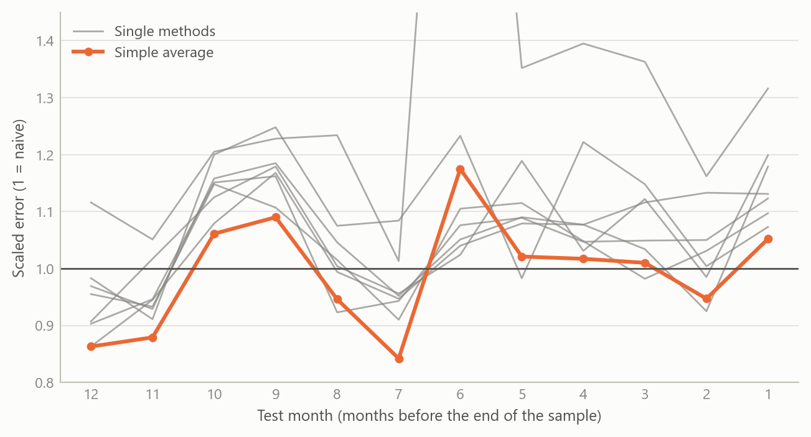
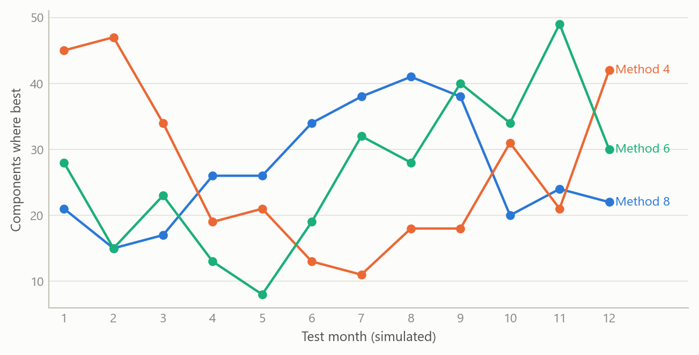
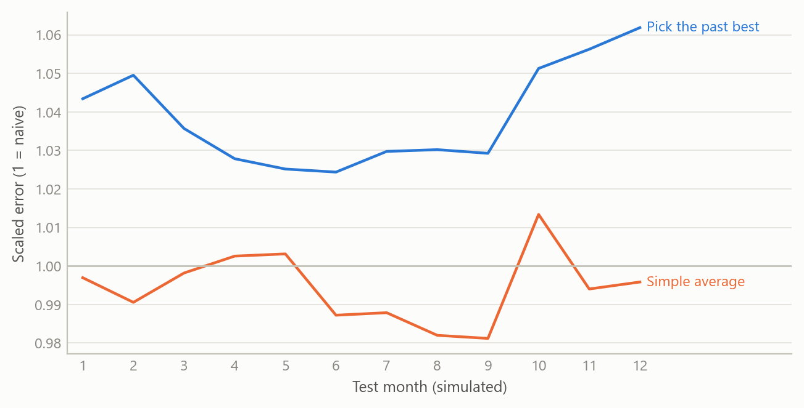

# Combining forecasting methods is the robust choice
Carlos Galindo

> [!NOTE]
>
> ### At a glance
>
> - **Question.** Which forecasting method should a bottom-up inflation forecaster rely on for each part of the US consumer-price index, and how stable is that choice?
> - **Approach.** Eight methods from different model families, and their simple average, compete on 181 price components in twelve rolling one-month-ahead tests over the most recent year, each scored against a naive benchmark.
> - **Finding.** Leadership is spread across methods and shifts from month to month. The simple average is the most accurate forecast over the full test year and the one entry that improves on the naive benchmark. For the typical component, every method improves on it.
> - **Why it matters.** When no method leads consistently, combining them gives the stability of the group rather than the risk of a single choice. The average is cheap to compute and is the natural default for a component-level forecasting system.

## The question

Forecasters who work from the bottom up, building headline inflation from its components, face a practical problem. A consumer-price index has well over a hundred published components, and they do not behave alike. Rents move slowly. Energy and some food items swing sharply. Apparel and travel carry strong seasonal patterns and large one-off spikes. A method that suits one of these may not suit another.

The usual answer is to pick a method and apply it everywhere, or to pick the best method for each component after some testing. Both rest on the assumption that there is a stable winner to find. This project tests that assumption directly. For each component, and in each of a sequence of monthly tests, which method is best, how large is its edge over a naive forecast, and is the edge stable enough to rely on?

## Approach

**Coverage.** The comparison covers 181 components of the US consumer price index for all urban consumers, from the broad headline down to detailed items.

**Candidate methods.** Nine forecasts compete on every component: eight individual methods and their simple, equally weighted average. The individual methods are statistical models of different families. Some forecast the underlying trend and seasonal pattern of the series directly, others split the series into trend, seasonal and irregular parts and forecast each part separately, and one treats the irregular spikes explicitly. All are built to run automatically, so that the same procedure applies to every component without hand tuning.

**Scoring.** Each forecast is scored by its mean absolute error, scaled by the mean absolute one-period change of the series itself. This is the mean absolute scaled error. A score of 1 means the method matches the naive benchmark, which assumes the series simply carries on from where it is. A score below 1 means it improves on that benchmark. Scaling by the series’ own volatility puts a calm item like rent and a volatile one like fuel on the same footing, so averages across components are meaningful.

**Rolling tests.** Scores come from twelve rolling out-of-sample tests over the most recent year. For each of the twelve most recent months in turn, the sample is cut just before that month, every model is re-estimated on the data up to that point, and its one-month-ahead forecast is scored against the published outcome. Each component therefore receives twelve one-month-ahead tests, one per month of the test year, and no forecast is judged on data it has seen.

**Combination.** Beyond the simple average, the pipeline also includes weights that favour methods with lower past error, using an exponential decay of the scaled error, normalised to sum to one. The comparison reported here uses the equal-weight average.

## What the work shows

**Leadership is spread across methods.** Across the 181 components, the method that comes first most often does so for 38, about one component in five. Leadership also shifts from test to test. In the most recent test month the most frequent leader is first for 32 components, while in the test seven months back a different method leads, for 40.

**Lasting leadership is the exception.** Only six components have a method that leads in six or more of the twelve tests, and the longest such run is ten. For the others, leadership moves between methods from one test month to another.

**The average is the most accurate forecast over the full year.** Across all twelve tests, the simple average scores 0.989 on the scaled error: the lowest of the nine entries, and below the naive benchmark of 1. The individual methods score between 1.04 and 1.33. The margin is narrow, and that is informative in itself: monthly price components carry little predictable signal beyond their recent past, so improving on the naive benchmark across 181 components and a full year is demanding, and the average does so.

Figure 1: Mean scaled error over all twelve tests and 181 components, by method, against the naive benchmark at 1.0. Source: summary results of the comparison (September 2025); author’s calculations.

**Month by month, the average is most often the best.** In an October 2025 re-run of the comparison on the same 181 components, the simple average has the lowest mean error in six of the twelve test months, and in a seventh it is a close second (0.8633 against 0.8631). No individual method is lowest in more than one test month.

**The typical component is forecast well.** In the same re-run, the median component’s scaled error is below 1 for every method in every test month, at most 0.86. Mean errors sit near 1 because a minority of components carry large errors. Those components are where series-specific attention is most likely to pay off.

Figure 2: Mean scaled error in each of the twelve one-month-ahead tests, 181 components, against the naive benchmark at 1.0. Grey: the single methods; orange: their simple average. Tests run from twelve months before the end of the sample (left) to one month before (right). One method reaches 2.48 in the test six months back, above the top of the scale. Source: October 2025 re-run of the comparison (seven distinct methods); author’s calculations.

The last two figures are simulated to share the shape of the exercise, with the same components, the same twelve test months and the same eight methods plus an average. They show the mechanism, not measured numbers.

Figure 3: Number of components for which each of three methods is best, test by test (simulated data).

Each line is one method’s count of component wins. The lines cross, so the ranking in one test month is not the ranking in the next.

## Insights

1.  **Combining is insurance against a shifting leader.** When the best method changes with the component and with the month, a choice made on past results is a bet that leadership persists. Averaging gives up the chance of being exactly right in return for protection against being badly wrong, and over the full year that trade pays.
2.  **The naive benchmark is the right yardstick.** For monthly price components, “no change from here” is a demanding standard. Scoring every method against it, rather than against other models, shows directly whether a forecast adds information.
3.  **Scale the error, then average across components.** Without scaling by each series’ own volatility, the volatile components dominate any average. The scaled error makes the comparison fair across rent, energy and apparel.
4.  **Every method has a place.** The method with the weakest overall score still leads for some components and test months. Judging methods only by their overall average hides where each one adds value, which is an argument for combining rather than culling.
5.  **Hard cases show where to specialise.** A small set of components is hard for the automated methods, and on some of them the weighting gives certain methods zero weight. These cases mark where a series-specific approach adds most.

Figure 4: Out-of-sample scaled error test by test: choosing the best past method per component versus the simple average (simulated data).

This figure illustrates insight 1. A method chosen because it won a first round tends to do worse on the next round than the average of all of them, because part of its win was luck. It is a simulation of that mechanism and does not report a measured gap.

## Scope and next steps

- **Selection versus averaging, measured.** The stored month-by-month scores allow a direct out-of-sample test of insight 1: choose each component’s method on the earlier test months and judge it on the later ones, against the average.
- **Size of the margin.** A formal test of forecast accuracy across many series, with a correction for multiple comparisons, would show how much of the average’s full-year margin over the benchmark is systematic.
- **Counts and magnitudes.** Win counts show how often a method leads. The month-by-month profile above adds how far each method is from the benchmark.
- **Weighted combinations.** Evaluating the error-based weights against the equal-weight average on held-out months is a natural extension.
- **Wider coverage.** The comparison covers US consumer prices over a recent year that includes unusual inflation. Repeating it across economies and over calmer periods would show how general the result is.

## About the evidence

The comparison is real: 181 US consumer-price components, twelve rolling one-month-ahead tests over the most recent year, completed in 2025 as part of the rebuild of a forecasting pipeline during a career break. The overall scores and leader counts come from its summary results (September 2025), and the month-by-month profile comes from an October 2025 re-run of the same comparison. The first two figures show measured results. The last two are simulated.

Figures and tables marked *simulated* are generated from simulated data built to share the structure of the analysis (its variables, horizons and frequencies). They show how each method works and what its output looks like. Results stated in the text, and figures that give a source, are the project’s own. Methods are described at the level of a methods section. Code and data pipelines are not reproduced here.
