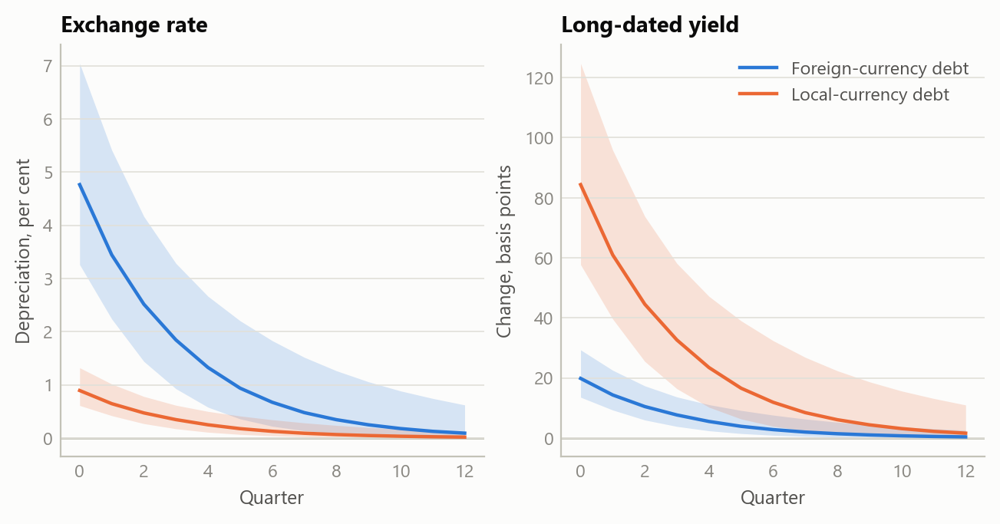
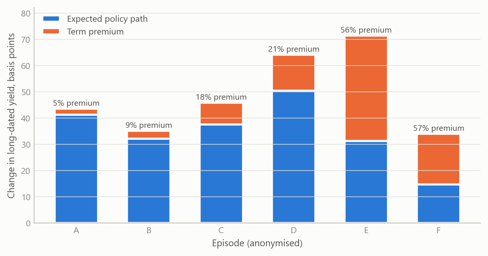
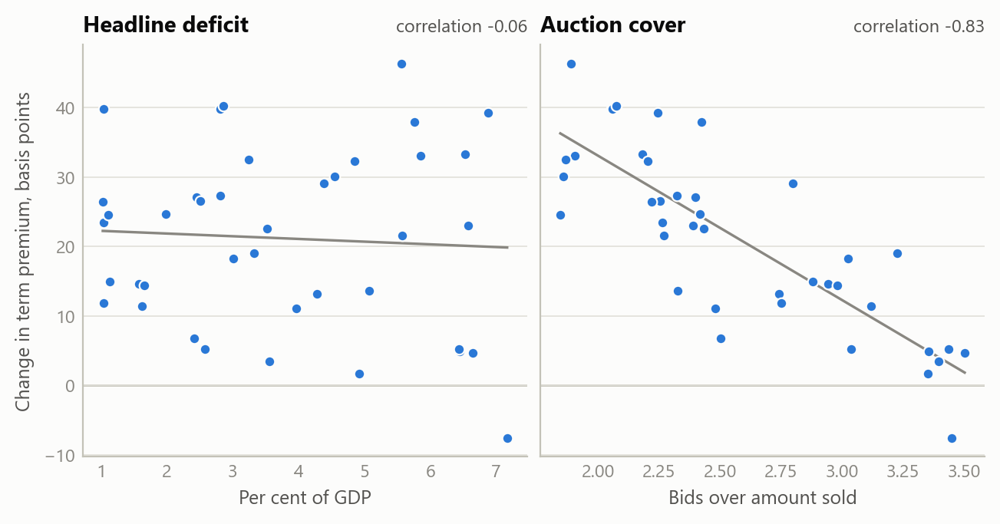

# Where a funding shock lands: one projection model for advanced and emerging economies
Carlos Galindo

> [!NOTE]
>
> ### At a glance
>
> - **Question.** Can one macroeconomic model read an emerging market and an advanced economy alike, without treating every country with a deficit as the same case?
> - **Approach.** A calibrated quarterly projection model with a regime switch keyed to the currency of public and bank debt, a policy rate reserved for inflation and the output gap, and political credibility and capital flows acting through risk premia; codified as one written specification run under a common evidence standard.
> - **Finding.** The currency of the debt decides where a funding shock lands: on the exchange rate where debt is in foreign currency, on long-dated government bond yields where it is in local currency. Applied to five advanced economies, the readings locate the common pressure point in the marginal buyer of long-dated government debt, not in headline deficits or currency risk.
> - **Why it matters.** The same deficit headline carries different risks in different economies. A model that knows which price can break tells an analyst which market to watch, and which signals to discount.

## The question

Models of small open economies grew up around emerging markets, where funding stress tends to end in the currency: debt is owed in foreign currency, reserves run down and the exchange rate gives way. Advanced economies mostly borrow in their own currency, yet when one runs a fiscal and an external deficit together it is often read through the same lens, and the currency is expected to break. That reading runs together objects that behave differently: the headline current account and the gap that actually needs financing, the debt ratio and this year’s borrowing, the expected path of the policy rate and the premium investors charge to hold long-dated bonds.

The question was how to write one model that serves both kinds of economy, so that a brief on an emerging market and a brief on an advanced economy use the same equations and differ only where the economics differs. A second question followed. If the model is applied across many countries, by different analysts and by different AI models, what makes two briefs on two economies comparable line by line?

## Approach

**The core.** The starting point is a quarterly projection model in the form used by the IMF for small open economies, and the work generalises the central-European scenario framework into a single model. The output gap depends on expected output and on the real interest rate; inflation on expected inflation, the output gap, and import and energy prices; the policy rate on inflation and the output gap; the exchange rate on interest parity plus a risk premium. The coefficients are calibration priors, not estimated elasticities: they fix the direction and rough size of each channel, so the model organises evidence rather than forecasting from fitted values.

**Three generalisations.**

*The policy rate does one job.* It reacts to inflation and the output gap only. Political credibility and capital-flow pressure act through risk premia on government bonds and on the currency, not through the policy rule. Credibility is slow and is graded in ordered steps, each tied to a named event such as a fiscal rule, a budget or an election, rather than given a continuous score it cannot support. Flow pressure is fast and is read from a short dashboard of market series, each kept in its own units rather than added into an index whose parts do not share a scale.

*Demand responds to the long rate.* Spending depends on the long real interest rate, and the long-dated yield is split into the expected path of the policy rate and a term premium measured against a named decomposition. Energy and import prices enter the inflation equation and the term premium enters the demand equation, so each shock reaches the economy through one door.

*The currency of the debt decides which stock can break.* A regime switch keyed to the currency of public and bank debt chooses the stock that enters the risk premium. Where debt is owed in foreign currency, a funding stop can become a currency event, and the objects to watch are reserve cover and external repayments. Where debt is in local currency, a stop is a strike by buyers of long-dated government bonds, and the objects are maturity and the marginal buyer; reserves and gross external debt are not solvency measures there, and the external stock that matters is the net international investment position. Where an economy carries both books, both blocks run side by side and are read separately, never averaged.

**One specification, one evidence standard.** The framework is codified as a single written specification that different AI models execute. It fixes the order of sources: the central bank, the statistics office, the debt office and the finance ministry first, international institutions after them. Every figure is graded established, inferred or not identified. Where two sources disagree, both are set side by side and the one used is named; a clause that cannot be sourced is dropped. The specification fixes the outputs too: a framework section, a dated snapshot, scenarios that each carry a mechanism and a falsifier, and a watch-list whose thresholds are stated in the units of the series they watch.

## What the work shows

**The regime fork.** The first figure runs one funding shock through both regimes. With foreign-currency debt the shock lands on the exchange rate and long-dated yields move little; with local-currency debt the same shock lands on long-dated yields and the currency moves little. Neither regime is simply safer: each has a different price that can break, and different things to watch.

Figure 1: One funding shock under two debt regimes: median response and 90% band of the exchange rate and of the long-dated yield over twelve quarters (simulated data).

**A yield rise has two parts.** Once the long rate is split into path and premium, two episodes with the same rise in yields can mean different things. When most of a rise is a higher expected path, the market is pricing the central bank, not refusing the bond, and the evidence for a buyers’ strike sits in the premium alone. The second figure shows that split for six simulated episodes.

Figure 2: Quarterly change in a long-dated yield split into the expected policy path and the term premium, six episodes ordered by the premium’s share (simulated data).

**Stock and flow.** The model keeps the debt ratio and the year’s borrowing apart because they answer different questions. A debt ratio can fall while borrowing runs ahead of the official forecast: that is a supply question for the next auctions, not a solvency question. The same separation applies to the external accounts. The headline current account can include volatile items such as precious metals and investment income; the gap that needs financing is the underlying one.

**Five advanced economies.** In October 2026 the specification was applied to the United States, the United Kingdom, Germany, France and Japan. All five borrow in their own currency or in one they share, so all five sit on the local-currency path, and none of the five readings pointed to a currency stop. For the two euro-area members the policy rate is set for the union as a whole, so the country-level object for France is its bond spread over Germany, while Germany, as the benchmark issuer, has no spread over itself to read. Across the five, the readings converged on one pressure point: the marginal buyer of long-dated government debt, rather than the size of the headline deficit or the external balance. The synthesis therefore ranks the five not by their deficits but on three questions: whether the debt ratio is rising or falling, whether long-dated auctions are absorbed, and whether short-dated yields have already moved away from the policy rate. Where the evidence for one of these was not published, the readings record it as not identified rather than filling the gap.

The third figure shows the shape of the cross-country test this reading implies, on simulated data. If the marginal buyer is the pressure point, changes in term premia should line up with how well long-dated auctions are absorbed, and much less with headline deficits.

Figure 3: The cross-country test the framework implies: change in the term premium against the headline deficit and against auction cover, forty economy-quarters (simulated data).

## Insights

1.  **Ask which price can move before asking how far.** The currency of the debt decides whether stress lands on the exchange rate or on long-dated bonds. A model that settles that first reads an advanced economy and an emerging market with the same equations and still tells them apart.
2.  **Keep the policy rule for inflation and the output gap.** Sending credibility and capital flows through risk premia, rather than through the policy rate, keeps each channel in one place, where it can be seen and tested on its own.
3.  **Stock and flow are different questions.** A falling debt ratio and a borrowing overrun can coexist; one is about solvency, the other about the supply the market must absorb next.
4.  **Only the premium part of a yield rise speaks about buyers.** A move driven by a higher expected policy path is the market pricing the central bank. A buyers’ strike shows up in the premium, which has to be measured against a named decomposition rather than assumed.
5.  **A common evidence standard makes analysis comparable.** When every figure carries a grade and every conflict is shown rather than averaged, briefs on different economies, written by different models, can be read side by side, and a gap in the evidence shows as a gap.

## Scope and next steps

The framework is built to read an advanced economy and an emerging market with one calibrated model, differing only where the currency of the debt says they should, and to apply it under an evidence standard that keeps every figure graded and every conflict in view.

The natural extensions are three. First, the five-economy comparison tracked through time, with each figure re-read at its official source at every update. Second, the same specification applied to emerging markets that borrow in foreign currency and to hybrid cases, where both blocks run at once. Third, a cross-country test on real data of whether auction absorption and non-resident take-up explain moves in term premia better than headline deficits do.

The full specification and the five country readings can be discussed on request.

## About the evidence

The work was done in 2026. It rests on a written model specification, a study of the regime fork on one advanced economy, and a cross-country synthesis of the five readings, dated October 2026. The coefficients are calibration priors, not estimates. The market and fiscal figures behind the readings are not reproduced here. The three figures are simulated, built to share the structure of the analysis (a quarterly horizon, two debt regimes, a path-and-premium split of the long yield); none shows a real estimate.

Figures and tables marked *simulated* are generated from simulated data built to share the structure of the analysis (its variables, horizons and frequencies). They show how each method works and what its output looks like. Results stated in the text, and figures that give a source, are the project’s own. Methods are described at the level of a methods section. Code and data pipelines are not reproduced here.
