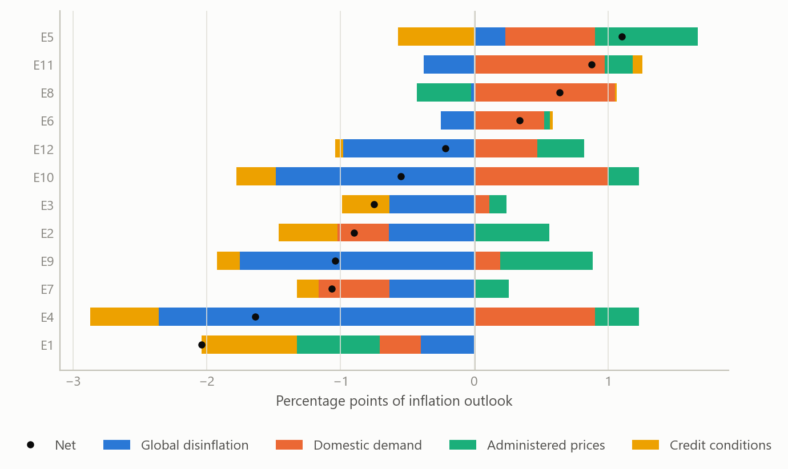
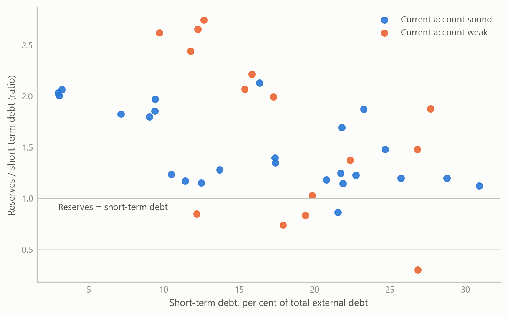
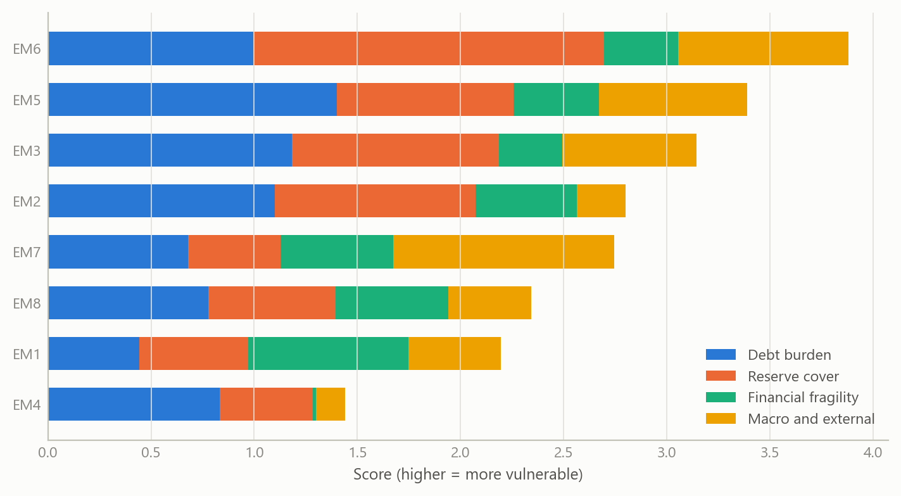

# Global macro monitoring and external-debt vulnerability
Carlos Galindo

> [!NOTE]
>
> ### At a glance
>
> - **Question.** How can one person keep a disciplined, comparable read on inflation and central-bank behaviour across a dozen economies, and judge which emerging markets are exposed on external debt?
> - **Approach.** Short notes built on one template: separate the forces acting on prices and policy, say which way each pushes, and name what would change the call. For external debt, a layered indicator framework that groups measures by the channel through which they hurt.
> - **Finding.** The same few channels recur across very different economies, and a policy decision is best explained by weighing several forces, not by one headline. External vulnerability shows up where thin reserves, short maturities and a weak current account coincide.
> - **Why it matters.** A consistent structure makes cross-country comparison fast, makes the reasoning checkable, and keeps analysis going between jobs.

## The question

After leaving a research role in June 2024, I kept up a daily habit of global macro monitoring through to September 2024. The aim was practical. Each week brings inflation prints, central-bank decisions and market moves in many countries, and the risk for any analyst is a pile of unconnected comments. A note on one country can be convincing and still be impossible to compare with the note on the next.

Two questions shaped the work. First, for inflation and monetary policy, what is the short list of forces that decide where a central bank goes next, and can the same list be applied to a dozen economies without losing what is specific to each? Second, for emerging markets, how should one judge external-debt vulnerability when the standard indicators disagree, as they often do? A country with a high debt-to-exports ratio but deep reserves is in a different position from one with a modest ratio and almost no buffer.

The obvious approach, a paragraph of commentary per country, falls short in both cases. It hides the weights the author is implicitly using, and it cannot show a reader what would change the conclusion.

## Approach

**Short country notes.** Each note follows the same logic. It starts from the policy decision or the inflation outcome to be explained. It then lists the forces acting on it, grouped as external (global disinflation, the stance of larger central banks, commodity prices), domestic demand and supply (labour-market tightness, public spending, administered prices such as electricity tariffs, credit conditions), and the policy reaction itself. Every force is given a direction, and the feedback from the policy decision back onto demand or communication is marked separately, because a rate cut that revives demand changes the next decision. Each note ends with the “swing factor”: the single development that would flip the call.

The notes covered inflation and policy in a dozen economies, spanning central and eastern Europe, the Middle East and Africa, Latin America, Asia and Australia. Where a country had a clear divergence from its peers, for example upside inflation surprises in a few high-inflation economies against downside surprises elsewhere, the note was written to explain the divergence and not just report it.

**External-debt vulnerability.** The framework groups indicators by channel instead of presenting a long flat list. I settled on five families: debt burden and structure; reserve cover; wider financial fragility; macroeconomic and external conditions; and institutional and structural features. Within debt, the measures are debt relative to exports, debt service relative to exports and to government revenue, the share of debt in foreign currency, and average maturity. Reserve cover is read against short-term debt, against broad money and in months of imports. Financial fragility adds the share of short-term debt, bank loan quality and capital, and household debt. The macro family covers the current account, the net international investment position, external financing needs, exchange-rate behaviour and terms of trade. The structural family covers openness, fiscal balance, policy credibility and dependence on commodities, tourism or remittances.

A second pass turned the list into a causal map. The current account feeds debt service and the risk of a sudden stop; terms-of-trade and exchange-rate volatility feed the current account; global risk appetite feeds both sudden stops and exchange-rate volatility; maturity structure feeds refinancing risk. The point of the map is to say which indicators are inputs and which are consequences, so that two high readings that share one cause are not counted twice.

**Checking.** The template builds in three tests: do the forces named actually explain the outcome that was observed; does the direction attached to each force survive a plain reading of the data release; and does the swing factor correspond to something observable soon. A call that cannot be falsified soon is not a call. Survey-based market expectations were used only as summary findings from Bloomberg survey data (2024), never reproduced.

## What the work shows

**Policy is a weighing exercise.** In the Latin American and central European cases, central-bank decisions were best explained by a balance of forces pulling in different directions. In one example, strong domestic demand, higher commodity prices and administered-price increases pushed inflation up, while global disinflation and softer private credit pulled the other way. The outcome was a cautious move paired with firm communication, and the real information was in the signal about the pace of future moves. A note that reported only the decision would have missed this.

**Divergence has identifiable causes.** Across the emerging economies of central and eastern Europe, the Middle East and Africa, lower commodity prices and favourable base effects produced disinflation in most economies, while overheating from loose fiscal policy and strong domestic demand explained upside surprises in a small group. The usual grouping by region was less useful than grouping by cause.

**Labour-market stories need the other side.** In a developed-market example, a tight labour market, driven by public-sector and care-sector expansion, immigration and rising participation, pressed wages and prices upward. The note also recorded the counter-scenario, that firms may be holding on to workers, so that unemployment could rise faster than forecasts suggest once higher rates bite. Keeping both in view is what stopped the note from becoming a one-sided story.

The first figure shows what this kind of decomposition looks like in a form that can be compared across countries. It is simulated, but it has the structure of the notes: a dozen economies, a handful of forces, and a signed contribution from each.

Figure 1: Signed contribution of four forces to the inflation outlook, twelve economies (simulated data).

**External vulnerability is about coincidence.** No single indicator separated the fragile cases from the resilient ones in the framework. What mattered was the overlap of three conditions: reserves that are thin relative to short-term debt, a large share of debt falling due soon or denominated in foreign currency, and a current account that depends on volatile export earnings. Where these coincide, a change in global risk appetite is enough to turn a manageable position into a financing problem. Where only one is present, the position is usually absorbable.

The second figure illustrates the screening logic with simulated emerging markets: reserve cover plotted against short-term debt exposure, with the group flagged when the third condition also holds.

Figure 2: Reserve cover against short-term debt share for 40 emerging markets; flagged where the current account is also weak (simulated data).

The layered structure also gave a way to rank countries by channel. The third figure shows a simple composite in which each family contributes to a score, so a reader can see not only who ranks highest but why.

Figure 3: Composite external-vulnerability score by family for eight emerging markets (simulated data).

## Insights

1.  **Weights should be visible.** A note that lists forces with signs lets a reader disagree with one weight without rejecting the whole view. That is the main reason the template mattered more than any individual call.
2.  **Communication is part of the decision.** Several central banks paired a move with a firm signal. The forecastable part was often the pace of what comes next, not the move itself.
3.  **Group by cause, not by region.** Disinflation and its exceptions lined up with commodity prices, base effects and fiscal stance far better than with geography.
4.  **Indicators are not independent.** Mapping which measures are inputs and which are outcomes prevents double-counting and shows where one shock would register in several measures at once.
5.  **Write down the swing factor.** Naming what would change the view turns commentary into a testable statement and makes the next update easier.

## Scope and next steps

The monitoring framework is built for fast, falsifiable calls: indicators grouped by channel into five families, each call tied to a swing factor that can be observed soon, and the reasoning behind each call written down so it can be checked against what followed.

The natural extensions are two. First, calibration on a panel of past episodes, estimating how much each family adds to the probability of financing stress and whether the joint signal of thin reserves, short maturities and a weak current account beats any single indicator. Second, testing the cross-country decomposition against subsequent policy decisions, to measure the predictive value of its signs and swing factors.

The maps and notes behind individual calls can be discussed on request.

## About the evidence

The work is real: June to September 2024, covering inflation and monetary policy in about a dozen economies and a framework for external-debt vulnerability in emerging markets, produced as short notes and causal maps. Market-survey inputs were used only as summary findings from Bloomberg survey data (2024). Everything shown as a figure on this page is illustrative and generated for this page.

Figures and tables marked *simulated* are generated from simulated data built to share the structure of the analysis (its variables, horizons and frequencies). They show how each method works and what its output looks like. Results stated in the text, and figures that give a source, are the project’s own. Methods are described at the level of a methods section. Code and data pipelines are not reproduced here.
