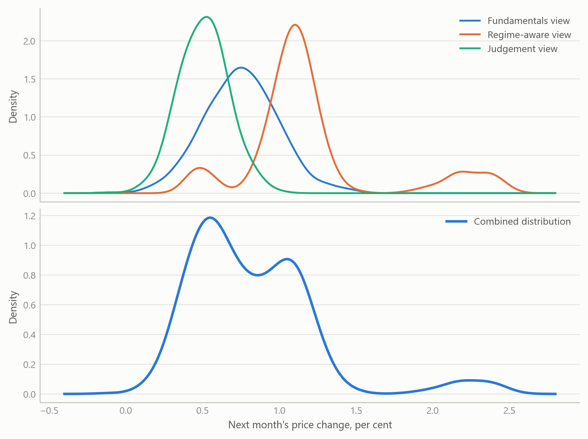
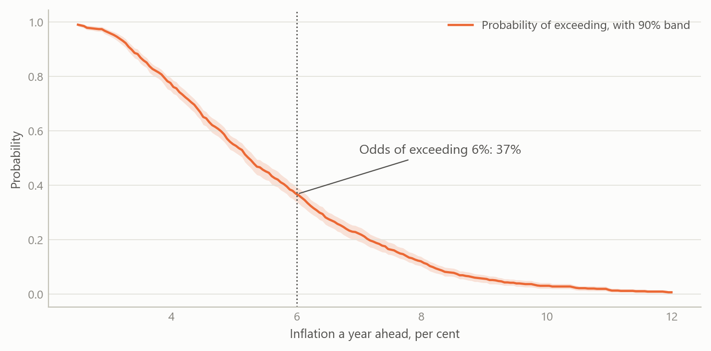
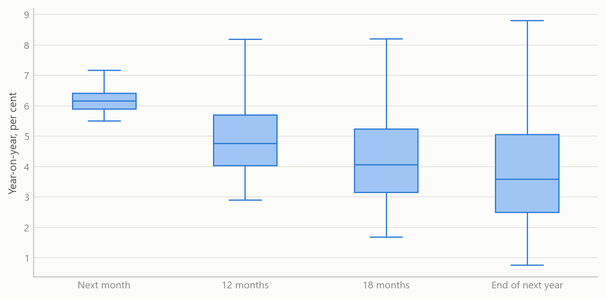
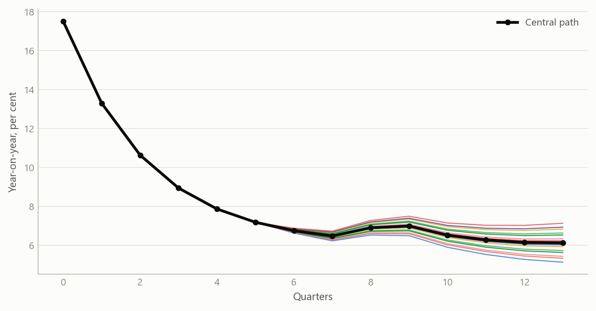

# Inflation forecasts as probabilities, not single numbers
Carlos Galindo

> [!NOTE]
>
> ### At a glance
>
> - **Question.** What are the odds that inflation ends up above, or below, the levels that matter to a central bank, an investor or a budget, next month and a year from now?
> - **Approach.** For each economy and each month, a forecast pack that pools several independent views into one distribution of outcomes, keeps that distribution’s real shape, and reads it as probabilities.
> - **Finding.** The pack runs for headline and core inflation across 22 economies. Each edition gives a full distribution at four horizons, the probability of exceeding any threshold, the odds of staying in a high-inflation regime, and scenario paths for the exchange rate and energy prices.
> - **Why it matters.** A single forecast number hides the risks that drive decisions. Probabilities of crossing a threshold are what a policy committee, a portfolio manager or a fiscal planner can act on directly.

## The question

Most inflation forecasts arrive as one number. Decisions rarely turn on one number. A central bank cares whether inflation will be back inside its target band; a bond investor cares about the chance of an upside surprise next month; a finance ministry cares about the odds that indexation costs overshoot the budget. Each of these is a question about probabilities, and each needs the whole distribution of outcomes, including its lopsided tails.

The difficulty is that inflation distributions are often not bell-shaped. After a large shock, an economy can sit between two regimes: a path back to normal, and a path where high inflation persists. Administered prices, tax changes and energy pass-through add discrete jumps. A forecast that assumes a symmetric bell curve misses exactly the risks a reader most needs to see.

This project rebuilt and improved the probabilistic layer of a multi-country inflation projection system that was begun in a previous role. The aim is one consistent forecast pack per economy per month, readable as odds rather than as a single line.

## Approach

### Several independent views of the same outcome

Each edition forms three views of the coming months, each built differently:

- a **fundamentals view**, driven by the economy’s own inflation dynamics and a composite of the external and domestic drivers that move with inflation over the long run, such as the exchange rate, energy prices, activity and financial conditions;
- a **regime-aware view**, which allows for distinct inflation regimes and for jumps between them, so that a minority high-inflation outcome is kept rather than averaged away;
- a **structured judgement view**, which brings in informed priors about the next print in a disciplined, repeatable form.

### Pooling the views and keeping their shape

The three views are pooled into one combined distribution. None of them is forced into a bell curve first, so the combined distribution keeps every peak and tail the evidence supports. When the views agree, it is narrow and single-peaked. When they disagree, it shows two or more peaks, and the disagreement itself becomes visible information rather than being blurred into a wider bell curve.

### Reading the distribution

Each edition then turns the distribution into readings a decision-maker can use directly:

1.  **Balance of risks at four horizons:** next month, twelve months, eighteen months and the end of the following year.
2.  **Threshold probabilities:** for every level of inflation, the probability that the outcome exceeds it, with a confidence band.
3.  **Regime persistence:** the probability, month by month, of remaining in a high-inflation regime.
4.  **Conditioning paths and scenarios:** the exchange-rate and energy assumptions behind the central path, and a grid of alternative paths in which each moves up or down.
5.  **Underlying signal:** trend, seasonal and momentum readings of the latest data, so the starting point is clean before any forecast is made.
6.  **An outside comparison:** the central path and its range, set against an independent external forecast.

## What the work shows

The first result is the pooled distribution. The figure shows the idea on simulated data: three views of next month’s price change, one of them with a small second peak for a jump scenario, and the combined distribution that keeps that peak visible.

Figure 1: Three independent views of next month’s price change (top) pooled into one combined distribution (bottom) (simulated data).

The second result is the reading in probabilities. The curve below gives, for each level of inflation a year ahead, the probability that the outcome exceeds it. A reader picks the threshold that matters to them, such as the top of a target band, and reads off the odds.

Figure 2: Probability that inflation a year ahead exceeds each level, with a 90 per cent confidence band (simulated data).

The third result is the balance of risks across horizons. The same pack shows how the range of outcomes widens with the horizon, and whether the risks lean up or down at each one.

Figure 3: Balance of risks at four horizons: the spread of outcomes widens, and its skew shows which way the risks lean (simulated data).

The fourth result is the scenario view. Starting from the end of a high-inflation episode, the central path is shown with a grid of alternatives in which the exchange rate and energy prices each move up or down by a moderate or a large amount. The spread of the paths shows how much of the outlook rests on those two assumptions.

Figure 4: Central path and sixteen alternative paths from a grid of exchange-rate and energy-price shocks (simulated data).

## Insights

- **Odds are the product.** Turning a forecast into the probability of crossing a threshold answers the question decision-makers actually ask, and makes forecasts from different economies directly comparable.
- **Keep the shape.** Pooling views without forcing them into a bell curve lets a minority scenario, such as a jump in administered prices or a stalled disinflation, stay visible as a second peak instead of disappearing into an average.
- **Disagreement is information.** When independent views point in different directions, the combined distribution shows it at a glance. That is often the most useful signal in a month’s edition.
- **Regimes matter most at turning points.** The probability of staying in a high-inflation regime is the reading that moves first when an episode ends, and it gives an early, quantified answer to “is it over?”.
- **One pack, many economies.** Producing the same readings every month for 22 economies turns a set of country forecasts into a consistent cross-country view of risk.

## Scope and next steps

The pack is built for economies where inflation risks are lopsided: after large shocks, under administered prices, and wherever the exchange rate and energy prices pass through quickly. It runs for headline and core inflation, with monthly editions continuing to January 2025.

The natural extensions are three. First, scoring the distributions over time with probability-based measures, so that each view’s weight can be learned from its record. Second, adding market-implied and survey-based views as further independent inputs. Third, publishing the threshold probabilities as a compact cross-country dashboard.

The full method and worked examples from real editions can be discussed on request.

## About the evidence

The work rebuilt and improved a system begun in a previous role. Monthly editions cover headline and core inflation for 22 economies, each with forecast distributions, threshold probabilities, regime probabilities and a balance of risks. The most recent editions run to January 2025. All figures on this page are simulated and illustrate the method only.

Figures and tables marked *simulated* are generated from simulated data built to share the structure of the analysis (its variables, horizons and frequencies). They show how each method works and what its output looks like. Results stated in the text, and figures that give a source, are the project’s own. Methods are described at the level of a methods section. Code and data pipelines are not reproduced here.
