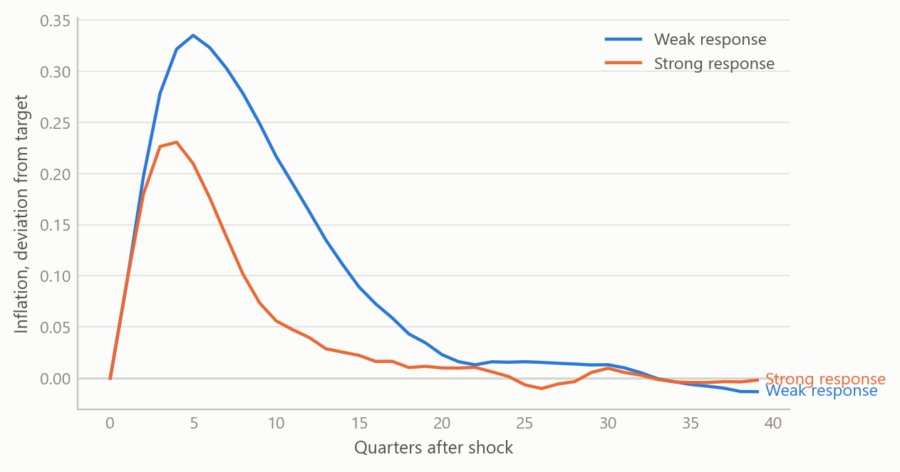
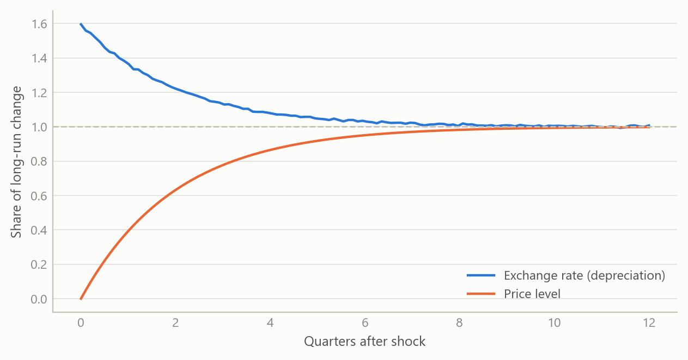
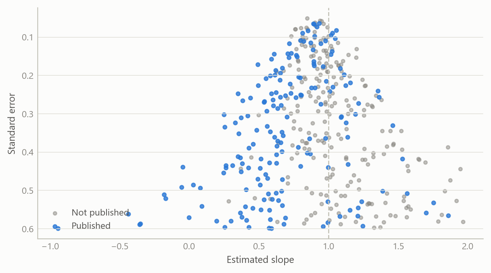

# A working map of macroeconomic model families
Carlos Galindo

> [!NOTE]
>
> ### At a glance
>
> - **Question.** What does each major family of macroeconomic model assume, what does it let you say about a policy shock, and where do the families disagree?
> - **Approach.** Work through the families in order of complexity, from the three-equation model and quarterly projection models for small open economies to New Keynesian and DSGE models, and anchor the exchange-rate side in a self-built base of over 80 papers.
> - **Finding.** The families are best read as one ladder: each adds one structural ingredient (expectations, an open economy, optimising agents) and each ingredient changes which shocks matter and how fast they fade.
> - **Why it matters.** A forecaster or policy analyst who knows what each model assumes can say when a simple tool is enough and when it is misleading.

## The question

Macroeconomists talk about “the model” as if there were one. There are several, built for different purposes, and the choice among them often decides the answer. A three-equation model can tell a central bank in a few lines what happens to inflation if rates rise. A fully micro-founded model can say whether a policy is welfare-improving, but only at the price of heavy machinery. A small open economy adds a further wrinkle: the exchange rate moves with expectations and with foreign interest rates, and it can jump.

This project builds a working map of those families. The aim is not a new model but a clear understanding of how the existing ones relate: which assumptions are shared, which are added at each step, and which empirical regularities each can or cannot reproduce. The reader it serves is anyone who has to choose a model for a forecast, a scenario or a policy discussion, and wants to know what that choice quietly assumes.

## Approach

The work proceeds in four stages, each building on the last.

**The three-equation model.** The starting point is a closed economy described by a demand curve linking output to the real interest rate, a Phillips curve linking inflation to slack, and a policy rule setting the interest rate in response to inflation and the output gap. The compact version used here is written in continuous time, with a decaying demand shock. Output feeds unemployment through a stable output–unemployment relationship, unemployment feeds inflation, and the policy rate closes the loop by feeding back into output. The key analytic question is stability: the loop is self-correcting only if the policy response to inflation is sufficiently strong, which is the familiar requirement that the rate rises by more than one-for-one with inflation.

**Quarterly projection models for small open economies.** The next step adds an exchange rate, foreign variables and forward-looking expectations. This is the structure many central banks use for routine forecasting: a few behavioural equations, gaps defined against trends, and an explicit policy rule. A central part of the study was a derivation showing how a model with rational expectations can, under stated conditions, be transformed into an equivalent vector autoregression. That matters because it connects a structural model, whose parameters have economic meaning, to a reduced form that can be estimated and checked against data. The derivation also sets out the minimum set of inputs needed to build such a system, the conditions for a unique stable solution, and the role of eigenvalues in judging determinacy.

**New Keynesian and DSGE models.** The third step makes households and firms optimise. Demand and the Phillips curve are then derived rather than assumed, expectations enter both, and shocks to technology, preferences and policy are specified explicitly. A basic real business cycle model served as the benchmark: solved to first order, simulated over a long sample after discarding a burn-in, and used to produce impulse responses over twenty periods. It is the simplest case in which the whole workflow, from steady state through solution to simulation, can be checked end to end.

**Exchange-rate overshooting and interest parity.** The fourth strand follows one question across all the families: how does the exchange rate respond to a monetary shock? The overshooting model gives a sharp answer. Prices are sticky in the short run but asset markets clear at once, capital is perfectly mobile, so interest parity holds and expectations are rational. A monetary expansion then depreciates the currency by more than its long-run amount, and the currency appreciates back as prices catch up. To test this against the evidence, a structured base of over 80 papers was assembled and converted into a searchable, machine-readable form, with a survey of the interest parity literature drawn from it.

How the work was checked: each model was written out in full, solved, and compared with the qualitative behaviour the literature reports (stability conditions, the sign and timing of responses, the size of overshooting relative to the long-run move). Summaries drawn from the paper base were treated as drafts and cross-read against the source papers.

## What the work shows

### Policy strength decides whether shocks fade

In the three-equation model a temporary demand shock raises output, which lowers unemployment, which pushes inflation up, which prompts the policy rate to rise and pull output back. How quickly this happens depends on how hard the rule responds. A weak response lets inflation drift for a long time; a strong one removes it quickly, at the cost of larger swings in the policy rate. The figure shows the shape of this trade-off in a discrete-time version with illustrative parameters.

Figure 1: Response of inflation to a temporary demand shock under a weak and a strong policy response (simulated data).

### The exchange rate overshoots, then returns

In the open-economy ladder, the exchange rate is the variable that jumps. After an unexpected monetary expansion the currency depreciates beyond its eventual level, while prices rise only slowly. The excess depreciation is exactly what makes the interest differential offset expected appreciation, so parity holds throughout. The figure shows both paths.

Figure 2: Exchange rate and price level after an unexpected monetary expansion, as a share of the long-run change (simulated data).

### Interest parity fails in simple tests, and the failure shrinks under scrutiny

The simple parity condition says the expected change in the exchange rate equals the interest differential. The standard test regresses the realised change on the differential, where parity implies a slope of one. In practice the slope is often well below one and sometimes negative, the so-called forward premium puzzle. The survey drawn from the paper base sets out six candidate explanations: time-varying risk premia, market microstructure, investor sentiment, measurement and small-sample bias, rare-disaster risk, and carry-trade dynamics with limits to arbitrage.

The most useful single finding concerns publication bias. A published meta-analysis of 3,643 estimates from 91 articles reports that, after correcting for selective publication, the corrected slope is about 0.31 for developed markets and about 0.98 for emerging markets. In other words, the puzzle is real but smaller than the raw literature suggests for developed economies, and close to absent for emerging ones. The figure reproduces the logic with simulated estimates: when small, imprecise studies with low slopes are more likely to be published, the published average falls below the truth.

Figure 3: Simulated study estimates of the parity slope: all studies versus the subset more likely to be published (simulated data).

### What each rung adds

The table summarises what each family adds and what it costs.

| Family | What is added | What it can say | Main cost |
|----|----|----|----|
| Three-equation model | Demand, Phillips curve, policy rule | Stability and policy strength | Closed economy, ad hoc expectations |
| Quarterly projection model | Exchange rate, foreign block, forward-looking terms | Routine forecasts and scenarios | Many gaps to be measured |
| New Keynesian / DSGE | Optimising agents, explicit shocks | Welfare and structural shocks | Heavy solution and estimation |
| Overshooting and parity | Sticky prices, mobile capital | Exchange-rate dynamics | Parity fails in simple tests |

## Insights

- **Stability is a property of the policy rule, not only of the economy.** The same shock fades or lingers depending on how strongly the rule responds to inflation.
- **Models are nested.** The richer models reduce to the simpler ones under restrictions, so the simple ones are a sound first read, not a rival.
- **A structural model can be turned into an estimable reduced form.** Showing the equivalent vector autoregression, and the conditions under which it exists, is what links theory to testing.
- **The exchange rate is the hard variable.** Overshooting is elegant, parity is its cornerstone, and parity is the part the data most often reject.
- **Literature evidence needs bias correction.** Weighing a puzzle by the raw count of published estimates overstates it.

## Scope and next steps

The study is built as a ladder of model families, solved and compared for the regularities each can reproduce, so that the choice of model for a forecast, a scenario or a policy question can be made deliberately. Its figures illustrate that qualitative behaviour.

The natural extensions are three. First, calibrating a small open economy projection model to a chosen country. Second, estimating its implied reduced form. Third, comparing the out-of-sample forecast performance of the rungs of the ladder.

The comparison can be discussed on request.

## About the evidence

The work was done during a career break (from 2024, with the material here dated 2025) as self-directed study, and combines written derivations, solved model runs and a structured base of over 80 papers. The one external number reported (the meta-analysis figures) comes from that paper base. Everything plotted is simulated.

Figures and tables marked *simulated* are generated from simulated data built to share the structure of the analysis (its variables, horizons and frequencies). They show how each method works and what its output looks like. Results stated in the text, and figures that give a source, are the project’s own. Methods are described at the level of a methods section. Code and data pipelines are not reproduced here.
