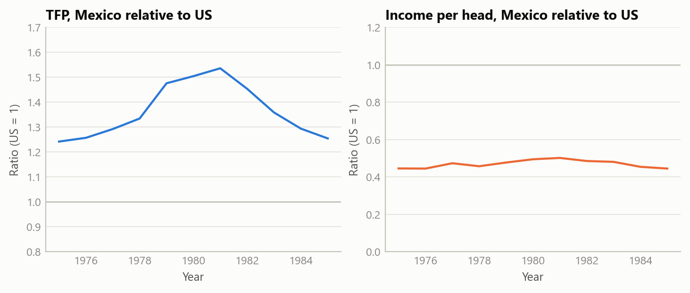
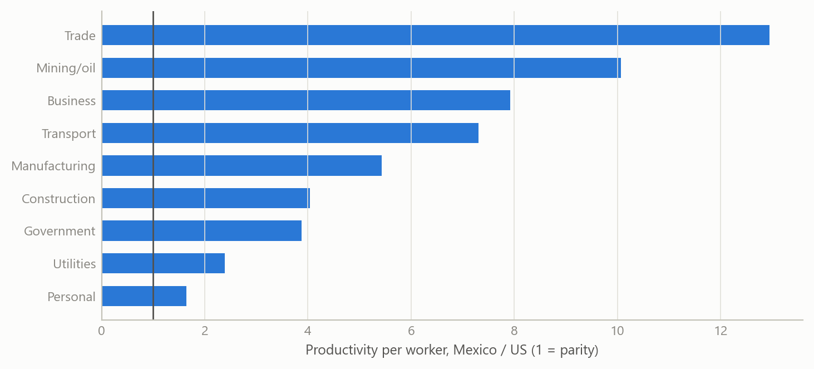
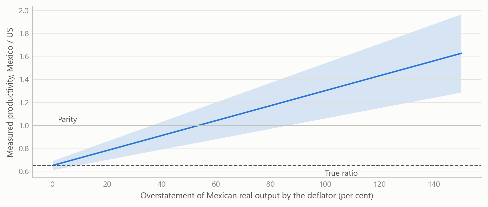

# Was Mexico really more productive than the US in 1980?
Carlos Galindo

> [!NOTE]
>
> ### At a glance
>
> - **Question.** Why does the Penn World Table show Mexico’s total factor productivity above the US level in 1980 and 1981, when Mexican income per head was about half the US level?
> - **Approach.** Check the capital-share assumption, break aggregate productivity into sectors, isolate the oil boom, and test whether the price deflators behind purchasing-power comparisons can generate the gap.
> - **Finding.** The gap is mostly a measurement artefact of the deflators used for purchasing-power comparisons, with smaller real contributions from the oil boom and from Mexico’s high measured capital share.
> - **Why it matters.** Taken at face value, the data tell a story of a collapse from leader to laggard. Corrected, they describe a country that never closed the gap at all.

## The question

Total factor productivity (TFP) is the part of output that capital and labour do not explain. It is the usual measure of how efficiently an economy turns inputs into output, and it is the number behind many growth narratives. Cross-country comparisons of it rest on one input above all: a way to value output in a common currency. That is the job of purchasing-power price comparisons.

The Penn World Table, in its latest edition, contains a result that should stop any economist. On its aggregate TFP measure, scaled so that the US in 2019 equals 1.0, Mexico stands at 1.51 against a US value held at 1.00 in 1980, and 1.50 in 1981. In the same years, Mexican real income per head was roughly half the US level. A country is being described as 51 per cent more efficient than the richest large economy while being about 52 per cent poorer.

There are two ways to read this. One is to take it as a fact and build a story on it: Mexico was a productivity leader in 1980 and then lost its edge. The other is to ask whether the number is measuring what we think it is. This note follows the second route. The question matters because a growth narrative resting on a spurious starting point misdiagnoses everything that follows, including how large the later decline was and what would be needed to reverse it.

## Approach

The investigation had four steps, each designed to eliminate one explanation before moving to the next.

**First, the capital share.** Standard TFP calculations weight capital and labour by factor shares. Mexico’s measured capital share in 1980 was far higher than the US share, 0.605 against 0.376. A high capital share changes how much of output is attributed to inputs and how much is left as TFP, so it is the first candidate for a mechanical distortion. The test is simple: recompute productivity for both countries with a single common capital share of one third, and see whether the gap closes.

**Second, a sectoral breakdown.** Aggregate productivity hides where it comes from. A sectoral database of value added and employment for the major sectors of each economy allows productivity per worker to be compared sector by sector, in constant prices converted to a common currency. If Mexico really were more efficient, the advantage should be concentrated in a few places, and it should be plausible in each of them.

**Third, the oil boom.** Mexico’s oil sector expanded sharply in the late 1970s as oil prices rose. Mining and oil employed only a small share of the workforce but produced very high output per worker. The question is how much of the aggregate gap that single sector can carry. A shift-share style decomposition, which splits changes in aggregate productivity into within-sector and between-sector parts, was also used to check the plausibility of the sector series. An early version produced absurd growth figures because nominal rather than constant prices had been used; catching that against a simple cross-check on employment shares was part of the validation.

**Fourth, the deflators.** The comparison of sectoral output across countries relies on price indices and purchasing-power conversion factors that are defined for the whole economy, not for each sector. If those aggregate factors misvalue a sector’s output, productivity in that sector will be misstated by the same proportion. The test here is one of plausibility: do the implied sector ratios make economic sense?

The data are the Penn World Table (aggregate TFP, capital shares, income) and a sectoral productivity database covering ten sectors. The work compares a developing and a rich economy, 1975–1985 for the paradox itself.

## What the work shows

**The paradox is stable, not a one-year blip.** The published ratio of Mexican to US TFP was 1.27 in 1975, 1.51 in 1980, 1.50 in 1981 and 1.20 in 1985. It rises with the oil boom and falls after it, but stays above one throughout, while the income ratio stays well below one (0.45, 0.48, 0.50 and 0.42 in the same years).

Figure 1: Stylised version of the puzzle: a TFP ratio above one alongside an income ratio below one, 1975–1985 (simulated data).

**Fixing the capital share does not remove it.** With a common capital share, the Mexican advantage falls to 24 per cent in 1980 and 27 per cent in 1981 — smaller, but still there. The capital-share difference is a real, mechanical contributor, and the investigation put it at roughly a fifth of the paradox. It does not explain the rest.

**The advantage is implausibly broad.** In 1980, labour productivity outside agriculture was about 4.7 times higher in Mexico than in the US on the sectoral data, and every non-agricultural sector showed a Mexican lead. The ratios ran from 1.5 times in personal services to 12.3 times in trade services, 8.0 times in business services and 5.4 times in manufacturing. Few of these can be believed. A Mexican retail worker is not twelve times as productive as a US one, and Mexican factories were not five times as productive as US factories at a time when the US led in automation, management practice and skills.

Figure 2: Stylised sectoral productivity ratios, Mexico relative to US (simulated data).

**The oil boom is real but small.** Mining and oil employed about 1.4 per cent of Mexican workers in 1980, yet output per worker was about 10.3 times the US figure, and 14.3 times in 1981. Real in this case means a genuine resource-price windfall, not a mismeasurement. But a sector that small can carry only a small part of an aggregate gap: the investigation estimated roughly 8 per cent of it.

**Most of what remains is the price comparison.** The sectoral series convert output with deflators and purchasing-power factors defined for the aggregate economy. They do not adjust sector by sector, and they do not adjust for quality: an output of the same nominal value in Mexico and in the US is not the same real quantity when the goods and services differ in quality and variety. The effect should be largest in services and in goods where quality differences are widest, which is exactly where the implausible ratios appear. The investigation attributed about 70 per cent of the paradox to measurement (roughly 60 per cent to the aggregate deflators and 10 per cent to missing quality adjustment) and 30 per cent to real factors (about 20 per cent from the capital share and 10 per cent from oil). On its working estimate, Mexican TFP in 1980 was about 65 per cent of the US level, not 151 per cent.

A small simulation makes the mechanism concrete. If the deflator overstates the real value of Mexican output by a given percentage, the measured productivity ratio rises one-for-one, and the error compounds in sectors that dominate employment.

Figure 3: How a deflator error moves the measured productivity ratio, for a true ratio of 0.65 (simulated data).

## Insights

1.  **When a poorer country beats a richer one on productivity, suspect the yardstick first.** An efficiency lead alongside half the income is not impossible, but it is a prompt to check the measurement before building a story on it.
2.  **Aggregate price conversions are not sector-specific.** Sectoral levels converted with economy-wide factors are good for composition and for growth within a sector, and poor for comparing levels across countries, particularly in services.
3.  **Decompose before you explain.** The aggregate paradox came apart into three pieces with different characters: a mechanical one (capital share), a real but tiny one (oil) and a large measurement one. Each needed a different response.
4.  **Resource-rich countries break the standard capital share.** A common share of one third is a convenient assumption, but a measured share of about 0.6 against 0.38 is large enough to move the answer.
5.  **The corrected story is, if anything, harsher.** If Mexico was never ahead, the post-1981 decline in the published series is mostly an artefact too, and the real finding is persistence: relative productivity stayed near 60 to 65 per cent of the US level for decades, in spite of heavy capital accumulation and rising schooling. The problem is one of never converging, not of losing a lead.

## Scope and next steps

The attribution of roughly 70 per cent to measurement is the investigation’s own judgement, built from sector ratios, plausibility arguments and the capital-share and oil tests. It is not an estimated decomposition and carries no confidence interval. The corrected productivity level of about 65 per cent of the US also rests on the same reasoning. Two things would strengthen it: a formal decomposition that nests the deflator channel as a parameter, and a sector-by-sector re-pricing using detailed international price survey data in place of aggregate factors. The sectoral database covers a limited set of countries and sectors, and the first decomposition runs had to be redone after a prices error, so the final numbers depend on the checks described above.

## About the evidence

This note covers a 2025 investigation of published international productivity data for Mexico and the US around 1980. The numbers in the text are results of that work. The figures are simulated: they have the same variables, years and sector structure as the real analysis, and show the mechanism rather than the published values.

Figures and tables marked *simulated* are generated from simulated data built to share the structure of the analysis (its variables, horizons and frequencies). They show how each method works and what its output looks like. Results stated in the text, and figures that give a source, are the project’s own. Methods are described at the level of a methods section. Code and data pipelines are not reproduced here.
