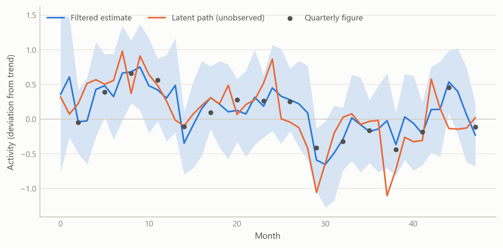
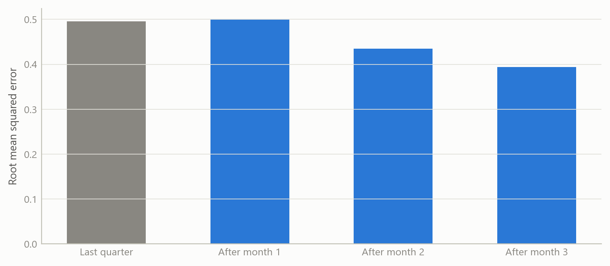
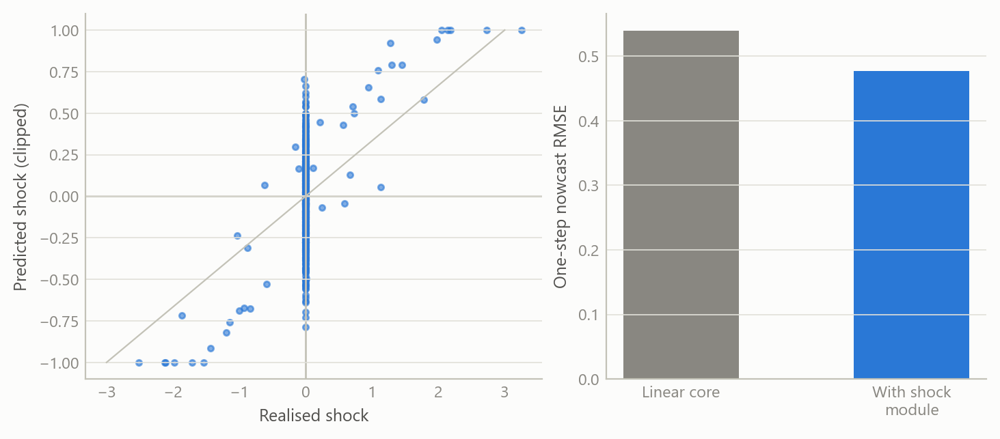

# Nowcasting with mixed-frequency data and a shock module
Carlos Galindo

> [!NOTE]
>
> ### At a glance
>
> - **Question.** How can a monthly indicator set and a slow quarterly release be combined into one estimate of current growth that updates as each number arrives, and can a learned component help with sudden shocks?
> - **Approach.** A monthly latent-state model in which quarterly figures enter as averages of three monthly values, estimated with a Kalman filter. A machine-learning module supplies expected shocks together with their uncertainty.
> - **Finding.** The prototype runs end to end on simulated mixed-frequency data, with the quarterly figures correctly aligned and the shock module’s uncertainty feeding the estimation. It has not yet been tested out of sample on real data.
> - **Why it matters.** The design keeps the linear core simple and auditable and treats the learned part as an optional, bounded add-on.

## The question

Policy and markets want to know how the economy is doing now, but the best measure of output arrives once a quarter and weeks late. In between, monthly indicators arrive on different dates and cover different periods. A nowcast is the attempt to turn that uneven stream into a current estimate.

The obvious approaches fall short in two ways. Bridging by hand, which averages monthly data into quarters and regresses on them, throws away the timing of the information and cannot cope when some indicators are published and others are not. And a purely linear model cannot anticipate the sudden events, such as a policy announcement or an energy price jump, that make nowcasting valuable in the first place.

This project is a prototype aimed at both gaps. It is a small, transparent mixed-frequency model, plus a learned module whose only job is to propose shocks that the linear core can absorb. The work was done during a career break as an independent build. It was designed to be audited line by line rather than to be impressive.

## Approach

**A monthly state.** Everything is modelled at the highest frequency in the problem, which is monthly. A small set of unobserved monthly states, such as underlying activity, evolves through a linear transition equation with an exogenous shock input. Monthly indicators measure these states directly with noise.

**Quarterly figures as averages.** A quarterly observation is not a monthly one. It is treated as an intermittent measurement that exists only in the last month of each quarter. The cleanest version of this is a strict aggregation restriction: the state is augmented with monthly lags, so that the quarterly figure equals the average of the last three monthly latent values. The prototype supports this strict form and a conservative form that maps the quarterly figure onto the monthly latent directly. The first is the more faithful of the two.

**The ragged edge.** Because the model sits at the monthly frequency, an indicator that has not yet been published is simply a missing measurement. The Kalman filter skips it and carries the state forward, and when the number arrives the estimate updates. The same mechanism handles quarterly figures, which are missing in two months out of three. No special treatment of the ragged edge is needed.

**Estimation.** Parameters are estimated by expectation-maximisation, with a floor on the shock variance and light regularisation to keep the estimates stable in short samples.

**The shock module.** A supervised learning module is trained to predict the exogenous shock from features. It returns a mean and a covariance for each period, not only a point value. Three safeguards keep it from damaging the core:

- predictions are clipped to a maximum shock magnitude;
- if the module is missing or fails, the shock defaults to zero, so the model reverts to its plain linear form;
- the module’s reported uncertainty enters the variance of the shock input, so a weakly informative prediction counts for less in estimation.

An attribution layer, based on Shapley values, explains each period’s predicted shock in terms of its features. The contributions are then projected through the input matrix onto the model’s latent states, which shows which inputs moved which state.

**Checks.** The design was held to a short list of acceptance criteria: the augmented system must reproduce the plain one when the optional pieces are off, estimation must stay stable across a grid of settings and seeds, and every run must persist its settings so it can be reproduced. A reality check on the output caught one real problem, in which the quarterly series was misaligned with the monthly index and arrived empty. It was fixed by aligning both on calendar periods.

## What the work shows

The prototype’s results are about design and behaviour, not about forecast accuracy. It runs end to end on simulated mixed-frequency data, which includes monthly states and indicators, daily series aggregated to monthly, and quarterly figures aligned at quarter-end. The quarterly series is correctly populated after the alignment fix. The model’s parameters are estimated and saved, and the report shows both the monthly and the quarterly series.

The figures below use simulated data built to share the structure of the problem. They illustrate how the method behaves.

Figure 1: A monthly latent activity path, noisy quarterly averages observed at quarter-end, and the filtered estimate with its band (simulated data).

Figure 2: Average error of the current-quarter nowcast by how many months of data are in, against a naive benchmark (simulated data).

Figure 3: Left: shocks predicted by the learned module against realised shocks, clipped at a bound. Right: nowcast error with and without the module (simulated data).

The first figure shows the mechanism: quarterly figures pin down the three-month average, monthly indicators fill in the path between them, and the band narrows when information arrives. The second shows the pattern a nowcast should have, with error falling as each month of data comes in. The third shows the shock module’s role, which is to cut error in the periods after a sudden event while its clipping keeps any single prediction bounded. These patterns are properties of the design, shown on simulated data. They are not measured accuracy.

## Insights

1.  **Treat the quarterly figure as a restriction, not a variable to be interpolated.** Writing it as the average of three monthly states lets one model handle both frequencies, and the missing-data logic of the filter does the rest.
2.  **Keep the learned part outside the core.** The shock module is optional, bounded and replaceable. If it fails, the model degrades to a plain linear nowcast, not to nonsense.
3.  **Pass uncertainty, not only predictions.** A shock forecast with a covariance lets estimation weigh a weak prediction lightly. A point forecast does not.
4.  **Attribution belongs in the state space.** Mapping feature contributions through the input matrix onto the latent states makes an opaque predictor answer the question a macroeconomist would ask: which state moved, and why.
5.  **Alignment bugs are silent.** Misaligned calendar periods produce empty quarterly columns, not errors. A minimal reality check on the output, not only on the code, found it.

## Scope and next steps

The prototype is built to nowcast quarterly activity from monthly indicators as they are published, keeping the timing of each release, with a shock module that adjusts after sudden events while keeping each prediction bounded. It is developed on simulated data, where the true path is known.

The natural extensions are three. First, a real-time vintage dataset for one economy and a pseudo-real-time test, by information vintage, against a simple benchmark. Second, training the shock module on genuine event features and reporting its cross-validated contribution to the nowcast. Third, a revision model that treats early releases as noisy measurements of later ones, together with publication-date calendars.

The design can be discussed on request.

## About the evidence

The work is an independent prototype built during a career break, in 2025, and it was documented through design notes, a staged plan with acceptance tests, and generated reports. It was run on simulated mixed-frequency data of a few monthly states, daily series aggregated to months, and quarterly figures. It has no real-data results. All figures on this page are simulated.

Figures and tables marked *simulated* are generated from simulated data built to share the structure of the analysis (its variables, horizons and frequencies). They show how each method works and what its output looks like. Results stated in the text, and figures that give a source, are the project’s own. Methods are described at the level of a methods section. Code and data pipelines are not reproduced here.
