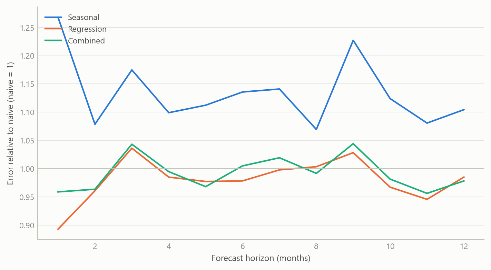
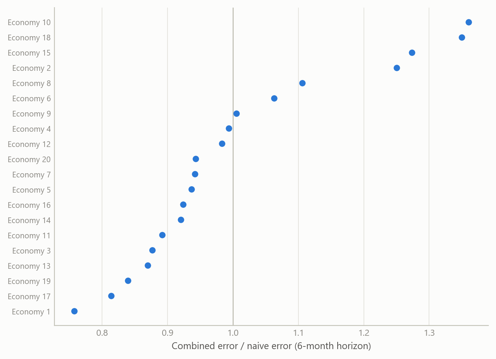
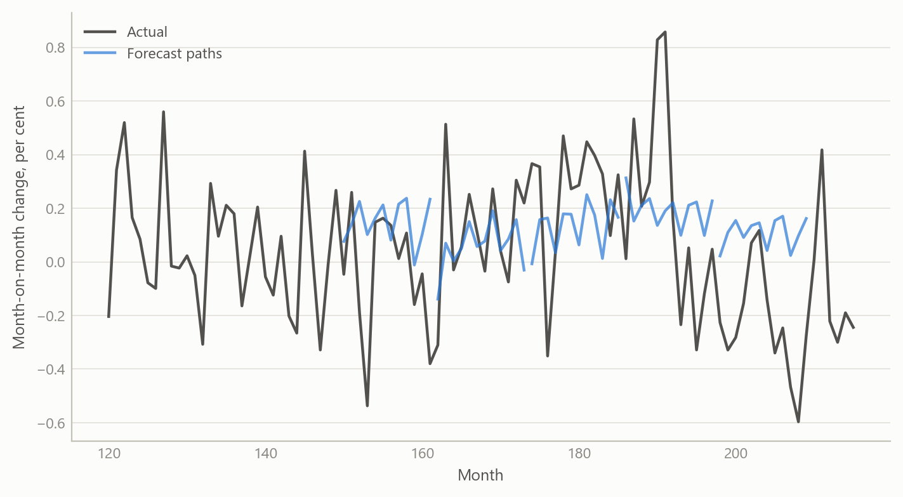

# One engine, many forecasting methods, back-tested across 20 economies
Carlos Galindo

> [!NOTE]
>
> ### At a glance
>
> - **Question.** Can one automated engine produce credible monthly price forecasts for many economies, and can we say rigorously whether it beats a simple benchmark?
> - **Approach.** Per series: remove seasonality, fit several regression-based forecasts, combine them using their track record, and judge the result in a rolling back-test against a naive forecast.
> - **Finding.** The engine was rebuilt and back-tested for price forecasts in 20 economies, including the UK, over 2024–2025. The design makes the comparison with a naive benchmark routine rather than an afterthought.
> - **Why it matters.** Forecast users need to know not just a number but whether the method behind it earns its complexity.

## The question

Price forecasting is usually done country by country, series by series, with a favoured model for each. That works for one economy and breaks down when the job is to cover twenty: the favoured model differs by place, the data arrive in different forms, and nobody can say whether a given forecast is better than simply carrying last year’s pattern forward.

The work described here began in a previous role as a set of forecasting routines and was rebuilt and improved during a period of independent research. The aim was an *automated multi-method engine*: give it a monthly price series for any economy, and it returns a set of forecasts from several different methods, a combined forecast, and a scorecard against a naive benchmark. The point is not any single model. It is a procedure that treats the choice of model as something to be tested, series by series.

Two shortcomings of the obvious approach motivated this. First, a single model’s good run is easily mistaken for skill; the benchmark question (“would doing nothing clever have done as well?”) is rarely asked. Second, a forecast that looks excellent in a back-test can be so only because the test quietly used information the forecaster would not have had. A multi-country engine multiplies both risks, so the discipline has to be built into the engine itself.

## Approach

**Data.** Monthly consumer-price series, one economy at a time, in whatever form the source supplies: an index level, a month-on-month change, or a year-on-year rate. The engine first converts every input to a common form, a price index, so that the same machinery can run on all of them. Forecasts are made as month-on-month changes, chained into an index, and reported as year-on-year rates, so the monthly and annual views cannot disagree.

**Methods.** For each series the engine fits several forecasting specifications and keeps all of them rather than a single winner.

- *Naive benchmark.* A forecast built only from the series’ own recent pattern, with no explanatory variables. It is the bar every other method must clear.
- *Regression on the series’ own history.* The month-on-month change is regressed on seasonal indicators and on its own lags up to twelve months back, plus short moving averages at different lags. Which regressors stay is decided by stepwise selection, adding and dropping terms by significance, so that each series gets the specification its own history supports.
- *Robust variants.* The same regression is re-estimated in a way that limits the influence of outliers, with a fall-back to ordinary estimation if the robust fit fails, so one awkward series does not stop a multi-country run.
- *Structural-break variant.* The regression is re-fitted allowing for up to seven structural breaks, because inflation relationships shift (energy shocks, policy regimes, changes in measurement).
- *Seasonal-adjustment treatment.* Forecasts can be passed through a model-based seasonal decomposition, so that seasonal patterns that drift over time are not frozen at their historical average.

**Combination.** The individual forecasts are combined with weights based on rank: methods with smaller past errors count for more. A second combination weights by past squared error. The final forecast is an equal blend of the two. Combining methods is a long-established way to hedge against any single specification being wrong, and it is the one item on this list that a reader can expect to help on average.

**Back-testing.** The engine holds the data back at a chosen date, treats the remaining history as all that is known, and forecasts 24 months ahead. It then rolls the date forward and repeats. At each date everything is re-estimated from the data available at that date, including the selection of regressors. Errors are collected by horizon and compared with the naive benchmark’s errors over the same windows. This is run for each economy in turn, and the work covered 20 economies, including the UK, over 2024–2025.

## What the work shows

The substantive result of the rebuild is a working, repeatable procedure rather than a single headline number: an engine that, for any monthly price series, produces a family of forecasts, a combined forecast, and a benchmark comparison from a rolling back-test, across 20 economies. The pattern of results the design is built to expose can be illustrated on simulated series that mimic the structure (20 economies, monthly data, horizons up to 12 months, a rolling set of forecast origins).

Figure 1: Forecast error relative to the naive benchmark, by horizon, averaged over 20 simulated economies (simulated data). Below 1 means better than naive.

The shape that matters is in the figure: no method need be best at every horizon, the combination tends to track the better of its ingredients, and a poorly specified method can lose to the naive benchmark at every horizon. That is why the engine reports every method against the benchmark instead of announcing a winner.

Figure 2: Combined forecast error relative to naive at a 6-month horizon, by simulated economy (simulated data). Dots to the left of 1 beat the benchmark.

Across economies the verdict is not uniform: in the simulated panel the combined forecast beats the benchmark in most economies at this horizon and loses in a few. A multi-country engine should therefore be judged by the distribution of outcomes, not by its best country.

Figure 3: One simulated economy: a rolling set of forecast paths launched from successive origins (simulated data).

## Insights

1.  **Build the benchmark into the engine.** The naive forecast is produced for every series every time, so that “does this beat doing nothing clever?” is answered by default.
2.  **Keep the ensemble, not a winner.** Selecting the best-looking model per series rewards luck. Retaining several and combining them on track record is a cheap hedge against specification error.
3.  **A back-test is only as reliable as its information set.** Everything, including variable selection, must be redone from the data available at each origin. A test that lets any later information leak (a later benchmark forecast, a better-informed oil price path) will flatter the model. Reviewing the wider forecasting system later made this concrete: the settings that make a test clean are not always the defaults, and an engine should say so on its face.
4.  **Automation needs graceful failure.** Robust estimation with a fall-back, and break-tolerant specifications, keep a twenty-economy run going when one series misbehaves.
5.  **Judge the distribution of outcomes.** Report how many economies and horizons beat the benchmark, and by how much, rather than the best case.

## Scope and next steps

The engine is built to forecast inflation across economies by combining several methods, with forecasts chained into an index so that the monthly and annual views cannot disagree. Back-test runs for 2024–2025 are stored for each economy; the figures here are simulated and show the method’s logic.

The natural extensions are three. First, a per-economy accuracy table from the stored back-test runs, against the naive benchmark by horizon. Second, a UK panel. Third, a test of whether the combination weights stay stable across forecast origins, and a separate evaluation of calibrated probability bands.

The engine can be discussed on request.

## About the evidence

The work is real and was done during an independent research period, May 2024 onward: a rebuilt automated engine, applied in back-tests to price forecasts in 20 economies including the UK, in 2024–2025, and developed with AI assistance as a systems architect. What you see on this page is illustrative. Every figure is simulated.

Figures and tables marked *simulated* are generated from simulated data built to share the structure of the analysis (its variables, horizons and frequencies). They show how each method works and what its output looks like. Results stated in the text, and figures that give a source, are the project’s own. Methods are described at the level of a methods section. Code and data pipelines are not reproduced here.
