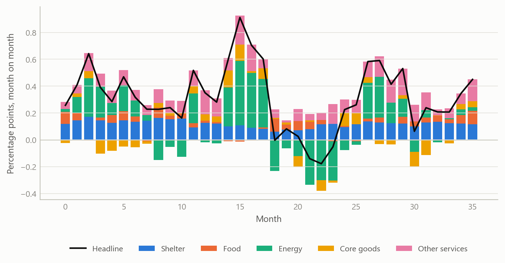
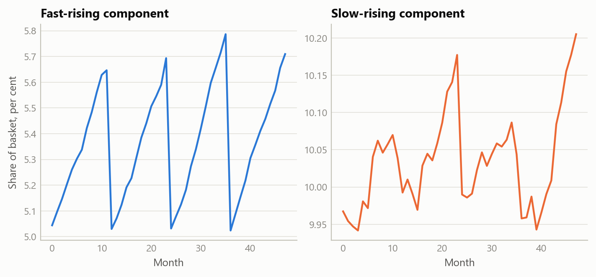
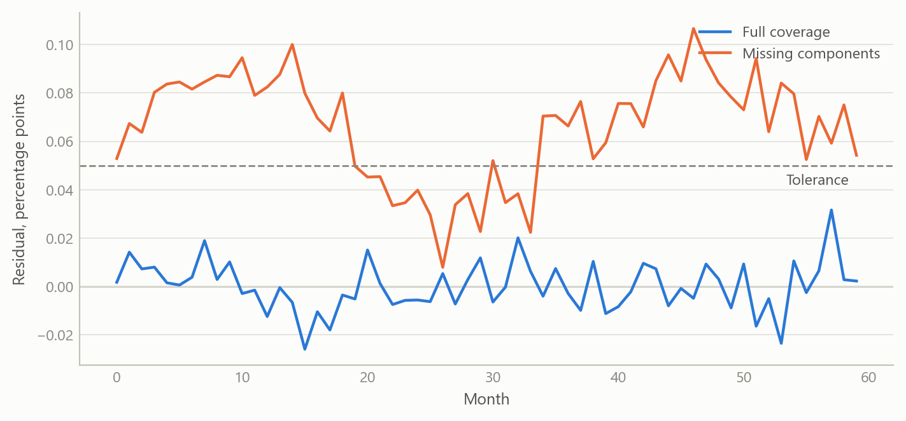

# An automated feed for component-level US inflation
Carlos Galindo

> [!NOTE]
>
> ### At a glance
>
> - **Question.** What is driving US consumer inflation this month, component by component, and can that answer be refreshed without manual work?
> - **Approach.** An automated feed from the official statistical agency, with change detection and revision handling, feeding a decomposition that turns each component’s price change into a contribution to the headline rate.
> - **Finding.** The decomposition is built to add back to the published headline, and the remaining gap is logged every month as a quality check.
> - **Why it matters.** Bottom-up forecasting of inflation needs a clean, current, additive component dataset before any model can be fitted.

## The question

Headline inflation is a weighted average of many price indices, from food and rent to airfares and used cars. A forecaster who only watches the headline sees that prices moved but not why. A bottom-up view asks which components pushed the rate up or down, how persistent each push is likely to be, and what that implies for the next print. Every one of those questions starts from the same raw material: a complete, current and consistent set of component price series, together with the weights that say how much each component counts.

Assembling that material by hand is slow and error-prone. Downloads are manual, the agency revises recent figures, new series appear, and the expenditure weights are published once a year in a different form from the prices. Between annual updates the effective weight of each component drifts, because components whose prices rise faster than average claim a growing share of the basket. A decomposition that ignores this drift will not add up to the headline.

The project in 2025 was to replace that manual routine with an automated feed that anyone doing component-level analysis could rely on.

## Approach

### The data feed

The feed draws monthly price indices for the whole published hierarchy of US consumer prices, a catalogue of 183 series spanning the headline, its groups and its components, from the statistical agency’s public programmatic interface. The history starts in January 2006 and runs to the latest release. The design goals were that it should be cheap to run, safe to repeat and explicit about its coverage.

- **Change detection first.** Before downloading anything, the routine asks for a small sentinel series, usually the headline, and compares its latest period with what is stored. If nothing is new it stops. A short-lived memory of recent checks avoids repeat requests inside the same working session.
- **Incremental updates with a revision window.** When there is news, only a recent window is re-fetched, and it overwrites the stored values for those months. The window looks back twelve months and extends further early in the year, when seasonal factors are re-estimated and the agency revises more of the recent past.
- **Strict failure rules.** A request that returns an empty or partial answer for any series aborts the update and leaves the stored base untouched, rather than writing a dataset with silent holes. Transient errors are retried with increasing delays and the agency’s request limits are respected.
- **Coverage checks.** A long history needs a registered access key. The routine checks that the span it received matches the span it asked for, so that a shortened history cannot pass unnoticed.
- **A catalogue alongside the data.** Series titles and survey metadata are stored beside the numbers, so every component can be labelled and placed in the hierarchy.

### From prices to contributions

The second layer turns index levels into contributions. For each month the routine takes the previous month’s effective weight of every lowest-level component, multiplies it by that component’s monthly percentage change, and records the result in percentage points. Summing the components gives the headline change, and the same sums give every intermediate group, such as food, energy, shelter or core goods.

The effective weights are rebuilt rather than read from a table. Each December the agency publishes expenditure weights. The routine takes the weights of the prior December and moves them forward month by month in proportion to each component’s relative price movement, then renormalises, which is a Laspeyres-style approximation using prior-month prices. Components are classified as leaves or aggregates from the structure of their codes, and the headline is excluded from the leaves so nothing is counted twice.

### Checking it

The check is built into the output. Each month the routine stores the residual, defined as the published headline change minus the sum of the component contributions. A tolerance triggers a warning if the residual is too large, and persistent residuals point to a specific cause: components missing from the weight table, a mistaken place in the hierarchy, or a normalisation problem. The weights are renormalised only when the leaf total drifts by more than half a percentage point from one hundred, so that rounding noise is not mistaken for a real discrepancy.

## What the work shows

### An additive decomposition with a monitored residual

The main result is a monthly decomposition, covering the whole history from 2006, in which component contributions are designed to reconcile to the published headline within a monitored tolerance. Because the residual is stored rather than hidden, a reader can see how well the decomposition closes in any month and where it does not.

Figure 1: Monthly contributions to headline inflation by major group, with the headline change as a line (simulated data).

The picture is the one a forecaster wants. A large swing in energy dominates the headline for a few months, while shelter contributes a steady positive amount that changes slowly. The routine delivers this view for every group and every lower-level component, and a month’s surprise can be traced to the few components that produced it.

### Weights that move within the year

Holding weights fixed until the next December would be simpler, but it lets the decomposition drift away from the headline. Rolling the weights forward each month keeps each component’s share current. A component with fast price growth gains share through the year and is then reset when new annual weights arrive.

Figure 2: Effective weight of a fast-rising and a slow-rising component, rolled forward within each year and reset each December (simulated data).

### Extending back before the machine-readable weights

Machine-readable annual weights were available only from 2011. For 2006 to 2010 the weights existed as December text tables without series codes. They were matched to the component catalogue by name, and 175 of 183 series, or 95.6 per cent, could be matched. The unmatched components were traced; they were series that already existed in 2006, and they were flagged for synonym mappings. A first match summed to about twice the expected total because aggregates and their parts had both been matched, which is why the final construction keeps only the lowest-level leaves and rescales them to sum to one hundred. The resulting weight vintages then run through the same monthly engine, so the early years splice onto the later ones without a break in method.

Figure 3: Residual between headline and summed contributions, with full and with incomplete component coverage (simulated data).

The residual is the feed’s smoke alarm. With complete coverage it is close to zero, as the first line shows. When components are missing it leans away from zero, which is how coverage gaps announce themselves.

## Insights

- **Build the check into the pipeline.** Storing the reconciliation residual every month turns a hidden assumption into a monitored quantity. Problems with coverage, hierarchy or weights show up as a pattern that can be diagnosed.
- **Refuse partial data.** An update that fails loudly and leaves the base unchanged is better than one that writes a dataset with gaps. Downstream models cannot tell a hole from a real zero.
- **Revisions are part of the data.** A refresh that only appends new months would keep stale values. A rolling window that overwrites recent months, wider early in the year, keeps the stored history current.
- **Check before you fetch.** A sentinel query avoids the cost of a full pull when nothing has been published, which respects the provider’s limits and makes scheduling cheap.
- **Match on structure first, names second.** Name matching worked for most components but needed leaf filtering and a handful of manual synonyms. Prior structure in the codes carried most of the load.

## Scope and next steps

The feed is a data layer, not a forecast. It does not show forecast accuracy, and nothing here claims that the decomposition improves predictions of inflation. The simulated figures illustrate the construction; they are not results.

Several limits are known. The reconstructed weights are an approximation based on prior-month prices, so small residuals are expected even with full coverage. The weights for 2006 to 2010 depend on name matching, with a small set of unmatched components still awaiting mapping. The feed covers the all-urban-consumers index only, so other price measures would need their own mappings.

The next steps are a union of all weight vintages for fuller historical coverage, a decomposition of the residual into coverage and rounding parts, and linking the contributions to component-level forecasting models so that the bottom-up and top-down views can be compared out of sample.

## About the evidence

The work was carried out in 2025 on monthly US consumer price data from January 2006 onward. The statements about the feed’s design, the 175-of-183 name match and the weight construction come from the project’s own documentation and outputs. All figures here use simulated data with the same structure, and the numbers in them are illustrative.

Figures and tables marked *simulated* are generated from simulated data built to share the structure of the analysis (its variables, horizons and frequencies). They show how each method works and what its output looks like. Results stated in the text, and figures that give a source, are the project’s own. Methods are described at the level of a methods section. Code and data pipelines are not reproduced here.
