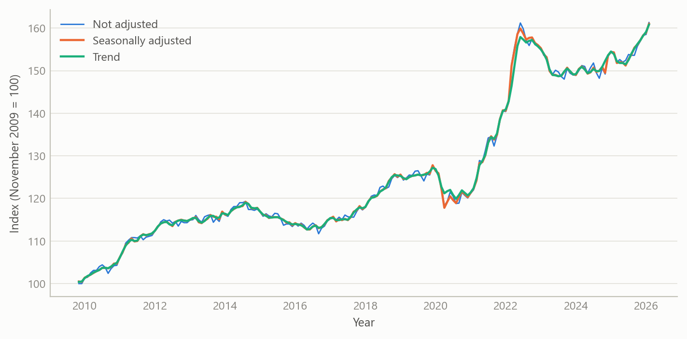
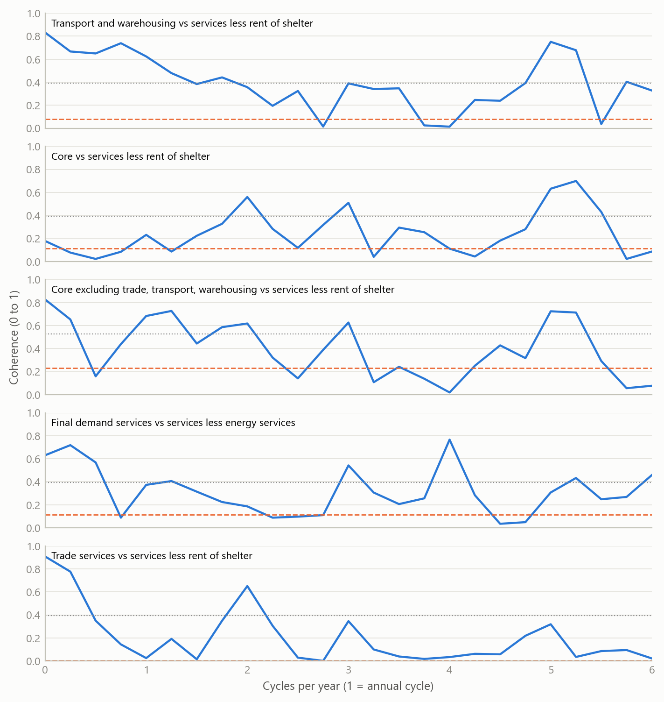
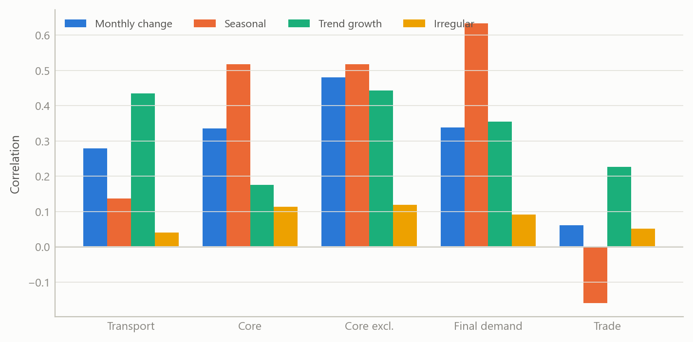
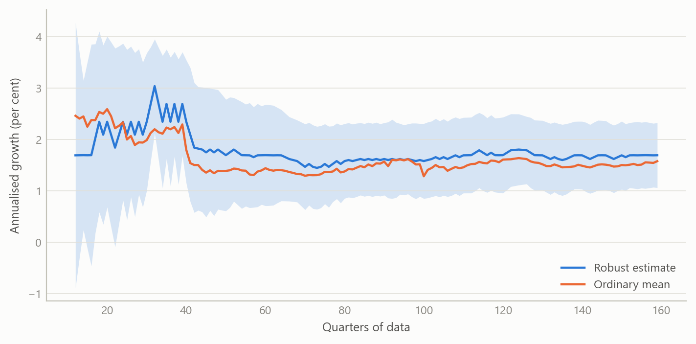

# Finding the signal in economic data
Carlos Galindo

> [!NOTE]
>
> ### At a glance
>
> - **Question.** When two economic series seem to move together, how much of that is seasonality, how much is a shared slow trend, and how much is genuine short-run co-movement?
> - **Approach.** Automated seasonal adjustment and trend-cycle decomposition, cross-spectral coherence by frequency, and a robust estimator of long-run growth, packaged to run on any series.
> - **Finding.** In a worked application to producer and consumer service prices, a claimed 70–80% correlation is not supported: correlations are 0.06–0.48. What link exists sits mostly at the seasonal frequency and in the very slow trend.
> - **Why it matters.** Headline correlations average over frequencies, so they can hide where a relationship lives and overstate how useful it is for forecasting.

## The question

Economists are often handed a statement of the form “series A and series B are 70–80% correlated” and asked to build on it. Correlation of raw data is a blunt instrument. Almost every monthly price index has a strong calendar pattern, and almost every price index drifts upward over the long run. Two series can therefore look closely related simply because both rise in the same months of the year or both trend. Neither says anything about whether a change in one *leads to* a change in the other.

The work here began as a practical need: a way to take any economic series, strip out what is predictable from the calendar, isolate the trend, and ask what is left. The aim was a set of reusable methods that run the same way on any series, not a one-off analysis of one pair. Three methods were built for that purpose, and then tested on a concrete, contested claim about the relationship between producer prices and consumer service prices.

## Approach

**Seasonal adjustment and trend-cycle decomposition.** Each monthly series is decomposed into a trend, a seasonal factor and an irregular component. The workhorse specification is a multiplicative seasonal-ARIMA “airline” model with a regular and a seasonal moving-average term, with additive-outlier detection and no calendar regressors. The procedure was automated so that it can be applied to large collections of series without hand-tuning, and was applied to price and activity series for the United States and Mexico. Automation matters because a decomposition that needs a person to inspect each series cannot be used to screen thousands of them.

**Co-movement across frequencies.** For a pair of series the question is not “what is the correlation?” but “at which cycle lengths do they move together?”. Magnitude-squared coherence is, in effect, a correlation computed separately at each frequency, between zero (unrelated) and one (a perfect linear relationship at that cycle length). It was estimated with segment-averaged spectra for monthly first differences, and also for each decomposed component separately, with attention to three bands: the seasonal harmonics, a business-cycle band covering cycles of roughly 18 to 96 months, and the higher-frequency noise band. Significance was assessed against the usual null of no coherence, and the estimates were stress-tested across 14 combinations of segment length and overlap, because coherence estimates are biased upward when few segments are averaged.

**Long-run growth.** For any series, the long-run (steady-state) growth rate is estimated from annualised log growth. The method uses a robust location estimator, so that crisis quarters and one-off outliers do not drag the estimate, and compares it with the ordinary mean. A recursive version shows how the estimate and its 95% band evolved as data arrived. A band-pass filter isolates the slow component of growth, and a sequential search for structural breaks in that slow component shows whether a series has shifted regime.

**Application.** The methods were tested on five pairs of US price series: five producer price aggregates (final demand services, trade services, transportation and warehousing, a core measure and a core-excluding measure) against two consumer service indices (services less rent of shelter, and services less energy services), about 196 monthly observations from late 2009. The claim under test was that the two sides move together with a correlation of 70–80%. Results were checked on first differences and on log differences, since the two scale the data differently.

## What the work shows

**The headline claim does not hold.** Correlations of log differences across the five pairs run from 0.06 to 0.48, against 0.11 to 0.53 for plain first differences. Formal tests reject a true correlation of 0.70 for every pair, and rolling 36-month correlations never reach 0.70 in any window, peaking at 0.65. The log version is uniformly a little weaker than the first-difference one, because price indices with different base levels weight large changes unevenly. This is a methodological point worth knowing: the choice of transformation moves correlations by up to about 0.05, without changing the conclusion.

**Much of the correlation that exists is seasonal, and some is trend.** Decomposing each series shows where the link lives. Correlations between the seasonal components are 0.52–0.63 for the core, core-excluding and final-demand pairs. Correlations between trend growth rates are 0.18–0.44 for the four pairs against services less rent of shelter, highest for transport and for the core-excluding measure. An earlier version of this analysis put trend correlations below 0.07; it had included nine months of model forecast beyond the data, one of them a large artefact. Coherence agrees: between seasonal factors, mean coherence is 0.51–0.70 and reaches 0.81–0.86 at the seasonal band for the pure-price pairs. In plain terms, the two sides of the economy share a calendar and, for some pairs, a slow trend. Neither is evidence that producer prices pass through to consumers.

**Coherence is frequency-selective, not absent.** Averaged over all frequencies, the irregular components are only weakly coherent (mean 0.12–0.35). Yet peak coherence of the irregular components is significant at 0.42–0.82 for every pair, in 86–100% of the 14 estimator settings, and the conservative lower bounds for the raw series are 0.37 to 0.69. The transport-and-warehousing pair is the clearest case: its irregular component has coherence of 0.57 in the business-cycle band and 0.79 at the two-month cycle, which the seasonal model does not capture. The core measure, by contrast, has almost no coherence in the business-cycle band (0.06 for its trend). Its relationship with consumer services is narrow and calendar-bound.

**Zero-frequency coherence can mislead.** The trade-services pair has coherence of 0.91 at the zero frequency yet a time-domain correlation of just 0.06. There is no contradiction. All price indices share a long-run drift, so coherence at the lowest frequency is high, while the ordinary correlation is a spectrum-weighted average dominated by frequencies where this pair is unrelated (seasonal coherence 0.03).

**Lead-lag evidence points the wrong way for pass-through.** Granger tests show trade services preceding consumer services (p = 0.001, against 0.30 in reverse), but for the core-excluding measure the reverse direction dominates (p \< 0.001), which suggests feedback and not simple pass-through.

The first three figures are drawn from the public price series and their stored decompositions, on observed months only (November 2009 to March 2026). The long-run growth figure still uses simulated data until the cross-country re-run is done.

Figure 1: US producer prices for transportation and warehousing services: not seasonally adjusted, seasonally adjusted, and the trend from the airline-model decomposition, November 2009 to March 2026. Source: BLS via FRED; the author’s decomposition.

Figure 2: Coherence of monthly log changes for the five producer-consumer pairs, by cycle length. Dashed: the squared ordinary correlation. Dotted: the 95% threshold for coherence under no relationship. Source: BLS via FRED; the author’s calculations.

Figure 3: Correlation of each producer-consumer pair, measured on monthly log changes and on each decomposed component. Source: BLS via FRED; the author’s decomposition and calculations.

Figure 4: Long-run growth of a simulated quarterly series with crisis outliers: the robust estimate against the ordinary mean, with a 95% band that tightens as data arrive (simulated data).

## Insights

1.  **Decompose before you correlate.** A pair can share a calendar and a trend without sharing any short-run dynamics. Splitting the series first changes the answer to “how related are they?”.
2.  **Summary statistics average over frequency.** The ordinary correlation is a weighted average of coherence across frequencies. A relationship that lives at one cycle length is diluted, and a high value at the lowest frequency is not evidence of causal pass-through.
3.  **Report the transformation.** Log differences and plain differences gave correlations up to about 0.05 apart. The effect is small, but it is systematic and should be disclosed.
4.  **Check the estimator before trusting the peak.** Coherence peaks depend on segment length and overlap. Reporting the share of settings that remain significant is more honest than quoting the largest value.
5.  **Robust growth rates are cheap insurance.** One or two crisis quarters can shift an average growth rate by more than its sampling error, and a robust estimate with a recursive band shows how much a number can be trusted.

## Limits and next steps

The application covers five pairs of US price series, and a refutation of one claim for those series is not a general statement about price pass-through. Coherence is not causation: common drivers could produce coupling in the business-cycle band. The size and variance share of the frequency-selective link has not been quantified, and the claim that it has forecasting value has not been tested. The natural next step is a forecasting experiment in which a band-limited component of producer prices is used to predict consumer service inflation out of sample, compared with a naive benchmark. The cross-country long-run growth estimates also need to be re-run and tabulated before they are shown.

## About the evidence

The application uses public monthly price series for the United States from late 2009, about 196 observations per series, and the decomposition work was applied to US and Mexican price and activity series. The first three figures are drawn from those public series and the stored decompositions; the long-run growth figure uses simulated data. The numbers in the text are the project’s own results from the real series. The work was done from 2025 to 2026, as part of a rebuild of an applied research toolkit.

Figures and tables marked *simulated* are generated from simulated data built to share the structure of the analysis (its variables, horizons and frequencies). They show how the method works and what its output looks like; they are not the project’s results. Results stated in the text are the project’s own. Methods are described at the level of a methods section. Code and data pipelines are not reproduced here.
