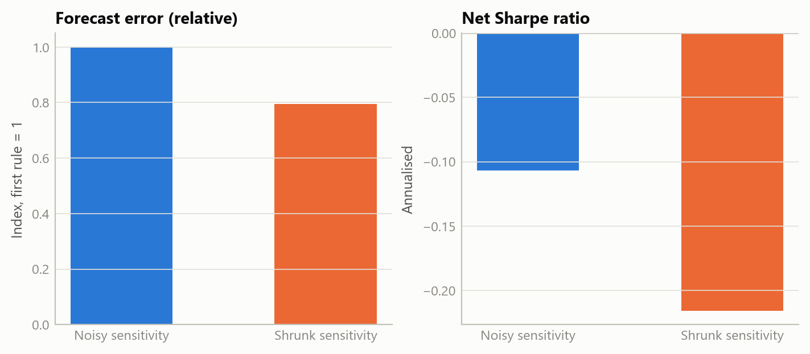
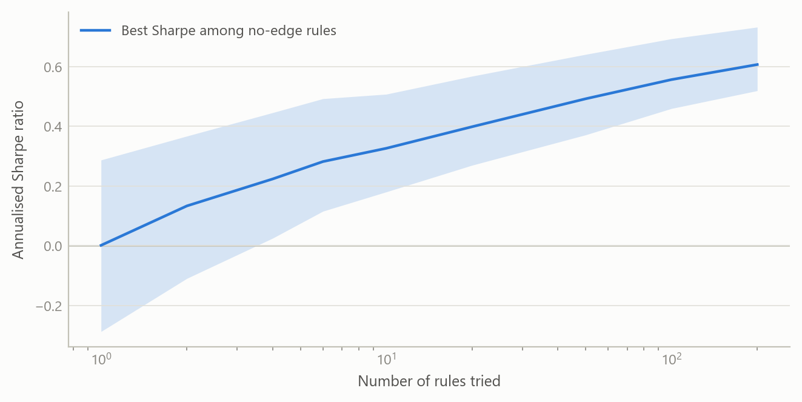
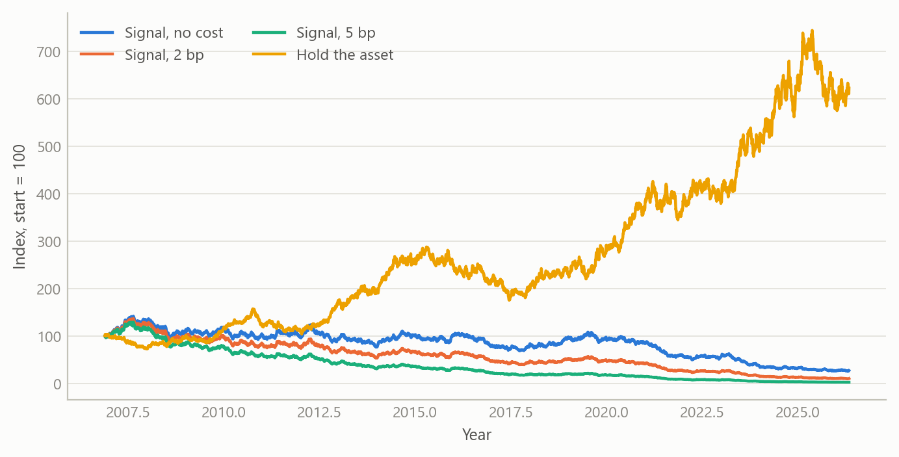

# A pre-registered framework for testing trading rules
Carlos Galindo

> [!NOTE]
>
> ### At a glance
>
> - **Question.** Does a model in which a precious metal’s daily sensitivity to real yields and the dollar drifts over time give a tradable, real-time, out-of-sample edge after costs?
> - **Approach.** A design fixed in writing before any result was produced: four benchmarks, two cost levels, a stated number of configurations tried, and a mechanical verdict rule.
> - **Finding.** The framework returned a clear verdict on both candidates: no exploitable edge net of costs. The time-varying-sensitivity signal’s deflated Sharpe ratio was essentially zero, and a simpler calendar rule on equities met the same verdict.
> - **Why it matters.** Statistical forecast skill is not an economic edge, and a test that can say “no” in advance is worth more than a backtest that always finds something.

## The question

A precious metal’s relationship with real interest rates and the dollar is one of the best-known regularities in macro-finance. Higher real yields raise the opportunity cost of holding a non-yielding asset, and a stronger dollar makes the metal dearer for everyone else. The relationship is not stable, though: it weakened markedly in recent years, which is the usual motivation for letting the sensitivities vary over time.

That motivation invites a trading idea. If the sensitivities can be tracked in real time, then today’s moves in yields and the dollar should predict tomorrow’s move in the metal, and a rule that goes long or short accordingly should make money. The question here is whether that is true, and the way the question is asked matters as much as the answer. Trading-rule research is a standard setting for self-deception. With enough variants, enough sample splits and enough tolerance for look-ahead, almost any rule can be made to look profitable. The aim was to remove those degrees of freedom before looking at any result.

## Approach

**Model.** Daily returns on the metal were regressed on daily changes in a long-term real interest rate and in the trade-weighted dollar, with both coefficients following random walks. The coefficients are estimated by a state-space filter that uses only information up to each date, never a smoothed estimate that sees the future. The rule is direct: the day’s fitted driver contribution gives a sign, and the position next day is long or short one unit according to that sign. In other words, it bets that the contemporaneous relationship persists one day forward.

**Data.** Daily closes of an exchange-traded fund tracking a precious metal, a long-term real interest rate and a broad trade-weighted dollar measure, 5,404 aligned trading days from late 2004 to mid-2026. These are market and official closes, so there is no revision problem. Two substitutions of series, forced by access limits, were logged in the design and both were judged to be conservative.

**Walk-forward discipline.** The two variance parameters of the filter were fitted by predictive likelihood on an expanding window of past data only and re-estimated once a year. A two-year warm-up preceded trading, which left 4,898 out-of-sample trading days from late 2006 to mid-2026. Nothing was tuned to the known 2022 to 2025 breakdown in the metal–yield relationship, and a regime-switching variant that would have been designed to fit it was explicitly excluded.

**Benchmarks that must all be beaten.** Buy-and-hold on the metal; the same signal with coefficients from a 60-day rolling regression, which isolates whether the filter adds anything; a rule that simply goes long when real yields fall; and a momentum rule.

**Costs.** Two basis points per unit of turnover, with five basis points as a robustness case.

**Multiple testing and the decision rule.** Performance was judged on the annualised Sharpe ratio and on the deflated Sharpe ratio, which corrects for the number of configurations tried, for skewness and fat tails, and for sample length. All six configurations were counted. The verdict was fixed in advance with three possible outcomes: edge confirmed only if the signal beat both buy-and-hold and the rolling regression and its deflated Sharpe ratio exceeded 0.95; ambiguous if it beat them on raw Sharpe only; no edge otherwise. The prior, recorded in advance, was that the null was the expected outcome, because the metal–yield link is largely a low-frequency, contemporaneous phenomenon.

## What the work shows

The verdict was **no edge; the null holds**. The table sets out the net-of-cost results over the 4,898-day window.

| Strategy | Sharpe (annual) | Deflated Sharpe | Annual return |
|----|----|----|----|
| Time-varying signal, 2 bp | -0.165 | 0.002 | -3.0% |
| Time-varying signal, 5 bp | -0.579 | 0.000 | -10.5% |
| Rolling-regression signal, 2 bp | -0.353 | 0.000 | -6.4% |
| Sign of real-yield change, 2 bp | -0.280 | 0.000 | -4.9% |
| Metal momentum, 2 bp | -0.510 | 0.000 | -9.3% |
| Buy and hold, metal | 0.482 | 0.475 | 8.8% |

Three results stand out. First, every active rule lost money after costs, and the main signal lost money even at the lowest cost level; at five basis points the annual loss was 10.5%. Second, the benchmark that mattered most, simply holding the metal, earned a Sharpe ratio of 0.482 against -0.165 for the signal. Third, the deflated Sharpe ratio of the signal was 0.002 against a requirement of 0.95. With six configurations the deflated hurdle for the annualised Sharpe ratio was 0.496, which even buy-and-hold did not clear on the deflated measure (0.475).

The filter did do something useful relative to the naive version: it beat the rolling regression on Sharpe (-0.165 against -0.353). A test of equal predictive accuracy on one-day-ahead squared errors also favoured the filter decisively. The filter shrinks its coefficients towards zero and so forecasts with less noise. Yet it still lost money. That is the central lesson, and it is easy to state in a sentence: *statistical forecast skill is not an economic edge.* A model can have lower squared error and still fail to profit, because the positions that matter are the extreme calls, and the cost and sign of those calls are not what mean squared error measures.

Figure 1: Lower forecast error without a profit: relative forecast error and net Sharpe for two rules with no true edge (simulated data).

The next figure shows why the deflation matters. Among many rules with no true edge, the best one will look impressive, and the more are tried the better the best looks.

Figure 2: The best of many no-edge rules looks good; the hurdle rises with the number tried (simulated data).

Figure 3: Cumulative net return of a no-edge signal at three cost levels, against holding the asset (simulated data).

The same discipline was applied to a second candidate chosen as a simple contrast: a fixed calendar rule that holds equities only around the turn of the month. A fixed calendar rule has no fitted parameters, so it is walk-forward clean by construction. Over 8,166 trading days it earned a Sharpe ratio of 0.376 against 0.548 for buy-and-hold, with a deflated Sharpe ratio of 0.927, short of the 0.95 bar. It was in the market 24% of the time and captured about 8% of the cumulative log return. Verdict: no edge, reported the same way.

## Insights

1.  **Fix the verdict before the result.** The decisive feature was a mechanical rule written first, with the prior stated, so a null could not be reinterpreted as a near miss.
2.  **A simple benchmark is the real opponent.** Beating a naive version of the same model was not enough; buy-and-hold and two crude rules were the bar, and the sophisticated model lost to all of them on a net basis.
3.  **Count the trials.** Six configurations lifted the deflated hurdle to 0.496 in annual Sharpe terms. Without the correction, a modest positive Sharpe ratio would have looked like a finding.
4.  **Contemporaneous is not predictive.** The relationship that motivates the model is real and strong at the same date, and it does not carry one day forward in a way that survives costs.
5.  **A clean null is an output.** The design was built so that a null would be a successful, useful result, and it is reported straight with a no-go decision and no capital deployed.

## Scope and next steps

The test covers one family of rules on one asset at daily frequency. It says nothing about intraday strategies, options, leverage or volatility targeting, other instruments, or regime-switching variants, all of which were declared out of scope in advance and none of which can rescue this result. The data substitutions were logged, though a different dollar measure or real-yield definition could shift the numbers slightly. Costs are retail-scale and applied as a flat charge per unit of turnover, with no market impact. The sample is long, but a single path of history is still one draw.

Natural extensions would be to apply the same pre-registered template to other candidate signals, so that the number of trials is tracked across a whole research programme and not only within one test, and to examine low-frequency levels relationships, where the original motivation lives, with the same standards.

## About the evidence

The results in the text are from the project’s own out-of-sample backtest, completed in 2026 on daily market and official data, with no capital deployed. The figures here are illustrative: they are simulated to share the horizon, sample length and cost structure of the real test and demonstrate the logic, not to reproduce its results.

Figures and tables marked *simulated* are generated from simulated data built to share the structure of the analysis (its variables, horizons and frequencies). They show how each method works and what its output looks like. Results stated in the text, and figures that give a source, are the project’s own. Methods are described at the level of a methods section. Code and data pipelines are not reproduced here.
