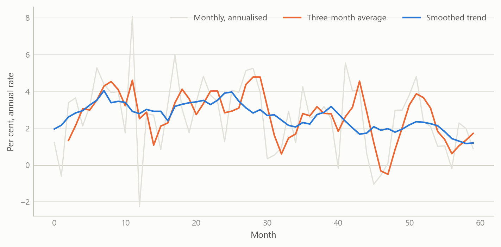
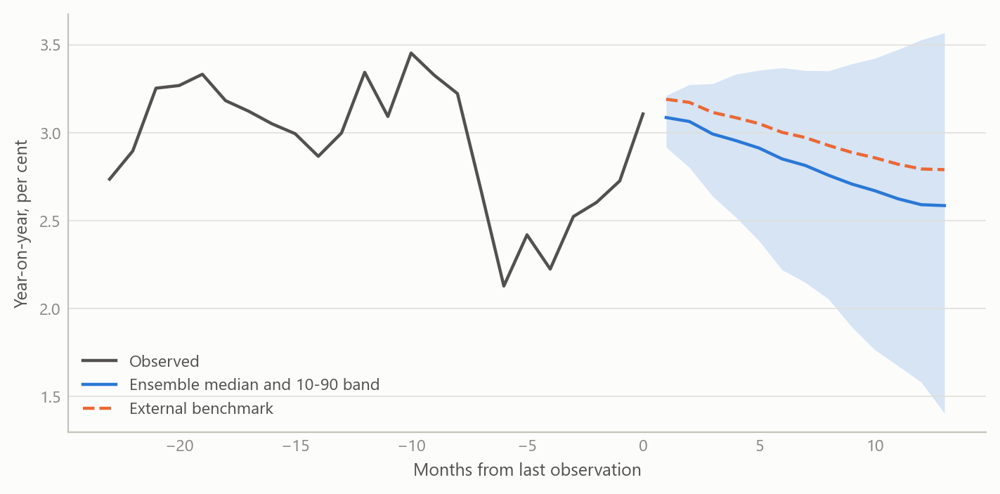
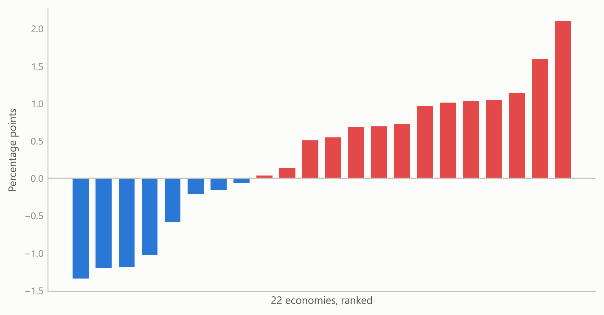

# A global underlying-inflation monitor with a blended projection system
Carlos Galindo

> [!NOTE]
>
> ### At a glance
>
> - **Question.** Where is inflation heading once one-off noise is stripped out, across many economies at once, and how far can a projection be trusted?
> - **Approach.** A monthly panel of headline and core inflation for 22 economies; several measures of underlying inflation; projections that blend model-based drivers with an external benchmark forecast.
> - **Finding.** One method now covers 22 economies to January 2025: a family of underlying-inflation measures per economy and a full projection distribution at each horizon, not a single line. The benchmark blend keeps near-term paths sensible; whether the model adds accuracy beyond the benchmark is the open, testable question.
> - **Why it matters.** Policy and market readers need a consistent, comparable read of underlying inflation. They also need to know what the projections have, and have not, been tested against.

## The question

Monthly inflation is noisy. A single hot or cold print can reflect a holiday shift, a one-off price change or a seasonal pattern that has moved. The question that matters to a central banker, a macro investor or a government forecaster is different: what is the underlying pace of price growth, and where does it head over the next year?

Answering that for one country is routine. Answering it for many countries, in the same way, every month, is harder. Each economy has its own seasonality, its own volatile components and its own relationship to oil and the exchange rate. A set of one-off country analyses cannot be compared, and an unmaintained set decays quickly.

This project rebuilt and improved a multi-country underlying-inflation monitor and the headline and core projection system behind it. Both were begun in a previous role. The rebuild covers 22 economies, with projections to January 2025, and the projections blend model-based drivers with an external benchmark forecast.

## Approach

### The monitor

For each economy the monitor tracks headline and core inflation monthly, and presents several measures of underlying inflation side by side rather than choosing one. The set used in the reports includes:

- short moving averages of seasonally adjusted monthly changes, expressed at an annual rate;
- a local trend model that separates a slowly moving trend from month-to-month noise;
- a “statistical super-core” that discards the most volatile items in each period;
- momentum gauges that compare the recent pace with the pace a year earlier.

Putting the measures together matters. When they agree, the signal is clear. When they diverge, the divergence is itself information: it usually means a few components are doing the work.

Seasonal adjustment uses a cascade: a standard model-based method is tried first, with fallbacks if it fails for a series. Cycle extraction uses a band-pass filter that keeps fluctuations between 18 and 96 months, alongside smoothing filters at several settings.

### The projection system

Projections are built from monthly changes and integrated into an index, from which year-on-year rates follow.

1.  **Drivers.** Each economy’s own past inflation, oil prices, exchange rates, and commodity and financial-conditions factors. The factors are extracted from large panels, with the number of factors set by parallel analysis. Structural breaks in the financial-conditions factor are tested for and handled.
2.  **Selection.** Drivers are chosen by stepwise search at every stage, so each economy gets the specification its own data support.
3.  **Quantile ensemble.** Rather than one regression, the system fits quantile regressions across many quantile levels, lag orders and forecast origins. Each combination gives a path. The forecast distribution is the cross-section of those paths at the end of the horizon, not an assumed bell curve.
4.  **An outside anchor.** One candidate driver is an external benchmark forecast. The anchor is a weighted combination: 0.66 of the external forecast and 0.34 of a robust-mean target. For a handful of economies the benchmark replaces the model’s own target in the second stage.
5.  **Regimes and fans.** The inflation cycle is classified into three levels, and a three-state Markov-switching model gives regime probabilities. Fan charts come from two routes: quantile bands, and a stochastic simulation of 1,000 replications that includes coefficient uncertainty and draws six bands up to 98 per cent.
6.  **Scenarios.** A grid of exchange-rate and oil shocks of 5 and 10 per cent a year in each direction maps how headline inflation would respond. This part was run for selected economies in earlier reports and is switched off in the current setup.

### Checking

The only formal evaluation in the system is a point-forecast comparison against the external benchmark, using squared errors and rank comparisons, plus combinations weighted by regression. The next section sets out what that does and does not support.

## What the work shows

The first result is the monitor itself. Underlying inflation is shown as a family of measures per economy. The report pages for each economy carry the monthly picture, a longer history, and a comparison across the measures. A September 2024 edition ran to 66 pages, built on an automated monthly refresh so that the same view could be reproduced for every economy.

The figure below shows the idea on simulated data. A noisy monthly series hides a slowly moving trend. The short moving average lags and still carries noise, while the local trend and the trimmed measure follow the underlying pace more closely.

Figure 1: Several measures of underlying inflation on one noisy series: monthly annualised rate, three-month average and a smoothed trend (simulated data).

The second result is the projection design. Because the quantile ensemble produces many candidate paths, the system yields a full distribution at each horizon and not just a central line. Anchoring on an external benchmark keeps near-term projections sensible; the model drivers add the economy-specific reasons for deviating from it later in the horizon.

Figure 2: A projection fan from an ensemble of paths, with an external benchmark path for comparison (simulated data).

The third result is breadth. Putting 22 economies on one footing allows a cross-country read: which economies have underlying inflation running above the level that headline suggests, and which below. The figure shows that kind of view on simulated numbers.

Figure 3: Underlying trend minus latest headline rate across 22 economies, ranked (simulated data).

## Insights

- **Show several measures, not one.** Disagreement among underlying-inflation measures is the most useful warning that a few components are driving the headline.
- **Distributions beat single lines.** Building the forecast distribution from an ensemble of quantile paths avoids assuming a shape, and shows when risks are skewed.
- **An outside anchor is a design choice with consequences.** Blending with a benchmark improves near-term plausibility, but it shifts the question from “is the model good?” to “does the model add anything to the benchmark?” That question needs an out-of-sample test that keeps the benchmark’s information out of the fit.
- **Consistency is the product.** Applying one method to 22 economies makes the results comparable and keeps the maintenance cost bounded.
- **Review finds the edges.** A methods review of the finished system was worth doing precisely because it separated what the system establishes from what it only suggests.

## Limits and next steps

The honest limits are specific. In the default configuration the second-stage fit uses data through the period covered by the external forecast, so any accuracy measured that way is flattered. A clean out-of-sample test needs that information switched off, which also changes the oil assumption. The fan charts are built from quantile paths that are iterated forward, smoothed and widened by judgement, and tails are trimmed at the 20th and 80th percentiles, so they are not calibrated quantiles. The evaluation covers point forecasts against the benchmark only: there is no coverage, probability-integral or density-score test. Runs also include unseeded random jitter, so results are not exactly repeatable.

Next steps follow directly. First, an out-of-sample comparison against the benchmark with the benchmark’s period excluded from the fit. Second, calibration tests for the fans, and a seeded run so results can be reproduced. Third, a decision on whether the exchange-rate and oil scenario grid should be restored for all economies.

I therefore do not claim that the projections beat the benchmark. The claim is that the monitor and projection system were rebuilt and extended, and that its design and limits are now documented.

## About the evidence

The work was done between May 2024 and January 2025, building on a system begun in a previous role. It covers monthly headline and core inflation for 22 economies. The system’s design was reviewed from its own documentation and outputs; the benchmark forecast is external and is not reproduced here. All figures on this page are simulated.

Figures and tables marked *simulated* are generated from simulated data built to share the structure of the analysis (its variables, horizons and frequencies). They show how the method works and what its output looks like; they are not the project’s results. Results stated in the text are the project’s own. Methods are described at the level of a methods section. Code and data pipelines are not reproduced here.
