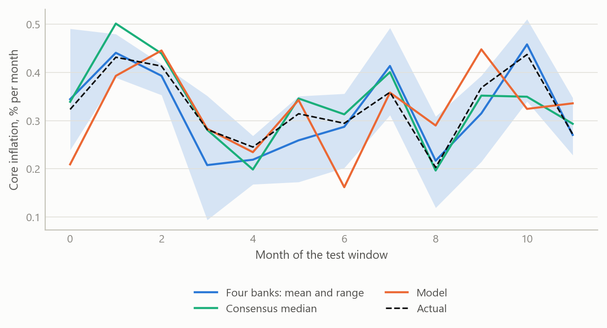
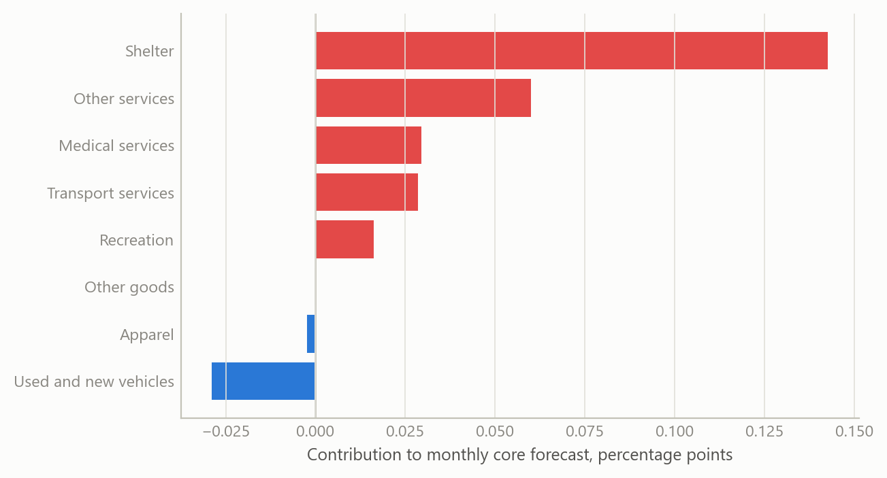
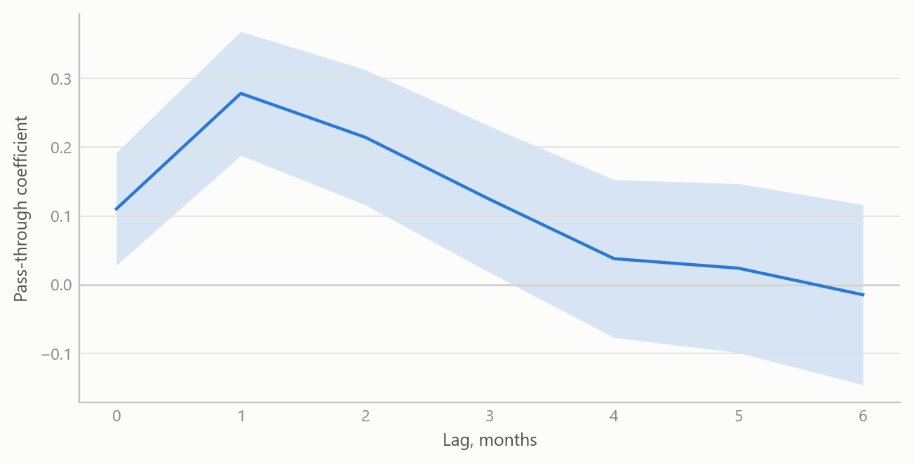

# Forecasting US core inflation from the bottom up
Carlos Galindo

> [!NOTE]
>
> ### At a glance
>
> - **Question.** Can a forecast built up from individual price components, and from producer prices passed through to consumer prices, track US core inflation as well as the professional forecasters who publish ahead of each release?
> - **Approach.** Rebuilt and improved the component-level forecasts and the producer-price-to-core-PCE translation, then scored them out of sample against four major banks and the survey consensus.
> - **Finding.** Over October 2023 to September 2024, accuracy sat within the banks’ range and slightly behind the consensus median.
> - **Why it matters.** A transparent bottom-up forecast explains *where* an inflation surprise comes from, which a single aggregate number cannot.

## The question

Core inflation, which strips out food and energy, is what central banks watch most closely, and the United States publishes it in two main forms: the consumer price index, released first, and the personal consumption expenditures price index, released a few weeks later and the one the Federal Reserve targets. Forecasters publish their expectations for each month’s print in advance. A survey of those forecasts gives a consensus, and the consensus is hard to beat: it pools many informed judgements, most of them made with the latest data and a sense of how each category has behaved lately.

A forecast of the aggregate can be built in two ways. The first models the aggregate directly. It is simple, but when it misses it says little about why. The second builds up from the pieces: dozens of price categories such as used cars, airfares, rents, medical services and apparel, each with its own dynamics and its own drivers, combined with the weights that statisticians use to construct the headline. When the headline surprises, a bottom-up forecast can say which categories moved and whether the movement looks like noise, a one-off, or a trend.

There is a second link that matters for the personal consumption measure. Many of its components are not priced from consumer surveys at all. They are derived from producer prices, such as margins earned by retailers and wholesalers, or prices charged by medical providers. Because producer prices are released a few days before the consumption series is published, they allow a forecaster to sharpen a core PCE nowcast just before the print. The question here is whether a rebuilt version of both pieces, the component forecasts and the producer-price translation, performs credibly against the people who do this for a living.

## Approach

The work was begun in a previous role and rebuilt and improved during the career break. The rebuild kept the architecture and changed what sat inside it.

**Component forecasts.** Each price category has its own monthly equation, estimated on month-on-month changes. A candidate set of regressors enters every equation: up to thirteen of the category’s own monthly lags, calendar effects for month and quarter, and a large panel of external indicators. These cover other consumer price categories, producer price indices at several levels of aggregation, import prices, financial-market variables such as yields and equity prices, housing indicators, and survey-based price measures. Selection is stepwise, in two stages. A first, looser pass screens the candidates. A second, stricter pass then chooses from what survived. The final equation is re-estimated with a structural-break check so that one unusual stretch of history does not drive the coefficients, and where an estimate fails the model falls back to a robust estimator. The point of two stages is to keep a wide search while resisting the spurious fits that a single wide search produces.

**From producer prices to core PCE.** The translation works at the level of the personal consumption measure itself. Candidate predictors, including the producer-price aggregates and the category-level forecasts from the first block, are added one at a time. An addition is kept only while its coefficient remains significant at the ten per cent level, up to a fixed ceiling of additions. Each step yields a forecast, and the set of forecasts is then pooled, using weights estimated from how well each has performed. The pooled path is seasonally adjusted with a model-based adjustment procedure so that it is comparable with the published series. Pooling was chosen deliberately. It is the same lesson the wider forecasting literature reports: individual models are unstable, and an average of reasonable models is more reliable than any chosen one.

**Testing.** The forecasts were scored out of sample: each month’s forecast used only information available at the time, and was compared with the realised print. The comparison group was four major banks that publish individual monthly forecasts, plus the survey’s median, over the twelve months from October 2023 to September 2024. The consensus data is Bloomberg survey data (2024). It is licensed, so this note reports only summary findings.

## What the work shows

The headline finding is modest, and stated plainly: across October 2023 to September 2024, the bottom-up forecasts landed within the range of the four banks, and slightly behind the consensus median. Being inside the banks’ range means the rebuilt system was not an outlier; on some months it was closer to the outcome than some banks, on others further. Being slightly behind the consensus median is the usual result for any single forecaster, because the median benefits from averaging out individual errors. The evidence does not support a claim that the system beats professional forecasters. It supports the narrower claim that a transparent, rebuilt system built by one researcher is competitive with them.

The simulated figure below shows what such a scoring exercise looks like. The real comparison used the same structure: twelve monthly prints, four bank forecasts and a consensus median, and one model. The paths here are generated, so they show how the output is read, not what the real forecasts were.

Figure 1: Out-of-sample scoring layout: actual monthly core inflation, the range of four bank forecasts, the consensus median and a model forecast over twelve months (simulated data).

The second figure shows the logic of building up from components. In any one month, each category contributes its weight times its forecast change, and the headline forecast is the sum. The useful property is that the contributions can be inspected one by one.

Figure 2: Contribution of broad price groups to a core forecast in one month: weight times forecast monthly change (simulated data).

The third figure shows the producer-price link. Producer-price changes feed consumer prices with a delay, and the strength of the link differs across the delay. The forecast uses the profile of that delay to decide how much weight a fresh producer-price release deserves.

Figure 3: Illustrative lag profile: association between a producer-price margin series and a core PCE category at lags of zero to six months, with simulated uncertainty bands (simulated data).

## Insights

**A forecast that can be taken apart is worth more than a forecast that is slightly more accurate.** Staying within the banks’ range, with a clear account of each category’s contribution, is more useful to a user than a black-box number of the same accuracy. When the print arrives, the bottom-up view says which components accounted for the miss.

**Wide search needs a stricter second pass.** A large indicator panel will always produce good in-sample fits. Two-stage selection, break checks and a robust fallback reduce the share of those fits that are accidents of the sample.

**Pooling earns its place.** The consensus median is a pooled forecast, and it was ahead of the single system. The system itself pools many specifications for the same reason. Where weighting by past accuracy is available, it is a cheap and effective step.

**Producer prices are timely, and timing is the point.** The producer-price release precedes the consumption price release, so the translation is most useful in the days before the print, when the other forecasters are also updating. That is where a small edge, if there is one, is found.

**Transparent scoring is the discipline.** The test was against named outside benchmarks over a defined twelve-month window, with the result reported as it came out: competitive, and not ahead.

## Scope and next steps

The window is twelve monthly observations. That is enough to say the system is not an outlier among bank forecasters, and too short to rank it precisely against them or against the median. A difference of a few hundredths of a percentage point per month between forecasters is within what one or two unusual months can produce.

The test also covers a particular period, one of declining but stubborn inflation. A bottom-up system could behave differently when relative prices move sharply, for example in a commodity shock, and the window does not tell us.

Two extensions would strengthen the work. First, a longer scored history, with formal tests of equal predictive accuracy against the consensus, so that “slightly behind” becomes a statement with a confidence interval. Second, a scoring split by category, to show which components the system forecasts best and which it should hand over to the pooled average.

## About the evidence

The scoring window runs from October 2023 to September 2024, with the rebuild carried out during the career break, from May 2024. The comparison uses four bank forecasts and the survey consensus from Bloomberg survey data (2024); the data is licensed, so only the summary result is stated. All figures here are simulated and illustrate the method and the scoring layout.

Figures and tables marked *simulated* are generated from simulated data built to share the structure of the analysis (its variables, horizons and frequencies). They show how each method works and what its output looks like. Results stated in the text, and figures that give a source, are the project’s own. Methods are described at the level of a methods section. Code and data pipelines are not reproduced here.
